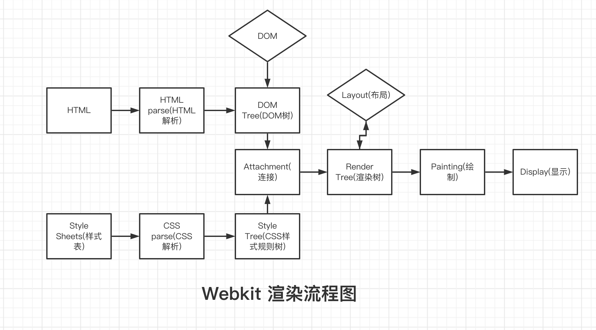
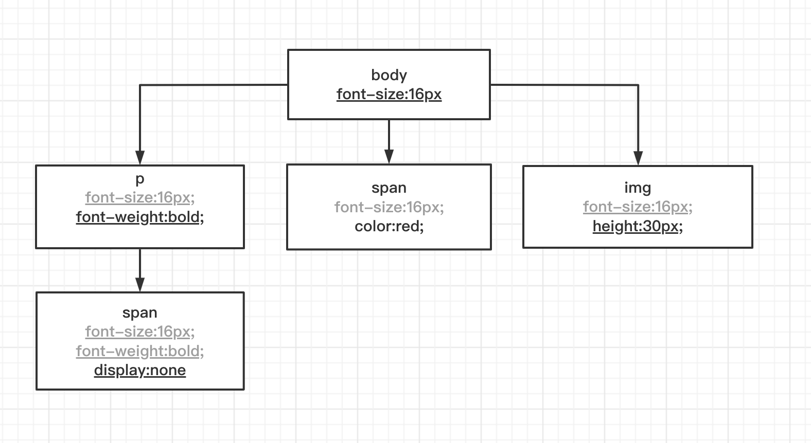

浏览器是现代应用最广的软件,本章将介绍浏览器的组成及浏览器渲染引擎的工作流程。

## 1.浏览器的组成

浏览器的主要功能就是向服务器发出请求,在浏览器窗口中展示所需的网络资源,这里所说的资源一般是指 HTML 文档,也可以是 PDF、图片或其他的类型。资源的位置由用户使用 URI(统一资源标示符)指定。浏览器解释并显示 HTML 文件的方式是在 HTML 和 CSS 规范中指定的,这些规范由网络标准化组织 W3C（万维网联盟）进行维护,但不同浏览器并未完全遵循 W3C 规范,这导致了开发人员经常要处理兼容性问题。浏览器在 1.1 版本组成部分如下:

- **用户界面**:包括地址栏、前进/后退按钮、书签菜单等。除了浏览器主窗口显示的请求的页面外,其他显示的各个部分都属于用户界面。
- **浏览器引擎**:在用户界面和呈现引擎之间传送指令。
- **渲染引擎**:负责显示请求的内容。如果请求的内容是 HTML,它就负责解析 HTML 和 CSS 内容,并将解析后的内容显示在屏幕上。渲染引擎和 JS 执行引擎被称作浏览器内核。渲染可以简单理解为在浏览器上画画,HTML 内容表示要在浏览器画什么结构,CSS 内容表示要为某些结构进行装饰。
- **网络**:用于网络调用,比如 HTTP 请求。其接口与平台无关,并为所有平台提供底层实现。
- **用户界面后端**:用于绘制基本的窗口小部件,比如组合框和窗口。其公开了与平台无关的通用接口,而在底层使用操作系统的用户界面方法。
- **JavaScript 执行引擎**:也叫 JavaScript 解释器,用于解析和执行 JavaScript 代码。
- **数据存储**:这是持久层。浏览器需要在硬盘上保存各种数据,例如 Cookie。新的 HTML 规范 (HTML5) 定义了“网络数据库”,这是一个完整(但是轻量级)的浏览器内数据库。

接下来将会围绕 Gecko、Webkit 这两款渲染引擎的工作流程进行深入研究。

| 浏览器  | 渲染引擎     | 描述                                                                                                                                                                                          |
| ------- | ------------ | --------------------------------------------------------------------------------------------------------------------------------------------------------------------------------------------- |
| Chrome  | WebKit/Blink | Blink 是谷歌开发渲染引擎,Blink 由 WebKit 的分支演化而来。                                                                                                                                     |
| Safari  | Webkit       | Webkit 是苹果公司自主研发的内核,Webkit 引擎包含渲染引擎 WebCore 和 javascript 引擎 JSCore,均是从 KDE 的 KHTML 及 KJS 引擎衍生而来。                                                           |
| Firefox | Gecko        | Netscape6 开始采用的内核,后来的 Mozilla FireFox(火狐浏览器)也采用了该内核                                                                                                                     |
| IE      | Trident      | Trident 内核程序在 1997 年的 IE4 中首次被采用,是微软在 Mosaic 代码的基础之上修改而来的,并沿用到 IE11,也被普遍称作"IE 内核",因为要处理 IE 兼容性问题,所以大家都很讨厌 IE                       |
| Opera   | Presto       | Presto 是一个由 Opera Software 开发的浏览器排版引擎,供 Opera 7.0 及以上使用。该款引擎的特点就是渲染速度的优化达到了极致,也是目前公认网页浏览速度最快的浏览器内核,然而代价是牺牲了网页的兼容性 |

## 2.渲染引擎的渲染流程


- 渲染引擎首先会解析 HTML 内容并逐个标记内容转换为 DOM 节点生成 DOM 树(DOM Tree),同时也会解析外部 CSS 样式以及 DOM 元素上的 CSS 样式,生成样式规则树(style rules), DOM 树和样式规则树创建完毕后会连接起来创建渲染树(render tree)。渲染树包含多个带有视觉属性(如颜色和尺寸)的矩形,这些矩形的排列顺序就是它们将在屏幕上显示的顺序。
- 渲染树创建完毕后,就会进入布局(Layout)处理阶段,也就是为每个节点分配一个应出现在屏幕上的确切坐标。
- 布局阶段完成后,就会进入绘制(Painting)阶段,渲染引擎会遍历渲染树,由用户界面后端层将每个节点在屏幕上绘制出来。

  注意:渲染引擎的渲染一个渐进的过程,为达到更好的用户体验,渲染引擎会力求尽快将内容显示在屏幕上。渲染引擎不必等到整个 HTML 文档解析完毕之后,就会开始构建呈现树和设置布局。在不断接收和处理来自网络的其余内容的同时,呈现引擎会将部分内容解析并显示出来。
  

### 2.1 构建 DOM Tree

由于浏览器无法直接识别和使用 HTML,所以在渲染引擎中通过 HTML parse 用于解析 HTML 内容,HTML parse 的作用就是将 HTML 字节流转换为树形的 DOM 结构,当 DOM Tree 构建完毕后就会触发`DOMContentLoaded`事件。HTML parse 的流程如下:

- 解码:浏览器将接收的字符流(Bytes)基于编码方式解析为字符(Characters)。
- 分词:通过分词器(词法分析)将字符串转换为 Token,分为 Tag Token 和文本 Token。
- 将 Token 解析为 Nodes(DOM 节点)。
- 将 DOM 添加至 DOM 树中。

步骤三和步骤四是同时进行的,首先将 Token 解析为 DOM 节点,将 DOM 节点添加到 DOM 树中。此过程 HTML parase 通过维护一个 Token 栈结构(先进后出的线性结构)来实现的。流程如下:

- 如果当前 Token 是一个 StartTag Token(例如`<div>`),则创建一个 DOM 节点,并推出栈。
- 如果当前 Token 是一个文本 Token,则生成一个文本节点,然后直接将该节点添加到 DOM 树中。
- 如果当前 Token 是 EndTag Token(例如`</div>`),则会查看栈顶元素是否为对应的 Start Tag,如果是则弹出(说明是一对标签),该节点解析完成。

```js
/* HTML内容 */
;<div>
  <span>我是zchengfeng</span>
</div>
/* 解析后的Tokens,以数组模拟 */
const tokens = [startTag.div, startTag.span, 我是zchengfeng, endTag.span, endTag.div]
// token栈
const tokenStack = []
// 第一次解析,由于div是一个开始标签,则会被推入栈中,tokenStack的值为[startTag.div]
// 第二次解析,由于span是一个开始标签,则会被推入栈中,tokenStack的值为[startTag.div,startTag.span]
// 第三次解析,由于是一个文本节点,则将该节点直接添加到 DOM 树中。
/*
 * 第四次解析,由于span是一个结束标签,且栈中有与之匹配的标签,所以会弹出栈中与之匹配的标签,
 * tokenStack的值为[startTag.div]。
 */
/*
 * 第五次解析,由于div是一个结束标签,且栈中有与之匹配的标签,所以会弹出栈中与之匹配的标签,
 * tokenStack的值为[],栈为空则说明解析完毕。
 */
```

### 2.2 构建 CSS Style Tree

与 HTML 内容一样,浏览器也无法直接理解和使用 CSS,因此浏览器引擎通过 CSS parse 将 CSS 文本转换为 Style Sheets。CSS parse 会根据 CSS 样式的继承、优先级层叠等规则生成最终的 CSS 规则树(通过浏览器开发者工具面板选中元素查看 Computed 可以查看元素计算后的样式)。



#### 2.3 Layout(布局)

当 DOM Tree 和 Style Tree 构建完毕后就会进行 Layout 阶段,Layout 大致分为构建 Render Tree(渲染树)和计算布局信息,Render Tree 步骤用于确定最终显示的 DOM 元素,计算布局信息用于确定 DOM 元素显示的几何位置。

#### 2.3.1 构建 Render Tree

DOM 树描述了源码中的 HTML 结构,但很多元素并不需要展示在页面中,例如`overflow:hidden`、`display:none`、伪类元素。所以在页面绘制前需要遍历 DOM Tree 中所有节点,忽略不可见元素,添加不存在 DOM 树中但需要显示的内容,最终生成一棵只包含可见元素的 Render Tree。

#### 2.3.2 计算布局信息

计算 DOM 元素的布局信息用于确定 DOM 元素在页面显示的位置、大小,而计算 DOM 元素的具体几何位置是一项艰巨的任务,即使是最简单的页面布局也必须考虑字体的大小以及如何换行,因为这会影响着段落的大小和形状,也会影响下一行的布局。

### 2.4 Paint(绘制)

Render Tree 构建完毕后表示已经得到了 DOM 元素结构、CSS 样式信息、布局位置信息,接下来就会进入 Paint 阶段。Paint 元素就如同在页面画一幅画,除了确定绘制元素的结构、样式、布局信息外,还需要知道元素的绘制顺序,后绘制的元素会覆盖先绘制的元素。由于页面可能包含很多复杂的效果,例如 3D 变换、页面滚动、使用`z-index`进行 z 轴排序,为了方便的实现这些效果,渲染引擎针对绘制顺序采用了分层机制。

#### 2.4.1 Layer(分层)

每个 DOM 元素都有自己的布局信息 Layout Object,根据其布局信息的层级等关系,某些 Layout Object 会拥有共同的渲染层 Paint Layer

#### 2.4.2 Paint Layer(绘制层)

#### 2.4.3 栅格化

### 2.5 合成和显示
