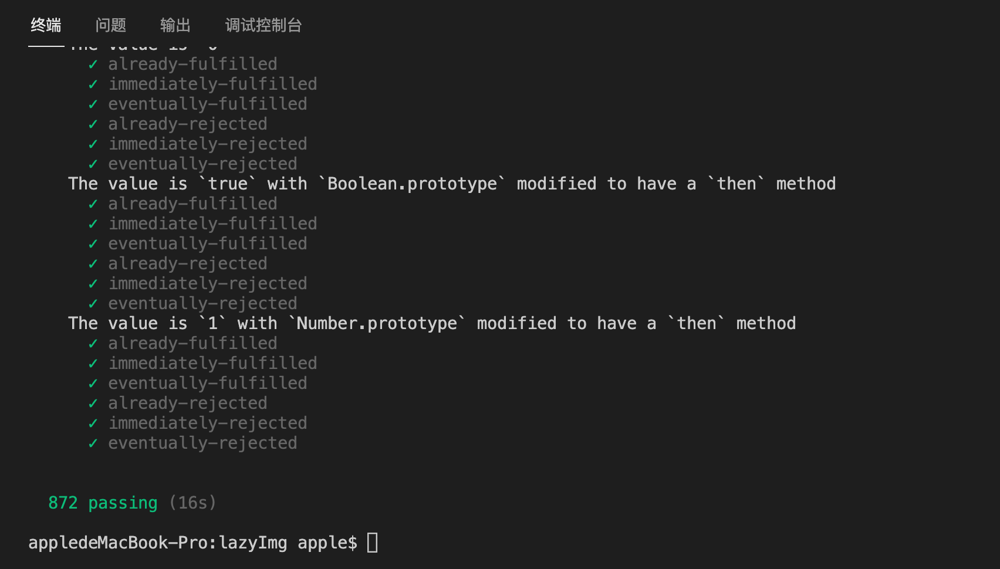

## 手写 Promise

Promise 是 ES6 提供的异步解决方案,Promise 通过链式调用可以解决回调函数(回调函数在事件循环中属于微任务)嵌套而产生的回调地狱问题,手写 Promise 会涉及 Promise、Class、this 显式绑定(call、apply、bind)、事件循环(Event Loop)等知识点。Promise 的特点如下:

- **Promise 是一个状态机**。Promise 内部提供 pending(待定)、fulfilled(已成功)、rejected(已拒绝)三种枚举状态来描述一个异步任务的执行情况,pending 状态只能向 fulfilled 和 rejected 状态变化,一旦 Promise 的状态发生变化后就无法改变。注意:Promise 构造函数是同步的,而`Promise.then()`属于异步执行的。
- **Promise 构造函数是同步的且抛出的错误可以被 catch()捕获,但 resolve()和 reject()是异步的**。Promise 接收一个回调函数,该回调允许接收 resolve()和 reject()两个回调函数,调用 resolve()会将 pending 状态的 Promise 变为 fulfilled 状态,调用 reject()会将 pending 状态的 Promise 变为 rejected 状态。而且 Promise 构造函数产生的错误是可以被 catch()捕获到的。
- **Promise 支持函数式链式调用**。Promise 的 then()、catch()等方法支持链式调用(例如 `promise.then().catch()`),所以 then()、catch()等方法需要返回一个新的 Promise 实例(不是原来那个 Promise 实例)。

::: details 手写 Promise(含注释)

```js
// 注释版Promise
class MyPromise {
  // 通过静态属性定义Promise三种状态,静态属性只能通过类获取,无法通过类实例获取。
  static PENDING = "pending";
  static FULFILLED = "fulfilled";
  static REJECTED = "rejected";

  constructor(callback) {
    // 初始化Promise的状态
    this.promiseStatus = MyPromise.PENDING;
    // 初始化Promise的结果,用于存储resolve()和reject()的入参
    this.promiseResult = null;
    /*
     * 初始化成功和拒绝回调函数数组,用于存储成功和拒绝回调函数,当resolve()和reject()
     * 被异步执行时,执行then()无法正确获得Promise状态(此时then函数中Promise状态仍是pending),
     * 所以定义两个回调函数数组用于存储成功和拒绝回调函数,当then()中的Promise状态为pending时,
     * 就向回调函数数组添加回调函数,在执行resolve()或reject()时,则遍历回调函数数组执行每个回调函数
     */
    this.onFulfilltedCallbacks = []; // 用于存储成功回调函数
    this.onRejectedCallbacks = []; // 用于存储失败回调函数

    // Promise构造函数产生的错误通过try/catch进行捕获,产生错误时调用reject
    try {
      /*
       * JS的函数this指向取决于函数的调用环境,而非函数声明环境,
       * 由于在resolve()和reject()需要用到当前MyPromise实例,
       * 故通过bind将resolve()和reject()的this指向当前MyPromise实例
       */
      callback(this.resolve.bind(this), this.reject.bind(this));
    } catch (err) {
      this.reject(err);
    }
  }

  /*
   * resolve()是一个异步方法,做了以下三件事:
   * (1).修改Promise状态从pending为fulfilled。
   * (2).修改Promise的结果,promiseResult的值会传递给then()的成功回调函数。
   * (3).遍历成功回调函数数组,执行数组中每个成功回调函数。
   */
  resolve(result) {
    const { PENDING, FULFILLED } = MyPromise;
    if (this.promiseStatus === PENDING) {
      setTimeout(() => {
        this.promiseStatus = FULFILLED;
        this.promiseResult = result;
        this.onFulfilltedCallbacks.forEach((callback) => callback(result));
      });
    }
  }

  /*
   * reject()是一个异步方法,做了以下三件事:
   * (1).修改Promise状态从pending为rejected。
   * (2).修改Promise的结果,promiseResult的值会传递给then()的失败回调函数。
   * (3).遍历失败回调函数数组,执行数组中每个失败回调函数。
   */
  reject(reason) {
    const { PENDING, REJECTED } = MyPromise;
    if (this.promiseStatus === PENDING) {
      setTimeout(() => {
        this.promiseStatus = REJECTED;
        this.promiseResult = reason;
        this.onRejectedCallbacks.forEach((callback) => callback(reason));
      });
    }
  }

  then(onFulfilled, onRejected) {
    // 如果onFulfilled()或onRejected()是函数则直接返回,否则通过函数包装,传入什么就返回什么
    onFulfilled =
      typeof onFulfilled === "function" ? onFulfilled : (value) => value;
    onRejected =
      typeof onRejected === "function"
        ? onRejected
        : (reason) => {
            throw reason;
          };
    // 执行then()会返回一个新的Promise实例
    const promise = new MyPromise((resolve, reject) => {
      const { PENDING, FULFILLED } = MyPromise;
      const { promiseStatus, onFulfilltedCallbacks, onRejectedCallbacks } =
        this;
      // 对onFulfillted和onRejected的返回值进行处理
      const handle = (fn) => {
        try {
          resolvePromise(promise, fn(this.promiseResult), resolve, reject);
        } catch (err) {
          reject(err);
        }
      };
      /*
       * 如果执行then()时Promise仍为pending则说明resolve()被异步执行了,则向
       * 回调函数数组添加回调函数。
       */
      if (promiseStatus === PENDING) {
        onFulfilltedCallbacks.push(() => handle(onFulfilled));
        onRejectedCallbacks.push(() => handle(onRejected));
      } else {
        /**
         * Promise A+规范要求onFulfilled()和onRejected()异步执行,
         * 且应该在then()被调用的那一轮事件循环后的新执行栈中执行。
         * 事件循环中的事件队列可以通过宏任务和微任务的机制决定执行时机,
         * 宏任务有setTimeout、setImmediate,微任务有MutationObserver、process.nextTick。
         * 这里通过setTimeout进行包装。
         */
        const fn = promiseStatus === FULFILLED ? onFulfilled : onRejected;
        setTimeout(() => handle(fn));
      }
    });
    return promise;
  }
}

/**
 *
 * @param promise then()返回新的Promise实例
 * @param result onFulfilled()或onRejected()的返回值
 * @param resolve 新Promise实例的resolve()
 * @param reject 新Promise实例的reject()
 */
function resolvePromise(promise, result, resolve, reject) {
  // 解决循环引用,避免then()回调的返回值是then()返回的新Promise实例,这样会造成循环引用问题
  if (result === promise) {
    return reject(new TypeError("Chaining cycle detected for promise"));
  }
  /* then()回调返回值策略:
   *
   * 策略1:如果then回调的返回值是一个Promise,则需要根据该Promise的状态进行处理:
   * (1).状态为pending时:说明还未调用resolve()和reject(),或者resolve()和reject()
   * 被异步执行中,此时调用then()进行处理,如果resolve()和reject()被异步执行,则会将then()
   * 的成功和失败回调添加到Promise的成功和失败回调函数数组中,由于调用then()该回调可能又会
   * 返回一个Promise实例,故调用resolvePromise()对其回调返回值进行处理。
   * (2).状态fulfillted时:说明已经调用了Promise的resolve()回调,那么直接执行resolve()
   * 并传入该Promise的promiseResult即可。
   * (3).状态为rejected时:明已经调用了Promise的reject()回调,那么直接执行reject()
   * 并传入该Promise的promiseResult即可。
   *
   * 策略2:如果then回调的返回值是一个对象或函数,首先查看对象上是否有then属性,如果具有then但不是函数则
   * 直接resovle,如果具有then且是一个函数则说明它是一个thenable对象(对象指的是具有then方法的对象),
   * 将then()中this的指向result,并包装一个onFulfillted()和onRejected()再传递给then()。由于调用
   * then()该回调可能又会返回一个Promise实例,故调用resolvePromise()对其回调返回值进行处理。
   *
   * 策略3:如果then回调的返回值即不是Promise,也不是对象或函数,则直接resolve()结果,
   * 即输入什么则返回什么。
   */
  if (result instanceof MyPromise) {
    const { PENDING, FULFILLED, REJECTED } = MyPromise;
    const map = {
      [PENDING]: () => {
        result.then((y) => resolvePromise(promise, y, resolve, reject), reject);
      },
      [FULFILLED]: () => resolve(result.promiseResult),
      [REJECTED]: () => reject(result.promiseResult),
    };
    map[result.promiseStatus]();
  } else if (
    result !== null &&
    ["object", "function"].includes(typeof result)
  ) {
    try {
      var then = result.then;
    } catch (e) {
      return reject(e);
    }
    if (typeof then === "function") {
      /*
       * 用于标记then()的onFulfillted()和onRejected()是否执行,
       * 只能执行onFulfillted()和onRejected()其中一个回调
       */
      let called = false;
      try {
        /*
         * 将then()中this的指向result,并包装一个onFulfillted()和onRejected(),
         * 传递给then()
         */
        then.call(
          result,
          (y) => {
            if (called) return;
            called = true;
            resolvePromise(promise, y, resolve, reject);
          },
          (r) => {
            if (called) return;
            called = true;
            reject(r);
          }
        );
      } catch (e) {
        if (called) return;
        called = true;
        reject(e);
      }
    } else {
      resolve(result);
    }
  } else {
    // 对于非Promise实例、非对象或函数,则直接resolve(),传入什么就返回什么
    resolve(result);
  }
}
```

:::

::: details 手写 Promise(不含注释)

```js
class MyPromise {
  static PENDING = "pending";
  static FULFILLED = "fulfilled";
  static REJECTED = "rejected";

  constructor(callback) {
    this.promiseStatus = MyPromise.PENDING;
    this.promiseResult = null;
    this.onFulfilltedCallbacks = [];
    this.onRejectedCallbacks = [];

    try {
      callback(this.resolve.bind(this), this.reject.bind(this));
    } catch (err) {
      this.reject(err);
    }
  }
  resolve(result) {
    const { PENDING, FULFILLED } = MyPromise;
    if (this.promiseStatus === PENDING) {
      setTimeout(() => {
        this.promiseStatus = FULFILLED;
        this.promiseResult = result;
        this.onFulfilltedCallbacks.forEach((callback) => callback(result));
      });
    }
  }
  reject(reason) {
    const { PENDING, REJECTED } = MyPromise;
    if (this.promiseStatus === PENDING) {
      setTimeout(() => {
        this.promiseStatus = REJECTED;
        this.promiseResult = reason;
        this.onRejectedCallbacks.forEach((callback) => callback(reason));
      });
    }
  }

  then(onFulfilled, onRejected) {
    onFulfilled =
      typeof onFulfilled === "function" ? onFulfilled : (value) => value;
    onRejected =
      typeof onRejected === "function"
        ? onRejected
        : (reason) => {
            throw reason;
          };
    const promise = new MyPromise((resolve, reject) => {
      const { PENDING, FULFILLED } = MyPromise;
      const { promiseStatus, onFulfilltedCallbacks, onRejectedCallbacks } =
        this;
      const handle = (fn) => {
        try {
          resolvePromise(promise, fn(this.promiseResult), resolve, reject);
        } catch (err) {
          reject(err);
        }
      };
      if (promiseStatus === PENDING) {
        onFulfilltedCallbacks.push(() => handle(onFulfilled));
        onRejectedCallbacks.push(() => handle(onRejected));
      } else {
        const fn = promiseStatus === FULFILLED ? onFulfilled : onRejected;
        setTimeout(() => handle(fn));
      }
    });
    return promise;
  }
}
function resolvePromise(promise, result, resolve, reject) {
  if (result === promise) {
    return reject(new TypeError("Chaining cycle detected for promise"));
  }
  if (result instanceof MyPromise) {
    const { PENDING, FULFILLED, REJECTED } = MyPromise;
    const map = {
      [PENDING]: () => {
        result.then((y) => resolvePromise(promise, y, resolve, reject), reject);
      },
      [FULFILLED]: () => resolve(result.promiseResult),
      [REJECTED]: () => reject(result.promiseResult),
    };
    map[result.promiseStatus]();
  } else if (
    result !== null &&
    ["object", "function"].includes(typeof result)
  ) {
    try {
      var then = result.then;
    } catch (e) {
      return reject(e);
    }
    if (typeof then === "function") {
      let called = false;
      try {
        then.call(
          result,
          (y) => {
            if (called) return;
            called = true;
            resolvePromise(promise, y, resolve, reject);
          },
          (r) => {
            if (called) return;
            called = true;
            reject(r);
          }
        );
      } catch (e) {
        if (called) return;
        called = true;
        reject(e);
      }
    } else {
      resolve(result);
    }
  } else {
    resolve(result);
  }
}
```

:::

```js
// 测试
console.log(1);
const p = new MyPromise((resolve, reject) => {
  console.log(2);
  resolve("xxx");
});
setTimeout(() => {
  console.log(3);
});

p.then(() => {
  console.log(4);
  return new MyPromise((resolve, reject) => {
    resolve(5);
  });
}).then((result) => {
  console.log(result);
});

// 输出结果:1 2 3 4 5
```

#### Promise A+规范测试

`promises-aplus-tests`是 Promises/A+官方的测试工具,可以通过它来测试 Promise 是否符合规范。使用步骤如下:

- (1).安装`promises-aplus-tests`。

```shell
npm install promises-aplus-tests -D
```

- (2).对外暴露 Promise 类,并在 Promise 实例上定义 deferred()。使用 `promises-aplus-tests` 进行测试，必须在 Promise 上实现一个静态方法 deferred()。

```js
/* index.js */
// ... 省略MyPromise代码
// 在Promise上定义deferred,返回一个包含resolve()和reject()的对象
MyPromise.deferred = () => {
  const result = {};
  result.promise = new MyPromise((resolve, reject) => {
    Object.assign(result, { resolve, reject });
  });
  return result;
};
// 导出Promise类
module.exports = MyPromise;
```

- (3).配置 package.json 添加 test 命令进行测试(测试结果通过 872 个测试用例)。

```json
{
  "name": "lazyimg",
  "version": "1.0.0",
  "description": "",
  "main": "index.js",
  "scripts": {
    "test": "promises-aplus-tests index.js"
  },
  "keywords": [],
  "author": "",
  "license": "ISC",
  "devDependencies": {
    "promises-aplus-tests": "^2.1.2"
  }
}
```



## 手写 async await

## 手写 Promise 错误处理函数

```js
/*
 * asyncTo支持泛型,接收Promise对象和执行函数,无论Promise的状态如何最终执行函数都会被执行,
 * asyncTo返回一个数组,数组的第一个元素是传入的promise产生的错误信息,元素二是promise执行成功
 * 返回的数据
 */
function asyncTo<E = Error, T = any>(promise: Promise<any>, fn?: () => void) {
  return (
    new Promise() <
    [null, T] >
    ((resolve, reject) => {
      return promise
        .then((data: T) => resolve([null, data]))
        .catch((err: E) => reject([err, null]))
        .finally(() => fn && fn());
    })
  );
}
```

## 异步请求控制并发数

```js
const limitRequest = (urls = [], limit = 0) => {
  return new Promise((resolve, reject) => {
    const len = urls.length;
    let count = 0;
    const start = async () => {
      const url = urls.shift();
      if (url) {
        try {
          // 请求
          await axios.post(url);
          if (count === len - 1) {
            // 如果是最后一个任务
            resolve();
          } else {
            count++;
            // 当前任务执行成功启动下一个任务
            start();
          }
        } catch (err) {
          count++;
          // 当前任务执行成功启动下一个任务
          start();
        }
      }
    };
    while (limit > 0) {
      start();
      limit -= 1;
    }
  });
};
```

## Promise 错误重试函数

解析:返回一个新的 Promise,遍历 count 次,每次遍历 count 减一,每次遍历都会使用`try catch`捕获外部传入的 Promise 执行时产生的异常,执行成功则调用`resolve()`修改 Promise 的状态为`fulfilled`,则立即终止循环,如果执行 count 次外部 Promise 任务仍未执行成功,则直接调用`reject()`修改 Promise 的状态为`rejected`。

```typescript
/**
 * @param fn Promise任务函数
 * @param count 重试次数
 */
function retry<T>(fn: (...args: any) => Promise<T>, count: number) {
  return new Promise(async (resolve, reject) => {
    while (count--) {
      try {
        const res = await fn();
        resolve(res);
        return;
      } catch (e) {
        console.log("任务执行错误...", e);
      }
    }
    // 如果循环结束后说明重试count次数后仍执行失败,直接reject()
    reject();
  });
}

// 测试
const fn = () => {
  return new Promise((resolve, reject) => {
    const val = Math.random();
    val > 0.7 ? resolve(val) : reject(val);
  });
};
retry(fn, 3).catch(() => {
  console.log("任务重试执行多次后仍处理失败");
});
```

## 实现带有延迟的 Promise
