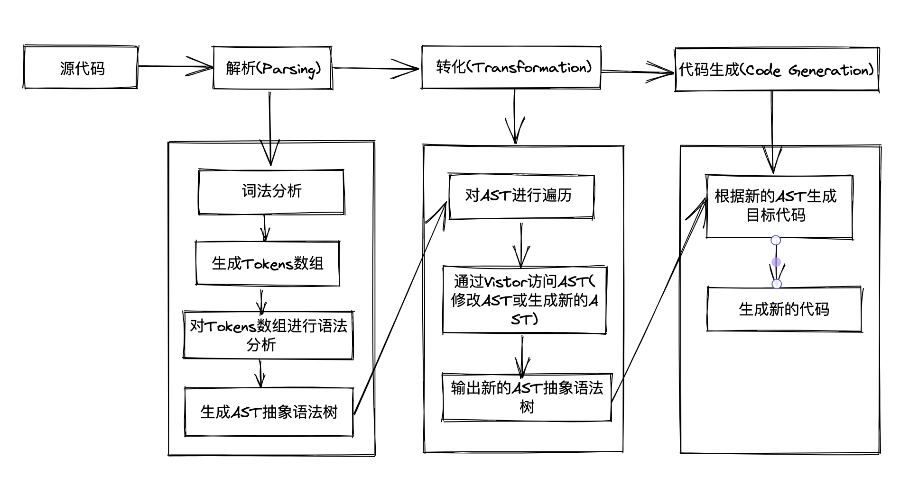
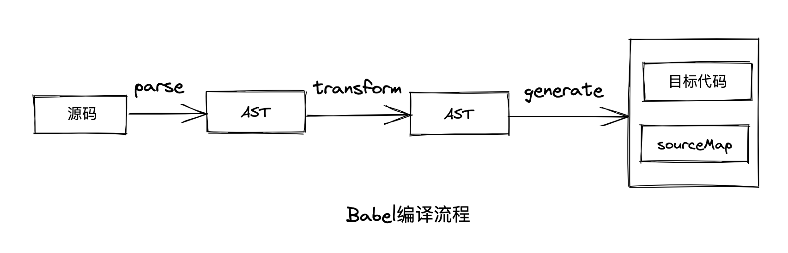

## 1.什么是 Babel?

Babel(巴别塔)最开始叫 6to5,顾名思义是将 ES6 转为 ES5,随着 ES 标准的推进,出现了 ES7、ES8 等标准,后改名为 Babel。简单来说,Babel 是一个 JavaScript 编译器,Babel 主要用于:

- **转换语法**。转换语法是 Babel 最常用的功能,Babel 可以将 esnext、typescript、flow 的语法转为基于目标环境支持的语法的实现。并且还可以吧目标环境不支持的 api 进行 polyfill。Babel7 提供了`@babel/preset-env`依赖,可以指定目标 env 来按需转换,转换过程更加精准,转换后的产物更小。
  :::tip
  Polyfill(垫片)是指在旧版浏览器中实现新版浏览器的 API,并且保证与新版浏览器的 API 功能一致。在 Web 开发中,经常会遇到一些 JS API 或者 CSS 特性在新版浏览器中已经被支持,但是在一些旧版浏览器中不被支持。使用 Polyfill 技术可以在旧版浏览器中实现这些新特性的功能,从而可以提供更好的用户体验。Polyfill 的实现方式通常是通过加载一个 JS 脚本,利用 JS 来实现那些在旧版浏览器中缺失的 API 或特性。例如,为了在旧版浏览器中实现 HTML5 的新标签,可以使用 HTML5 Shiv Polyfill。
  :::
- **代码转换**。Babel 是一个转义器,暴露了丰富的 API,这些 API 提供了代码到 AST 的解析、转换以及目标代码生成的能力。借助 Babel 可以实现特定用途的转换,例如函数插桩(函数中自动插入一些代码,例如埋点代码、函数劫持等)、自动国际化等。流行的跨端框架 Taro,就是基于 Babel 的 API 实现代码的转译。
- **代码静态分析**。使用 Babel 对源码进行 Parse(解析)后,会生成 AST(抽象语法树),AST 描述着源码的代码结构和语法信息,除了转换 AST 再输出成目标代码外,同样也可以用于代码分析,进行代码静态检查。
  - linter 工具。linter 工具的原理就是分析 AST 结构,根据 AST 对代码规范进行检查。
  - API 文档自动生成工具。通过 Babel 提取源码文件中的 JSDoc(JavaScript 注释),然后生成文档(例如生成 MarkDown 文档)。
  - type checker(类型检查)。type checker 会根据从 AST 中提取的或者推导的类型信息,对 AST 进行类型是否一致的检查,从而减少运行时因类型导致的错误。
  - 压缩混淆工具。压缩混淆工具的原理也是基于代码结构分析,进行删除死代码、变量名混淆、常量折叠等各种编译优化,生成体积更小、性能更好的代码。
  - JS 解释器。除了对 AST 进行各种信息的提取和检查外,Babel 还可以直接解释执行 AST。

## 2.编译知识的介绍

### 2.1 什么是编译器和解释器?

- 编译器(Compiler):编译器是一种将源代码转化为目标代码的应用程序。源代码是一种人类可读的代码,用来表达程序员的意图,而目标代码是计算机可读的二进制代码,用来在计算机上执行程序。编译器的主要工作是将源代码中的高级语言(如 C、C++、Java 等)转换成目标代码,使其可以在计算机上执行。
  解释器是一种将源代码逐行翻译并逐行执行的软件。解释器逐行读取源代码，并将其翻译成计算机可执行的指令，然后执行这些指令。与编译器不同，解释器不会生成目标代码，而是直接将源代码翻译并执行。解释器通常用于脚本语言（如 JavaScript、Python 等）的解释执行，可以实现实时的编程任务。

- 解释器:解释器是一种将源代码逐行翻译并逐行执行的应用程序。解释器逐行读取源代码,并将其翻译成计算机可执行的指令，然后执行这些指令。与编译器不同,解释器不会生成目标代码,而是直接将源代码翻译并执行。解释器通常用于脚本语言(如 JavaScript、Python 等)的解释执行,可以实现实时的编程任务。

编译器和解释器都是将高级语言转换成计算机能够执行的机器语言的应用程序。它们的主要区别在于编译器会将整个程序一次性编译成目标代码,而解释器则是逐行解释执行源代码。编译器编译出的程序通常执行速度更快,但是需要预先编译、链接、生成目标代码文件等操作,而解释器通常更容易使用,可以直接运行源代码,但是执行速度较慢。

### 2.2 什么是 AST?

AST(Abstract Syntax Tree),抽象语法树,是一种数据结构,它用于表示编程语言的抽象语法结构。在编程语言中,源代码是由一系列字符组成的,计算机并不能直接理解它们,需要将其转换成抽象语法树,以便计算机能够理解和处理它们。

抽象语法树可以看作是源代码的抽象语法结构的一种中间表示形式。在抽象语法树中,每个节点表示一个语法元素,例如函数、变量、表达式、语句等等。节点之间的关系则表示语法结构的嵌套关系,例如函数包含参数和函数体,函数体又包含多个语句,语句包含多个表达式等等。抽象语法树在编译器、静态分析、代码优化、代码生成等领域中都有广泛的应用,例如 Babel(前端编译器)、Webpack(打包器)、ESLint(JS Lint 工具)、Perttier(代码格式化工具)等。

## 3.编译的编译流程

一个完整的编译器整体执行过程可以分为三个步骤:

- **Parsing(解析)**。这个过程要经词法分析、语法分析、构建 AST（抽象语法树）一系列操作。
- **Transformation(转化)**。这个过程就是将上一步解析后的内容,按照编译器指定的规则进行处理,形成一个新的表现形式。
- **Code Generation(代码生成)**。将上一步处理好的内容转化为新的代码。


以 lisp 的函数调用编译成类似 C 的函数为例:

```js
LISP 代码: (add 2 (subtract 4 2))
C    代码:  add(2, subtract(4, 2))
释义: 2 + （ 4 - 2)
```

#### 3.1 Parsing 过程

解析过程主要分为词法分析和语法分析两个步骤:

- **词法分析**:词法分析是使用 tokenizer(分词器)或者 lexer(词法分析器),将源码拆分成 tokens,tokens 是一个放置对象的数组,其中的每一个对象都可以看做是一个单元(数字，标签，标点，操作符...)的描述信息。例如对"你是猪"进行词法分析就可以得到主谓宾词语,对`(add 2 (subtract 4 2))`进行词法分析后得到:

```js
;[
  { type: 'paren', value: '(' },
  { type: 'name', value: 'add' },
  { type: 'number', value: '2' },
  { type: 'paren', value: '(' },
  { type: 'name', value: 'subtract' },
  { type: 'number', value: '4' },
  { type: 'number', value: '2' },
  { type: 'paren', value: ')' },
  { type: 'paren', value: ')' },
]
```

- **语法解析**:将词法分析的结果转化为抽象语法树(AST),并检查其语法是否正确。语法分析会将 tokens 重新整理成语法相互关联的表达形式,这种表达形式一般被称为中间层或者 AST(抽象语法树)。对`(add 2 (subtract 4 2))`进行语法解析后得到的 AST:

```js
{
  type: 'Program',
  body: [{
    type: 'CallExpression',
    name: 'add',
    params:
      [{
        type: 'NumberLiteral',
        value: '2',
      },
      {
        type: 'CallExpression',
        name: 'subtract',
        params: [{
          type: 'NumberLiteral',
          value: '4',
        }, {
          type: 'NumberLiteral',
          value: '2',
        }]
      }]
  }]
}
```

## 4.实现一个编译器(Compiler)

根据 Compiler 的执行流程,Compiler 的实现分为以下四个步骤:

- 生成 Tokens。
- 将生成好的 tokens 转化为 AST。
- 遍历和访问生成好的 AST。
- 将生成好的 AST 转化为新的 AST。
- 根据转化的 AST 生成目标代码。

### 4.1 生成 Tokens

第一步是将输入代码解析为 tokens。这个过程需要 tokenizer(分词器)函数,整体思路就是通过遍历字符串的方式,对每个字符按照一定的规则进行`switch case`,最终生成 tokens 数组。

```js
/**
 * 通过分词器对输入代码进行分词,返回分词解析后的tokens数组
 * @param input 输入代码
 * @returns tokens 分词解析后的tokens数组
 */
function tokenizer(input) {
  // 记录当前访问的位置
  let current = 0
  // 最终生成的tokens
  let tokens = []

  // 遍历输入代码
  while (current < input.length) {
    let char = input[current]
    // 如果字符是开括号,则把一个新的token放到tokens数组里,类型是`paren`
    if (char === '(') {
      tokens.push({
        type: 'paren',
        value: '(',
      })
      current++
      continue
    }

    // 闭括号做同样的操作
    if (char === ')') {
      tokens.push({
        type: 'paren',
        value: ')',
      })
      current++
      continue
    }

    // 空格检查,分词时需要关心空格在分隔字符上是否存在,但是在token中他是无意义的
    let WHITESPACE = /\s/
    if (WHITESPACE.test(char)) {
      current++
      continue
    }
    /**
     * 检查数字,遇到解析 add 22 33时避免内容被解析为2、2、3、3,所以遇到数字后需要
     * 继续向后匹配直到匹配失败,这样就可以截取到连续的数字了
     */
    let NUMBERS = /[0-9]/
    if (NUMBERS.test(char)) {
      let value = ''
      while (NUMBERS.test(char)) {
        value += char
        char = input[++current]
      }
      tokens.push({ type: 'number', value })
      continue
    }

    // 接下来检测字符串,这里只检测双引号,和上述同理也是截取连续完整的字符串
    if (char === '"') {
      let value = ''
      char = input[++current]
      /**
       * 循环遍历char,如果没有遇到闭合的双引号,value会拼接双引号的中间部分,也就是不带双引号的
       * 字符串内容,每次遍历char的内容向右移动(++current),直到遇到char === '"" 才会终止遍历
       */
      while (char !== '"') {
        value += char
        char = input[++current]
      }
      char = input[++current]
      tokens.push({ type: 'string', value })
      continue
    }
    // 最后一个检测的是name,如add这样,也是一串连续的字符,但是他是没有""的
    let LETTERS = /[a-z]/i
    if (LETTERS.test(char)) {
      let value = ''
      while (LETTERS.test(char)) {
        value += char
        char = input[++current]
      }
      tokens.push({ type: 'name', value })
      continue
    }
    // 容错处理,如果什么都没有匹配到,说明这个token不在我们的解析范围内
    throw new TypeError('I dont know what this character is: ' + char)
  }
  return tokens
}

/**
 * 解析器,用于将入输入的token转为ast
 * @param tokens 分词器分词后生成的tokens数组
 * @return ast 返回生成的ast
 */
function parser(tokens) {
  let current = 0 // 访问tokens的下标
  // walk函数用于辅助遍历整个tokens,遍历出每一个token,根据其类型生成对应的节点
  function walk() {
    let token = tokens[current]
    // 如果token是number类型
    if (token.type === 'number') {
      current++
      return {
        type: 'NumberLiteral',
        value: token.value,
      }
    }
    // 如果token是string类型
    if (token.type === 'string') {
      current++
      return {
        type: 'StringLiteral',
        value: token.value,
      }
    }

    // 处理调用语句
    if (token.type === 'paren' && token.value === '(') {
      token = tokens[++current]
      let node = {
        type: 'CallExpression',
        value: token.value,
        params: [],
      }
      token = tokens[++current]
      // 通过递归调用不断的读取参数
      while (token.type !== 'paren' || (token.type === 'paren' && token.value !== ')')) {
        node.params.push(walk())
        // 因为参数的if判断里会让 current++ 实际上就是持续向后遍历了tokens,然后将参数推入params
        token = tokens[current]
      }
      // 当while中断后就说明参数读取完了,现在下一个应该是")"，所以++越过
      current++
      // 最终将CallExpression节点返回
      return node
    }
  }
  // 创建AST,树的最根层就是Program
  let ast = {
    type: 'Program',
    body: [],
  }
  // 通过调用walk遍历tokens将tokens内的对象,转化为AST的节点,完成AST的构建
  while (current < tokens.length) {
    ast.body.push(walk())
  }
  // 最后返回ast
  return ast
}
```

::: details 测试 tokenizer

```js
// tokenizer("(add 2 (subtract 4 2))") 结果如下:
;[
  { type: 'paren', value: '(' },
  { type: 'name', value: 'add' },
  { type: 'number', value: '2' },
  { type: 'paren', value: '(' },
  { type: 'name', value: 'subtract' },
  { type: 'number', value: '4' },
  { type: 'number', value: '2' },
  { type: 'paren', value: ')' },
  { type: 'paren', value: ')' },
]
```

:::

### 4.2 生成 AST

第二步是定义一个 parse(解析器)接收生成好的 tokens 并将其转化为 AST。

```js
/**
 * 解析器,用于将入输入的token转为ast
 * @param tokens 分词器分词后生成的tokens数组
 * @return ast 返回生成的ast
 */
function parser(tokens) {
  let current = 0 // 访问tokens的下标
  // walk函数用于辅助遍历整个tokens,遍历出每一个token,根据其类型生成对应的节点
  function walk() {
    let token = tokens[current]
    // 如果token是number类型
    if (token.type === 'number') {
      current++
      return {
        type: 'NumberLiteral',
        value: token.value,
      }
    }
    // 如果token是string类型
    if (token.type === 'string') {
      current++
      return {
        type: 'StringLiteral',
        value: token.value,
      }
    }

    // 处理调用语句
    if (token.type === 'paren' && token.value === '(') {
      token = tokens[++current]
      let node = {
        type: 'CallExpression',
        value: token.value,
        params: [],
      }
      token = tokens[++current]
      // 通过递归调用不断的读取参数
      while (token.type !== 'paren' || (token.type === 'paren' && token.value !== ')')) {
        node.params.push(walk())
        // 因为参数的if判断里会让 current++ 实际上就是持续向后遍历了tokens,然后将参数推入params
        token = tokens[current]
      }
      // 当while中断后就说明参数读取完了,现在下一个应该是")"，所以++越过
      current++
      // 最终将CallExpression节点返回
      return node
    }
  }
  // 创建AST,树的最根层就是Program
  let ast = {
    type: 'Program',
    body: [],
  }
  // 通过调用walk遍历tokens将tokens内的对象,转化为AST的节点,完成AST的构建
  while (current < tokens.length) {
    ast.body.push(walk())
  }
  // 最后返回ast
  return ast
}
```

::: details 测试 parser

```js
// parser(tokenizer("(add 2 (subtract 4 2))")) 结果如下:
{
  type: 'Program',
  body: [ { type: 'CallExpression', value: 'add', params: [Array] } ]
}
```

:::

### 4.3 遍历和访问生成好的 AST

traverser(也称为 AST traverser)指的是一种遍历程序抽象语法树（AST）节点的工具或程序,traverser 可以遍历 AST 树的节点,并对这些节点进行处理。一些常见的 traverser 操作包括查找、替换、修改、生成代码等。生成 AST 后为了访问和操作节点,需要通过 traverser 的访问器访问不同的节点,当遇到不同的节点的时候,调用访问器的不同函数,格式大致如下:

::: details 访问器格式

```js
//  traverse(ast,visitor)迭代器(抽象语法树,访问器)
traverse(ast, {
  Program: {
    enter(node, parent) {
      // ...
    },
    exit(node, parent) {
      // ...
    },
  },
  CallExpression: {
    enter(node, parent) {
      // ...
    },
    exit(node, parent) {
      // ...
    },
  },
  NumberLiteral: {
    enter(node, parent) {
      // ...
    },
    exit(node, parent) {
      // ...
    },
  },
})
```

:::

```js
/**
 * traverser提供了访问AST节点的功能
 * @param {*} ast 经过parser()生成后的抽象语法树
 * @param {*} visitor 访问器,用于访问AST中的节点
 */
function traverser(ast, visitor) {
  // 遍历数组,在遍历数组的同时会调用traverseNode来遍历节点
  function traverseArray(array, parent) {
    array.forEach((child) => {
      traverseNode(child, parent)
    })
  }
  function traverseNode(node, parent) {
    // 判断访问器中是否有合适处理该节点的函数
    let methods = visitor[node.type]
    // 如果有就执行enter函数,因为此时已经进入这个节点了
    if (methods && methods.enter) {
      methods.enter(node, parent)
    }
    // 接下来根据node节点类型来处理
    switch (node.type) {
      case 'Program': {
        // 如果当前节点是ast的根部，就相当于树根，body中的每一项都是一个分支
        traverseArray(node.body, node)
        break
      }
      case 'CallExpression':
        // 这个和Program一样处理,但是这里是为了遍历params,上面是为了遍历分支
        traverseArray(node.params, node)
        break
      // 字符串和数字没有子节点需要访问直接跳过
      case 'NumberLiteral':
      case 'StringLiteral':
        break
      // 最后容错处理
      default:
        throw new TypeError(node.type)
    }
    // 当执行到这里时，说明该节点（分支）已经遍历到尽头了，执行exit
    if (methods && methods.exit) {
      methods.exit(node, parent)
    }
  }
  // 从ast开始进行节点遍历,因为ast没有父节点所以传入null
  traverseNode(ast, null)
}
```

### 4.4 Transformer 转换

现在已经生成好 AST 了,需要通过转换器生成的 AST 转化为新的 AST,新生成的 AST 相比较源 AST 具有更多节点信息,例如声明表达式(ExpressionStatement)、调用表达式(CallExpression)、标识符(Identifier)等信息。
::: details AST 转换前后的结构对比

```js
// AST转换前的结构
[
  { type: "paren", value: "(" },
  { type: "name", value: "add" },
  { type: "number", value: "2" },
  { type: "paren", value: "(" },
  { type: "name", value: "subtract" },
  { type: "number", value: "4" },
  { type: "number", value: "2" },
  { type: "paren", value: ")" },
  { type: "paren", value: ")" },
];

// AST转换后的结构
{
  type: "Program",
  body: [
    {
      type: "ExpressionStatement",
      expression: [
        {
          type: "ExpressionStatement",
          expression: {
            type: "CallExpression",
            callee: { type: "Identifier", name: "add" },
            arguments: [
              { type: "NumberLiteral", value: "2" },
              {
                type: "CallExpression",
                callee: { type: "Identifier", name: "subtract" },
                arguments: [
                  { type: "NumberLiteral", value: "4" },
                  { type: "NumberLiteral", value: "2" },
                ],
              },
            ],
          },
        },
      ],
    },
  ],
}
```

:::

```js
/**
 * transformer(转换器)用于将输入的AST转换为新的AST
 * @param {*} ast 输入的ast
 * @return newAst 经过转换后的ast
 */
function transformer(ast) {
  // 将要被返回的新的AST
  let newAst = {
    type: 'Program',
    body: [],
  }
  /** 这里相当于将在旧的AST上创建一个_content,这个属性就是新AST的body,
   * 因为是引用,所以后面可以直接操作就的AST
   */
  ast._context = newAst.body

  // 使用之前创建的访问器来访问这个AST的所有节点
  traverser(ast, {
    // 针对于数字片段的处理
    NumberLiteral: {
      enter(node, parent) {
        // 创建一个新的节点,其实就是创建新AST的节点,这个新节点存在于父节点的body中
        parent._context.push({
          type: 'NumberLiteral',
          value: node.value,
        })
      },
    },
    // 针对于字符串片段的处理
    StringLiteral: {
      enter(node, parent) {
        parent._context.push({
          type: 'StringLiteral',
          value: node.value,
        })
      },
    },
    // 针对调用语句的处理
    CallExpression: {
      enter(node, parent) {
        // 在新的AST中如果是调用语句,type是`CallExpression`,同时还有一个`Identifier`来标识操作
        let expression = {
          type: 'CallExpression',
          callee: {
            type: 'Identifier',
            name: node.value,
          },
          arguments: [],
        }
        /**
         * 在原来的节点上再创建一个新的属性,用于存放参数,这样当子节点修改_context时，
         * 会同步到expression.arguments中,这里用的是同一个内存地址
         */
        node._context = expression.arguments
        /**
         * 这里需要判断父节点是否是调用语句,如果不是,那么就使用
         * `ExpressionStatement`将`CallExpression`包裹,
         * 因为js中顶层的`CallExpression`是有效语句
         */
        if (parent.type !== 'CallExpression') {
          expression = {
            type: 'ExpressionStatement',
            expression: expression,
          }
        }
        parent._context.push(expression)
      },
    },
  })
  return newAst
}
```

### 4.5 新代码生成

最后一步:新代码生成,根据转换后的 AST,遍历其每一个节点,根据指定规则生成最终新的代码。

```js
function codeGenerator(node) {
  // 根据AST节点的种类拆解
  switch (node.type) {
    /**
     * 如果是Program,表示节点是AST的最根部了,节点的body中的每一项
     * 就是一个分支,需要将每一个分支都放入代码生成器中
     */
    case 'Program':
      return node.body.map(codeGenerator).join('\n')
    /**
     * 如果是声明语句注意看新的AST结构,那么在声明语句中expression,就是声明的标示,
     * 以他为参数再次调用codeGenerator
     */
    case 'ExpressionStatement':
      return codeGenerator(node.expression) + ';'

    // 如果是调用语句,则打印出调用者的名字加括号,中间放置参数如生成这样"add(2,2)",
    case 'CallExpression':
      return codeGenerator(node.callee) + '(' + node.arguments.map(codeGenerator).join(', ') + ')'
    // 如果是识别就直接返回值,如:(add 2 2),在新AST中 add 就是identifier节点
    case 'Identifier':
      return node.name
    // 如果是数字则直接返回该值
    case 'NumberLiteral':
      return node.value
    // 如果是文本则用双引号包裹文本
    case 'StringLiteral':
      return '"' + node.value + '"'
    // 容错处理
    default:
      throw new TypeError(node.type)
  }
}
```

### 4.6 compiler 的整体流程

```js
/**
 * 编译器,根据输入代码(input)编译成新的代码
 * @param input 输入代码
 */
function compiler(input) {
  let tokens = tokenizer(input) //生成tokens
  let ast = parser(tokens) //生成ast
  let newAst = transformer(ast) //拿到新的ast
  let output = codeGenerator(newAst) //生成新代码
  return output
}
console.log(compiler('(add 2 (subtract 4 2))')) // add(2, subtract(4, 2));
```

## 5.Babel 的编译流程

### 5.1 Babel 整体编译流程

Babel 是 source to source 的转换,其本质是一个编译器,整体编译步骤分为三步:

- parse(解析):通过 parser 把输入源码转成抽象语法树(AST)。
- transform(转换):遍历 AST,调用各种 transform 插件对 AST 进行增删改操作。
- generate(代码生成):把转换后的 AST 输出成目标代码,并生成 sourcemap。



### 5.2 Babel 的 AST

Babel 编译的第一步是把源码 parse 成抽象语法树,transform 阶段会对 AST 进行转换生成一棵新的 AST。AST 是对源码的抽象,字面量、标识符、表达式、语句、模块语法、class 语法都有各种的 AST。通过`axtexplorer.net`这个网站可以以可视化的方式查看源码解析后的 AST。

#### 5.2.1 Literal

Literal 是字面量的意思,例如`let name = 'feng'`中,feng 就是一个字符串字面量,AST 使用 StringLiteral 表示,除了 StringLiteral,AST 还提供了 NumberLiteral(数字字面量)、BooleanLiteral(布尔字面量)、RegexLiteral(正则表达式字面量)等。字面量与 AST Literal 节点对应关系如下:

```js
'feng' -> StringLiteral
`template` -> TemplateLiteral
123 -> NumberLiteral
true -> BooleanLiteral
/^[a-z]+/ -> 、RegexLiteral
1.21234n -> BigintLiteral
null -> NullLiteral
```

#### 5.2.2 Identifier

Identifier 是标识符的意思,变量名、属性名、参数名等各种声明和引用的名字都算作 Identifier。例如:

```js
const name = 'feng'
function hello(name) {
  console.log(name)
}
const obj = { name: 'feng' }

/**
 * 其中 name、hello、hello函数的入参name、console、console的log、log输出的name、
 * obj、obj中的name都是Identifier
 */
```

#### 5.2.3 Statement

Statement 的意思是语句,它是可以独立执行的单位,例如 break、continue、debugger、return、if 语句、while、for、声明语句、表达式语句等。代码中每一条可以独立执行的都是语句,语句末尾一般会添加一个分号分隔,或者用换行符分隔。语句与 AST Statement 节点对应关系如下:

```js
break -> BreakStatement
continue -> ContinueStatement
debugger -> DebuggerStatement
return -> ReturnStatement
if -> IfStatement
throw Error -> ThrowStatement
{} -> BlockStatement
try {} catch(e){} -> TryStatement
for(let key in obj){} -> ForInStatement
for(let i=0;i<10;i++){} -> ForStatement
while(true){} -> WhileStatement
do{} while(true){} -> DoWhileStatement
switch(v){case 1:break;default:break;} -> SwitchStatement
label:console.log(); -> LabelStatement
with(obj){} -> WithStatement
```

#### 5.2.4 Declaration

Declaration 表示声明语句,声明语句是一种特殊的语句,它执行的逻辑是在作用域内声明一个变量、函数、class、import、export 等。声明语句与 AST Declaration 节点对应关系如下:

```js
const a = 1; -> VariableDeclaration
function fn(){} -> FunctionDeclaration
class A {} -> ClassDeclaration
import d from './d' -> ImportDeclaration
export default function (){} -> ExportDefaultDeclaration
export {name:'feng'} -> ExportDeclaration
export * from './e' -> ExportAllDeclaration
```

#### 5.2.5 Expression

Expression 的意思是表达式,其特点是执行完成后有返回值,这是跟 Statement 的区别。表达式与 AST Expression 节点对应关系如下:

```js
[1,2,3] -> ArrayExpression(数组表达式)
a = 1 -> AssignmentExpression(赋值表达式)
1 + 2 -> BinaryExpression(二元表达式)
-1 -> UnaryExpression(一元表达式)
function(){} -> FunctionExpression(函数表达式)
()=>{} -> ArrowFunctionExpression(箭头函数表达式)
class{} -> ClassExpression(class表达式)
a -> Identifier(标识符)
this -> ThisExpression(this表达式)
super -> Super(super表达式)
a::b -> BindingExpression(绑定表达式)
```

#### 5.2.6 Class

class 的语法也有专门的 AST 节点来表示。整个 class 的内容是 ClassBody,属性是 ClassProperty,方法是 ClassMethod(通过 kind 属性来区分是 constructor 还是 method)。例如:

```js
class Cat extends Animal {
  name = "cat";
  constructor() {}
  eat() {}
}

// 对应AST如下:
                  ClassDeclaration
                         |
                         |
                      ClassBody
                      /  |   \
                     /   |    \
                    /    |     \
                   /     |      \
   ClassProperty ClassMethod(kind='constructor') ClassMethod(kind='method')
```

#### 5.2.7 Module

ESModule 是语法级的模块规范,因此也有专门的 AST。ESModule 规范中使用 import 导入模块,export 导出模块,import 和 export 都有三种语法,Module 与 AST Expression 节点对应关系如下:

```js
import {a,b} from './a' -> ImportDeclaration -> ImportSpecifier(导入说明)
import a from './a' -> ImportDeclaration -> ImportDefaultSpecifier(默认导入说明)
import * as b from './b' -> ImportDeclaration -> ImportNamespaceSpecifier(命名导入说明)

export default a; -> ExportDefaultDeclaration -> ExportDefaultSpecifier(默认导出说明)
export {d,c} -> ExportDefaultDeclaration -> ExportNameSpecifier(命名导出说明)
export * from 'c' -> ExportDefaultDeclaration -> ExportAllSpecifiers(导出所有说明)
```

#### 5.2.8 File & Comment

Babel 的 AST 最外层节点是 File,它包含了 program、comments、tokens 等属性,分别存放 Program 程序题、注释、token 等信息,是最外层节点。

Comment 表示注释,注释分为块注释和行内注释,分别对应 CommentBlock 和 CommentLine 节点。

```js
/**块注释*/ -> CommentBlock
// 行内注释 -> CommentLine
```
