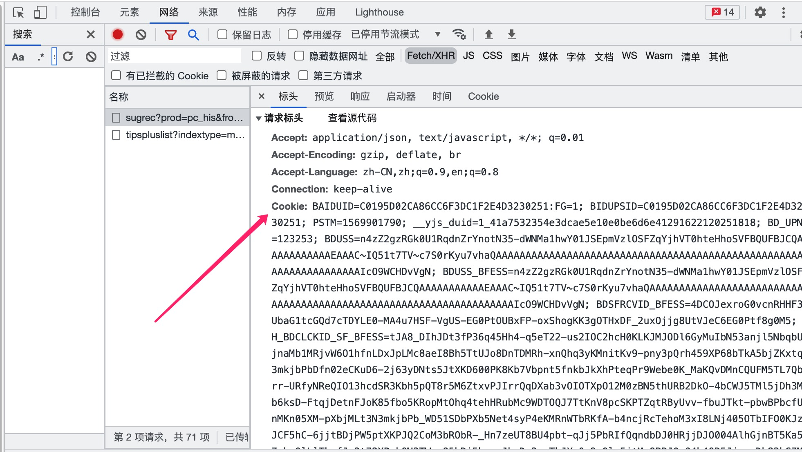

Html5 的客户端存储方案可分为 Cookies、Web Storage(包括 SessionStorage、LocalStorage)、IndexedDB,其中 IndexedDB 是一个基于 JavaScript 的面向对象事务型数据库,IndexedDB 支持存储和检索用键索引的对象,可以存储结构化克隆算法支持的任何对象。

### Cookies

Cookie 是一段不超过 4KB 的小型文本数据,通常用于记录身份授权信息和分析用户行为。Cookie 由一个名称（Name）、一个值（Value）和其它几个用于控制 Cookie 有效期、安全性、使用范围的可选属性组成。每次发送 Http 都会携带 Cookie 发送至服务器端,因此使用 Cookie 会导致降低性能,推荐使用 Web Storage 存储。Cookie 由一系列的 key/value 对组成,形式为 `<cookie-name>=<cookie-value>`,名称/值对之间用分号和空格隔开,Cookie 支持指令如下:
|指令名|作用|例子|
|-|-|-|
|`<cookie-name>=<cookie-value>`|`<cookie-name>=<cookie-value>`是一组键值对,由 cookie 名称与对应值组成,cookie name 是除了控制字符 (CTLs)、空格 (spaces) 或制表符 (tab)之外的任务字符,且同步不能包含`( )` `<` `>` `@` `,` `;` `:` `\` `"` `/` `[ ]` `?` `=` `{ }`分割字符。cookie-value 是可选的,如果传递,则需要包含在双引号里面|`"id=a3fWa;"`、`"id=a3fWa;name=haha;"`|
|`Expires=<date>`|**cookie 的最长有效期时间(可选),其值是一个符合 HTTP-date 规范的时间戳。如果未设置该属性,则表示当前 cookie 是一个会话期 cookie,一个会话结束于客户端被关闭时,这意味着会话期 cookie 在彼时会被移除**。|`id=a3fWa; Expires=Wed, 21 Oct 2015 07:28:00 GMT`|
|`Max-Age=<non-zero-digit>`|**cookie 有效期的秒数(可选)。设置 Max-Age 表示当前是一个持久性 cookie,持久化 Cookie 不会在客户端关闭时失效,而是在特定的日期(Expires)或者经过一段特定的时间之后(Max-Age)才会失效。秒数为 0 或 -1 将会使 cookie 直接过期(cookie 的有效时间默认为-1),同时设置 Expires 和 Max-Age,则 Max-Age 优先级更高。**|`id=a3fWa;Max-Age=3600`|
|`Domain=<domain-value>`|指定 cookie 可以送达的主机名(可选)。假如没有指定,那么默认值为当前文档访问地址中的主机部分(但是不包含子域名)。与之前的规范不同的是,域名之前的点号会被忽略。假如指定了域名,那么相当于各个子域名也包含在内了。|`id=a3fWa;Domain=localhost`|
|`Path`|指定一个 URL 路径(可选),该路径必须出现在要请求的资源的路径中才可以发送 Cookie 首部。字符 %x2F ("/") 可以解释为文件目录分隔符,此目录的下级目录也满足匹配的条件(例如,如果 path=/docs,那么 "/docs", "/docs/Web/" 或者 "/docs/Web/HTTP" 都满足匹配的条件)。|`id=a3fWa;Path=/docs`|
|`Secure`|可选,一个带有安全属性的 cookie 只有在请求使用 SSL 和 HTTPS 协议的时候才会被发送到服务器。然而,保密或敏感信息永远不要在 HTTP cookie 中存储或传输，因为整个机制从本质上来说都是不安全的，比如前述协议并不意味着所有的信息都是经过加密的。|`id=a3fWa;Secure`|
|`HttpOnly`|设置了 HttpOnly 属性的 cookie 不能使用 JavaScript 经由 Document.cookie 属性、XMLHttpRequest 和 Request APIs 进行访问,以防范跨站脚本攻击(XSS)。|`id=a3fWa;HttpOnly`|
|`SameSite=Strict`和`SameSite=Lax`|允许服务器设定一则 cookie 不随着跨域请求一起发送,这样可以在一定程度上防范跨站请求伪造攻击(CSRF)。SameSite 它是响应头 Set-Cookie 的属性之一,用于声明当前 Cookie 是否允许在第一方或同一个站点使用 HTTP。<br> SameSite 包含如下三个值: <br> **Lax(默认值)**:Cookies 允许与顶级导航器一起发送,并与中网站一起发送浏览器请求。 <br> **Strict**:表示开启严格模式,Cookie 的恶意,不会与第一方网站的请求一起发送。<br> **None** :Cookie 将允许在所有时间中发送,即跨域发送。由于容易遭受请求伪造攻击(CSRF),所以浏览器将 Lax 作为默认值。|`id=a3fWa;SameSite=Lax`、`id=a3fWa;SameSite=Strict`|

每次发起 Http 请求都会在请求头携带 Cookie,以`www.baidu.com`为例,如下图:



#### js 操作 Cookie

```ts
type SameSiteValue = 'None' | 'Lax' | 'Strict'
interface CookieOption {
  // cookie名称
  name: string
  // cookie值
  value: string
  // 最长有效期
  expires?: Date
  // 有效期秒数
  maxAge?: number
  // 指定需要发送cookie的请求path
  path?: string
  // cookie安全策略,只有使用 SSL 和 HTTPS 协议才会发送cookie
  secure?: boolean
  // cookie安全策略,配置HttpOnly将不会向服务器发送cookie
  httpOnly?: boolean
  // cookie安全策略
  sameSite?: SameSiteValue
}

class CookiePlus {
  constructor(option?: CookieOption) {
    this.option = option || {}
  }
  static set() {}
  static del(name: string) {}
  static change() {}
  static get(name: string) {}
  static clear() {}
}
```

#### CookieStore

CookieStore API 提供了以异步方式获取和设置 cookie 的方法,但兼容较差,推荐使用第三方 cookie 工具库。

- cookieStore.set(name,value):使用指定名称和值设置 cookie。返回一个 Undefiend 类型的 Promise,设置 cookie 失败则会抛出 TypeError,如果源未序列化为 URL 则抛出 DOMException SecurityError。
- cookieStore.set(options):根据配置对象设置 cookie。
- cookieStore.get(name):根据 cookie 名称获取单个 cookie。若获取成功返回一个 Cookie 类型 的 Promise,该 Cookie 具有 cookieStore.set(options)中 options 一样的属性。
- cookieStore.get(options):根据 options 选项获取单个 cookie。
- cookieStore.getAll(name):根据 cookie 名称获取与之匹配的 cookie 列表,name 可选,不传递参数将返回当前上下文的所有 cookie。
- cookieStore.getAll(options):根据配置项获取与之匹配的 cookie 列表,name 可选,不传递参数将返回当前上下文的所有 cookie。

```js
/* cookieStore.set() */
// 方式1:接收name和value
cookieStore
  .set('cookie01', 'haha')
  .then((data) => {
    console.log(data) // undefined
  })
  .catch((err) => console.log(err))

// 方式2:接收一个配置对象
cookieStore.set({
  // cookie 名称
  name: 'cookie02',
  // cookie 名称对应值
  value: 'hehe',
  // 过期时间(可选,单位为毫秒)
  expires: Date.now() + 24 * 60 * 60 * 1000,
  // 包含 cookie 的域
  domain: 'example.com',
  // 包含 cookie 的路径
  path: '/',
})

/* cookieStore.get()  */
// 方式1:根据name获取cookie
cookieStore
  .get('cookie01')
  .then((cookie) => {
    const { domain, expires, name, path, sameSite, secure, value } = cookie
    console.log('cookie value:', value) // cookie value:haha
  })
  .catch((err) => console.log(err))

// 方式2:根据配置对象获取cookie,配置对象包含cookie name和url两个属性
cookieStore.get({ name: '123', url: '/' }).then((cookie) => {
  const { domain, expires, name, path, sameSite, secure, value } = cookie
  console.log('cookie value:', value) // cookie value:hehe
})

/* cookieStore.getAll() */
```

#### Cookie、Session、JWT 介绍

Cookie、Session、JWT 三者都是应用在 web 中对 http 无状态协议的补充,达到状态保持的目的。

- Cookie:cookie 中的信息是以键值对的形式储存在浏览器中,而且在浏览器中可以直接看到数据。但缺点是存储大小有限制、安全性有问题且容易遭受攻击。
- Session:Session 是服务器端的存储方案,用于存储服务器端的会话信息(现在一般很少用 Session)。使用 Session 的流程大致如下:客户端发起登录或认证授权请求成功后,服务器端保存登录或认证授权信息,然后响应一个 Cookie 存储在客户端,Cookie 的 key 是 session_id,之后每次请求服务器通过 session_id 可以获取对应的 Session 信息。
- JWT:JWT 是 Json Web Token 的简称,由服务器产生加密的 json,JWT 由 header，payload 和 signature 三部分组成。header 中通常来说由 token 的生成算法和类型组成;payload 中则用来保存相关的状态信息;signature 部分由 header,payload,secret_key 三部分加密生成。 注意:不要在 JWT 的 payload 或 header 中放置敏感信息,除非它们是加密的。

### Web Storage

Web Storage 包括 SeesionStorage 与 LocalStorage,它们具有一样的 API,除了生命周期不同外,它们都可以用于存储不超过 5MB 大小的文本数据,存储引用类型的数据时需要使用`JSON.stringify()`对数据进行序列化转为字符串,获取引用数据时需要使用`JSON.parse()`对其解析。

- SessionStorage:SessionStorage 用于将数据保存到 session 对象中,sessionStorage 的生命周期是在仅在当前会话下有效,sessionStorage 引入了一个"浏览器窗口"的概念,SessionStorage 是在同源的窗口中始终存在的数据。只要这个浏览器窗口没有关闭,即使刷新页面或者进入同源另一个页面,数据依然存在。但是 sessionStorage 在关闭了浏览器窗口后就会被销毁。同时独立的打开同一个窗口同一个页面,sessionStorage 也是不一样的。sessionStorage 中的数据属于临时性数据,关闭浏览器窗口后就会被销毁。

- LocalStorage:LocaStorage 的生命周期是永久的,即使关闭浏览器或窗口后数据仍会存在,除非主动删除 localStorage 的数据,否则 localStorage 将永远存在。

```js
// SessionStorage和LocalStorage具有一样的API

// 存储数据
localStorage.setItem('name', 'z乘风')
const user = { name: 'z乘风', age: 20 }
// SessionStorage和LocalStorage只能存储文本类型的数据,存储引用类型的数据需要使用JSON.stringify()转为字符串
localStorage.setItem('user', JSON.stringify(user))

// 获取数据,使用JSON.parse()将引用数据转为JSON对象
JSON.parse(localStorage.getItem('name')) // { name: "z乘风", age: 20 }

// 删除数据
localStorage.removeItem('name')

// 获取localStorage存储数据的数量
console.log(localStorage.length) // 1

// 清除所有数据
localStorage.clear()
```

#### Cookie、SeesionStorage、LocalStorage 的区别

Cookie、SeesionStorage、LocalStorage 三者均可以存储客户端数据,其区别如下:

- 从存储容量来看:Cookie 最大存储容量是 4KB,而 SeesionStorage、LocalStorage 存储容量是 5MB,SeesionStorage、LocalStorage 存储容量大于 Cookie。
- 从生命周期来看:Cookie 存储数据可以设置有效期(expire),当存储数据过期时就会被删除;SessionStorage 存储是临时性的,SessionStorage 的生命周期是在仅在当前会话下有效,当关闭浏览器存储的数据就会全部被清除;LocalStorage 存储的数据是永久性的,若非手动清理,则一直存在浏览器中。
- 从安全性来看:由于每次发送 Http 都会在请求头中携带 Cookie,所以 cookie 会占据一定的带宽,导致降低性能,而且容易被获取和篡改的风险,容易发生 CSRF 攻击。localStorage 和 sessionStorage 都保存在客户端,Http 不会携带 localStorage 和 sessionStorage 存储的数据,相比较 Cookie 来说性能更高,也更安全。

### 客户端存储实践

存储实践可以分为命名规范、过期时间、存储数据加密三个方面。在多项目多环境中存储数据有可能会造成相同的存储名称,导致存储数据被覆盖,为了区分多项目多环境推荐以`项目名`+`当前环境`+`存储名`,例如:`FLYBIRD_ADMIN__DEV__NAME`。为了存储的安全性通过会为存储名设置失效时间(expire)及存储数据加密,可以通过`crypto-js`的`encrypt`和`decrypyt`API 对存储数据进行加解密。

```ts
// 封装LocalStorage
import CryptoJS from 'crypto-js'
function useStorage(mode?: string) {
  const storage = mode === 'session' ? sessionStorage : localStorage

  return {
    set(name: string, value: string, expire?: number) {
      // 以存储name为秘钥使用AES加密得到密文
      const ciphertext = CryptoJS.AES.encrypt(JSON.stringify(value), name).toString()
      // 默认过期时间为1天
      expire = expire || Date.now() + 1000 * 60 * 60 * 24
      storage.setItem(name, JSON.stringify({ ciphertext, expire }))
      return ciphertext
    },
    get(name: string) {
      const data = JSON.parse(storage.getItem(name)!)
      if (!data) return
      const { expire, ciphertext } = data

      if (expire && Date.now() > expire) {
        // 判断是否过期,如果过期则删除
        storage.removeItem(name)
        return
      }
      // 根据密文和秘钥解密
      const bytes = CryptoJS.AES.decrypt(ciphertext, name)
      return JSON.parse(bytes.toString(CryptoJS.enc.Utf8))
    },
    has(name: string) {
      return Boolean(storage.getItem(name))
    },
    del(name: string) {
      storage.removeItem(name)
    },
    clear() {
      storage.clear()
    },
    len() {
      return storage.length
    },
  }
}

const { set, get, has, del, clear, len } = useStorage()
console.log(set('name', 'z乘风')) // U2FsdGVkX19znT2zCvOdG86EWSPmNQtEeP7qBm4S9NM=
set('user', JSON.stringify({ name: 'z乘风', age: 20 }))
set('age', '20', 1)
console.log(get('name')) // "z乘风"
console.log('user:', get('user'))
console.log(len()) // 3
console.log(get('age')) // undefined
del('name')
console.log(len()) // 1
console.log(has('user')) // true
clear()
console.log(len()) // 0
```
