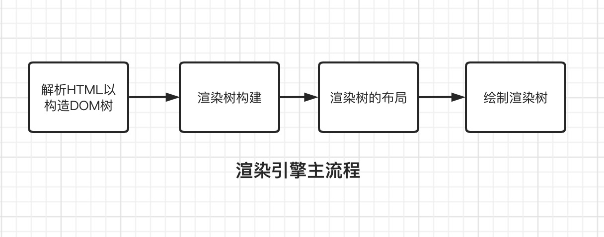
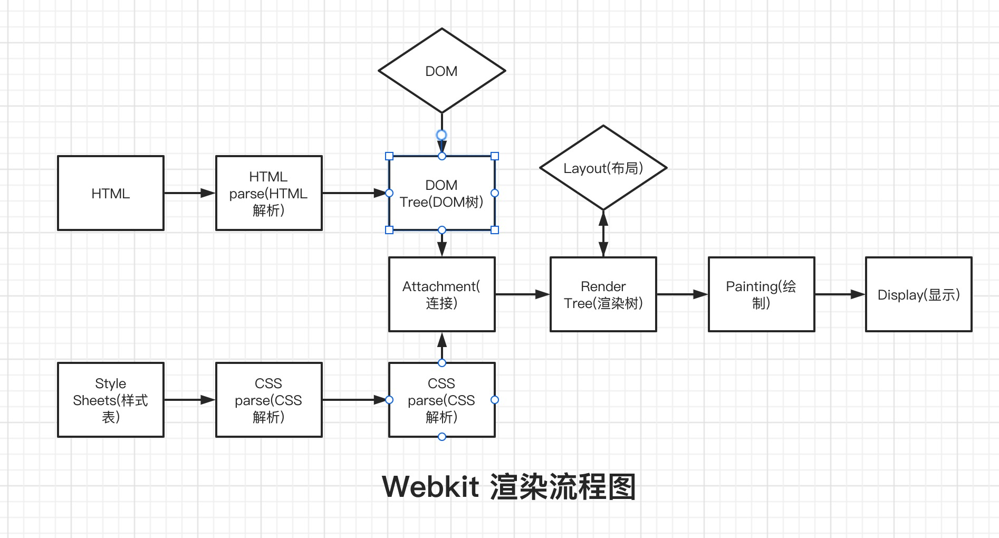

浏览器是现代应用最广的软件,本章将介绍浏览器的组成及浏览器渲染引擎的工作流程,还有"向浏览器地址栏输入一串网址整个过程"大名鼎鼎的面试题。下面介绍了常用的浏览器及其渲染引擎:

| 浏览器  | 渲染引擎     | 描述                                                                                                                                                                                          |
| ------- | ------------ | --------------------------------------------------------------------------------------------------------------------------------------------------------------------------------------------- |
| Chrome  | WebKit/Blink | Blink 是谷歌开发渲染引擎,Blink 由 WebKit 的分支演化而来。                                                                                                                                     |
| Safari  | Webkit       | Webkit 是苹果公司自主研发的内核,Webkit 引擎包含渲染引擎 WebCore 和 javascript 引擎 JSCore,均是从 KDE 的 KHTML 及 KJS 引擎衍生而来。                                                           |
| Firefox | Gecko        | Netscape6 开始采用的内核,后来的 Mozilla FireFox(火狐浏览器)也采用了该内核                                                                                                                     |
| IE      | Trident      | Trident 内核程序在 1997 年的 IE4 中首次被采用,是微软在 Mosaic 代码的基础之上修改而来的,并沿用到 IE11,也被普遍称作"IE 内核",因为要处理 IE 兼容性问题,所以大家都很讨厌 IE                       |
| Opera   | Presto       | Presto 是一个由 Opera Software 开发的浏览器排版引擎,供 Opera 7.0 及以上使用。该款引擎的特点就是渲染速度的优化达到了极致,也是目前公认网页浏览速度最快的浏览器内核,然而代价是牺牲了网页的兼容性 |

### 浏览器的组成

浏览器的主要功能就是向服务器发出请求,在浏览器窗口中展示所需的网络资源,这里所说的资源一般是指 HTML 文档,也可以是 PDF、图片或其他的类型。资源的位置由用户使用 URI(统一资源标示符)指定。浏览器解释并显示 HTML 文件的方式是在 HTML 和 CSS 规范中指定的,这些规范由网络标准化组织 W3C（万维网联盟）进行维护,但不同浏览器并未完全遵循 W3C 规范,这导致了开发人员经常要处理兼容性问题。浏览器在 1.1 版本组成部分如下:

- **用户界面**:包括地址栏、前进/后退按钮、书签菜单等。除了浏览器主窗口显示的请求的页面外,其他显示的各个部分都属于用户界面。
- **浏览器引擎**:在用户界面和呈现引擎之间传送指令。
- **渲染引擎**:负责显示请求的内容。如果请求的内容是 HTML,它就负责解析 HTML 和 CSS 内容,并将解析后的内容显示在屏幕上。渲染引擎和 JS 执行引擎被称作浏览器内核。渲染可以简单理解为在浏览器上画画,HTML 内容表示要在浏览器画什么结构,CSS 内容表示要为某些结构进行装饰。
- **网络**:用于网络调用,比如 HTTP 请求。其接口与平台无关,并为所有平台提供底层实现。
- **用户界面后端**:用于绘制基本的窗口小部件,比如组合框和窗口。其公开了与平台无关的通用接口,而在底层使用操作系统的用户界面方法。
- **JavaScript 执行引擎**:也叫 JavaScript 解释器,用于解析和执行 JavaScript 代码。
- **数据存储**:这是持久层。浏览器需要在硬盘上保存各种数据,例如 Cookie。新的 HTML 规范 (HTML5) 定义了“网络数据库”,这是一个完整(但是轻量级)的浏览器内数据库。

接下来将会围绕 Gecko、Webkit 这两款渲染引擎的工作流程进行深入研究。

### 渲染引擎的执行流程

- 渲染引擎首先会解析 HTML 内容并逐个标记内容转换为 DOM 节点生成 DOM 树(DOM Tree),同时也会解析外部 CSS 样式以及 DOM 元素上的 CSS 样式,生成样式规则树(style rules), DOM 树和样式规则树创建完毕后会连接起来创建渲染树(render tree)。渲染树包含多个带有视觉属性(如颜色和尺寸)的矩形,这些矩形的排列顺序就是它们将在屏幕上显示的顺序。
- 渲染树创建完毕后,就会进入布局(Layout)处理阶段,也就是为每个节点分配一个应出现在屏幕上的确切坐标。
- 布局阶段完成后,就会进入绘制(Painting)阶段,渲染引擎会遍历渲染树,由用户界面后端层将每个节点在屏幕上绘制出来。

  注意:渲染引擎的渲染一个渐进的过程,为达到更好的用户体验,渲染引擎会力求尽快将内容显示在屏幕上。渲染引擎不必等到整个 HTML 文档解析完毕之后,就会开始构建呈现树和设置布局。在不断接收和处理来自网络的其余内容的同时,呈现引擎会将部分内容解析并显示出来。
  
