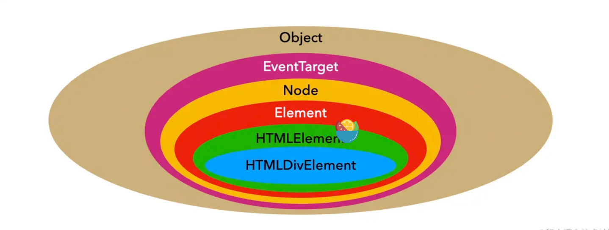

DOM 是 Document Object Model 的简称,中文译为文档对象模型,浏览器在渲染页面时会通过创建 CSS 样式和 DOM 树来展示 UI 界面。DOM 定义了访问和操作 HTML 文档的标准方法。

## 1.获取元素(element)的 八种方式

| 方式                                           | 描述                                   |
| ---------------------------------------------- | -------------------------------------- |
| document.getElementById(idSelector)            | 根据 id 选择器获取一个元素(Element)    |
| document.getElementBysClassName(classSelector) | 根据 class 选择器获取一组元素(Element) |
| document.getElementsByName(nameAttr)           | 根据 name 属性获取一组元素(Element)    |
| document.getElementsByTagName(tagName)         | 根据标签名获取一组元素(Element)        |
| document.querySelector(selector)               | 根据选择器获取一个元素(Element)        |
| document.querySelectorAll(selector)            | 根据选项器获取一组元素(Element)        |
| document.documentElement()                     | 获取 html 标签元素(Element)            |
| document.body                                  | 获取 body 标签元素(Element)            |

在 DOM 中通常操作 Element(元素)进行行为控制,Element 继承自 Node 类,Element 一定是 Node,但 Node 不一定是 Element,Element 与 Node 的关系图如下:


### 1.1 document.getElementById()

document.getElementById(idSelector):可以根据 id 选择器获取一个元素。

```html
<div id="root"></div>

<script>
  const root = document.getElementById("root");
  console.log(root); // <div id="root"></div>;
</script>
```

### 1.2 dcoument.getElementBysClassName()

document.getElementBysClassName(classSelector):可以根据 class 选择器获取一组元素。

```html
<!-- dom结构 -->
<div>
  <div class="div">1</div>
  <div class="div">2</div>
</div>

<script>
  // 返回一个DOM元素数组,这是一个类数组,可以通过Array.from()转为数组
  const divArr = document.getElementsByClassName("div");
  console.log(divArr); // HTMLCollection(2) [div.div, div.div]
</script>
```

### 1.3 document.getElementsByName()

document.getElementsByName(nameAttr):根据元素的 name 属性值获取一组 DOM 元素。

```html
<!-- dom结构 -->
<div>
  <p name="section">1</p>
  <p name="section">2</p>
</div>

<!-- js -->
<script>
  const pArr = document.getElementsByName("section");
  console.log(pArr); // HTMLCollection(2)[(p, p)];
</script>
```

### 1.4 document.getElementsByTagName()

document.getElementsByTagName(tagName):根据元素标签名称获取一组 DOM 元素。

```html
<!-- dom结构 -->
<div>
  <p>1</p>
  <p>2</p>
</div>
<script>
  const pArr = document.getElementsByTagName("p");
  console.log(pArr); // HTMLCollection(2)[(p, p)];
</script>
```

### 1.5 document.querySelector()与 document.querySelectorAll()

document.querySelector(selector):可以根据选择器获取一个元素。document.querySelectorAll(selector):可以根据选项器获取一组元素。

```html
<!-- dom结构 -->
<div>
  <div id="root">0</div>
  <div class="div">1</div>
  <div class="div">2</div>
</div>

<script>
  /* querySelector()只能获取单个元素,如要获取多个元素可使用querySelectorAll() */

  // 根据id选择器获取元素
  const root = document.querySelector("#root");
  console.log(root); // <div id="root">0</div>

  // 根据class选择器获取元素 const div = document.querySelector(".div");
  console.log(div); // <div class="div">1</div>

  const rootArr = document.querySelectorAll("#root");
  console.log(rootArr); // NodeList [div#root]

  const divRoot = document.querySelectorAll(".div");
  console.log(divRoot); // NodeList(2) [div.div, div.div]
</script>
```

### 1.6 document.documentElement 和 document.body

document.documentElement 用于获取 html 标签。document.body 用于获取 body 标签。

```js
console.log(document.body); // <body>...</body>
console.log(document.documentElement); // <html>...</html>
```

## 2.Element 的属性与方法

## DOM 提供的五种 Observer

### MutationObserver

MutationObserver(变异观察者)接口提供了用于监视 DOM 树发生变化的功能,它旨在替代旧的 Mutation Events 功能,该功能是 DOM3 事件规范的一部分。

MutationObserver 相较于 Mutation Events 性能要更好,Mutation Events 是同步执行的,它的每次调用,都需要从事件队列中取出事件并执行,然后从事件队列中移除该事件,期间需要移动队列元素。如果事件触发的较为频繁的话,每一次都需要执行以上这些步骤,那么会严重影响执行效率。而 MutationObserver 所有监听操作以及相应处理都是在其他脚本执行完成之后异步执行的,并且是所有变动触发之后,将变化记录在数组中,然后再统一进行回调。也就是说,使用 observer 监听多个 DOM 变化时,并且这若干个 DOM 发生了变化,那么 observer 会将变化记录到变化数组中,等待一起都结束了,然后一次性的从变化数组中执行其对应的回调函数。

#### MutationObserver 的应用场景:

- 监听水印组件是否被去除。水印是作为一种知识产权保护手段,某种情况破解者可能会设置水印 display 或 opacity 等手段来达到去除水印的效果,通过 MutationObserver 监听水印组件变化,一旦水印节点发生变化就重新生成一个新的水印节点,以此来防篡改水印。
- 监听图片 src 长度或监听元素属性。一旦图片的 src 的长度或 dom 属性个数超过某个阈值则记录优化。

#### MutationObserver 介绍

- new MutationObserver(callback):MutationObserver 构造函数返回一个 MutationObserver 实例,MutationObserver 构造函数接收一个回调函数,当 MutationObserver 观察的 DOM 发生变化时就会调用回调函数,该回调函数接收一组 MutationRecord 对象(用于描述每个 DOM 发生的变化)和一个 MutationObserver 对象。
- observe(node, options):observe 用于观察 node,node 表示被观察 DOM 树中的一个 Node(可能是 Element),或者作为要被观察 Node 的子树的根节点。options 是一个可选的 MutationObserverInit 对象,该配置项描述了 DOM 的哪些变化应该提供给当前观察者的 callback,包含如下配置:
  - attributeFilter:要监视的特定属性名称的数组。如果未包含此属性,则对所有属性的更改都会触发变动通知。无默认值。
  - attributeOldValue:当监视节点的属性改动时,将此属性设为 true 将记录任何有改动的属性的上一个值。无默认值。
  - attributes:设为 true 以观察受监视元素的属性值变更。默认值为 false。
  - characterData:设为 true 以监视指定目标节点或子节点树中节点所包含的字符数据的变化。无默认值。
  - characterDataOldValue:设为 true 以在文本在受监视节点上发生更改时记录节点文本的先前值。无默认值。
  - childList:设为 true 以监视目标节点（如果 subtree 为 true，则包含子孙节点）添加或删除新的子节点。默认值为 false。
  - subtree:设为 true 以将监视范围扩展至目标节点整个节点树中的所有节点。MutationObserverInit 的其他值也会作用于此子树下的所有节点，而不仅仅只作用于目标节点。默认值为 false。
- disconnect():用于告诉 MutationObserver 停止观察 DOM 变化。可以重新调用 observe()来观察 DOM 发生的变化。
- takeRecords():返回已检测到但尚未由观察者的回调函数处理的所有匹配 DOM 更改的列表,使变更队列保持为空。 此方法最常见的使用场景是在断开观察者之前立即获取所有未处理的更改记录,以便在停止观察者时可以处理任何未处理的更改。

```html
<ul>
  <li>0</li>
</ul>
<button class="add">add</button>
<button class="addAttr">addAttr</button>
<button class="stop">stop observe</button>
<button class="start">start observe</button>
<button class="getMutations">getMutations</button>

<script>
  function randomStr() {
    return Math.random().toString(36).slice(2);
  }

  window.onload = () => {
    /**
     * 通过MutationObserver()构造函数创建一个MutationObserver实例,MutationObserver构造函数
     * 接收一个回调函数,当观察的DOM发生变化时就会执行该函数,回调函数接收一组一组 MutationRecord
     * 对象(用于描述每个 DOM 发生的变化)和一个 MutationObserver 对象。
     */
    const observer = new MutationObserver((mutationList, observer) => {
      mutationList.forEach((item) => {
        /**
         * type:DOM变化的类型,如果是属性变化,则返回 "attributes",如果是 characterData 节点变化,
         * 则返回 "characterData",如果是子节点树 childList 变化,则返回 "childList"。
         * target:发生变化的目标DOM节点。
         * addedNodes:返回被添加的节点,如果没有被添加的节点,则是一个空数组。
         * removedNodes:返回被删除的节点,如果没有被删除的节点,则是一个空数组。
         * previousSibling:返回被添加或移除的节点之前的兄弟节点,或者 null。
         * nextSibling:返回被添加或移除的节点之后的兄弟节点,或者 null。
         * attributeName:返回被修改的属性的属性名,或者 null。
         * attributeNamespace:返回被修改属性的命名空间，或者 null。
         * oldValue:返回值取决于 MutationRecord.type。对于属性 attributes 变化,
         * 返回变化之前的属性值。对于 characterData 变化，返回变化之前的数据。
         * 对于子节点树 childList 变化，返回 null。
         */
        const {
          type,
          target,
          addedNodes,
          removedNodes,
          previousSibling,
          nextSibling,
          attributeName,
          attributeNamespace,
          oldValue,
        } = item;
        console.log(type);
        console.log(target);
        console.log(addedNodes);
        console.log(removedNodes);
        console.log(previousSibling);
        console.log(nextSibling);
        console.log(attributeName);
        console.log(attributeNamespace);
        console.log(oldValue);
      });
    });
    const observeOptions = {
      /**
       * 是否观察指定DOM树下所有节点,默认为false
       */
      subtree: true,
      /**
       * 是否观察添加或删除子节点,默认为false
       */
      childList: true,
      /**
       * 是否观察DOM元素属性发生变化,默认为false
       */
      attributes: true,
    };

    const $ = (selector) => document.querySelector(selector);

    // 观察document.body节点发生变化
    observer.observe(document.body, observeOptions);
    const ul = $("ul"),
      addBtn = $(".add"),
      addAttrBtn = $(".addAttr"),
      stopBtn = $(".stop"),
      startBtn = $(".start"),
      getBtn = $(".getMutations");

    function addElement() {
      const li = document.createElement("li");
      li.innerText = "item_" + randomStr();
      ul.appendChild(li);
    }
    function addAttribute() {
      const li = document.querySelectorAll("li")[0];
      li.setAttribute("style", "color:red;font-size:20px;");
    }

    // takeRecords()例子
    function getMutations() {
      for (let i = 0; i < 10; i++) {
        setTimeout(() => {
          addElement();
          // 返回已检测到但尚未由观察者的回调函数处理的所有匹配DOM更改的列表
          console.log(observer.takeRecords());
        }, 300);
      }
    }

    // 添加元素
    addBtn.onclick = addElement;
    // 添加属性
    addAttrBtn.onclick = addAttribute;
    // 停止观察,停止观察后即使被观察的DOM发生变化,也不会执行MutationObserver回调函数
    stopBtn.onclick = () => observer.disconnect();
    // 重新观察
    startBtn.onclick = () => observer.observe(document.body, observeOptions);
    // 获取未被回调函数处理的DOM更改的列表
    getBtn.onclick = getMutations;
  };
</script>
```

### ResizeObserver

ResizeObserver 接口可以监听到 Element 的内容区域或 SVGElement 的边界框改变,内容区域则需要减去内边距 padding。ResizeObserver 避免了在自身回调中调整大小，从而触发的无限回调和循环依赖。它仅通过在后续帧中处理 DOM 中更深层次的元素来实现这一点。如果（浏览器）遵循规范,只会在绘制前或布局后触发调用。

- new ResizeObserver(callback):ResizeObserver 构造函数用于创建一个 ResizeObserver 实例,ResizeObserver 构造函数接收一个回调函数,当观察元素尺寸发生变化时执行该回调函数,该回调函数接收一个一组 ResizeObserverEntry(描述 DOM 元素尺寸变化信息)。
- disconnect():停止和取消目标对象上所有对 Element 或 SVGElement 的监听。
- observe(target,options):用于观察 Element 或 SVGElement 尺寸变化。target 表示被观察的 Element 或 SVGElement。options 表示一个指定观察设置的可选参数对象,options 只包含 box 一个配置项,box 表示设置观察者将以哪种盒子模型来观察变动。可以设置的值为 content-box (默认值),border-box 和 device-pixel-content-box。
- unobserve(target):方法用于结束一个指定的 Element 或 SVGElement 的观察。

```html
<div class="container">
  <div class="child"></div>
</div>
<button class="change">change size</button>
<button class="changeChild">change child size</button>
<button class="stop">stop all observer</button>
<button class="end">end observer container</button>
<style>
  .container {
    width: 100px;
    height: 100px;
    border-radius: 4px;
    background-color: #1890ff;
    margin: 20px auto;
    display: flex;
    align-items: center;
    justify-content: center;
  }
  .child {
    width: 50px;
    height: 50px;
    border-radius: 4px;
    background-color: red;
  }
</style>
<script>
  const $ = (selector) => document.querySelector(selector);
  const container = $(".container"),
    child = $(".child"),
    changeBtn = $(".change"),
    changeChildBtn = $(".changeChild"),
    stopBtn = $(".stop"),
    endBtn = $(".end");

  function callback(entries) {
    entries.forEach((item) => {
      /**
       * target:当前改变尺寸大小的元素的 Element 引用。
       * contentRect:对改变尺寸大小的元素的 DOMRectReadOnly引用,DOMRectReadOnly包含
       * x(原点的x坐标)、y(原点的y坐标)、width(元素的宽度)、height(元素的高度)、
       * top(返回DOMRect的顶部坐标值,通常是与y相同)、bottom(返回DOMRect的底部坐标值,通常是y+height)、
       * right(返回 DOMRect 的右坐标值,通常与 x + width 相同)、left(返回 DOMRect 的左坐标值,
       * 通常与 x​​​​​​​ 相同)。
       */
      const { target, contentRect } = item;
      console.log(target);
      console.log(contentRect);
    });
  }
  const observer = new ResizeObserver(callback);

  // 监听container元素尺寸变化
  observer.observe(container, { box: "content-box" });
  // 监听child元素尺寸变化
  observer.observe(child, { box: "content-box" });

  // 改变container元素尺寸
  changeBtn.onclick = () => {
    container.style.width = `${container.offsetWidth + 10}px`;
    container.style.height = `${container.offsetHeight + 10}px`;
  };
  // 改变container child元素尺寸
  changeChildBtn.onclick = () => {
    child.style.width = `${child.offsetWidth + 2}px`;
    child.style.height = `${child.offsetHeight + 2}px`;
  };

  stopBtn.onclick = () => {
    observer.disconnect();
  };

  endBtn.onclick = () => {
    observer.unobserve(container);
  };
</script>
```

### IntersectionObserver

IntersectionObserver 接口提供了一种异步观察目标元素与其祖先元素或顶级文档视窗(viewport)交叉状态的方法。祖先元素与视窗(viewport)被称为根(root)。当一个 IntersectionObserver 对象被创建时,其被配置为监听根中一段给定比例的可见区域。一旦 IntersectionObserver 被创建,则无法更改其配置,所以一个给定的观察者对象只能用来监听可见区域的特定变化值;然而,可以在同一个观察者对象中配置监听多个目标元素。

#### IntersectionObserver 应用场景

- 图片懒加载——当图片滚动到可见时才进行加载。
- 内容无限滚动——也就是用户滚动到接近内容底部时直接加载更多，而无需用户操作翻页，给用户一种网页可以无限滚动的错觉。
- 检测广告的曝光情况——为了计算广告收益，需要知道广告元素的曝光情况。
- 在用户看见某个区域时执行任务或播放动画。

#### IntersectionObserver 介绍

- new IntersectionObserver(callback(entries,observer),options):IntersectionObserver 构造函数接收一个回调函数和一个可选配置项并返回一个 IntersectionObserver 实例。当元素可见比例超过指定阈值后,就会执行 callback。entries 是一个 IntersectionObserverEntry 对象的数组,observer 表示被调用的 IntersectionObserver 实例。
  options 是一个可以用来配置 observer 实例的对象。如果 options 未指定,observer 实例默认使用文档视口作为 root，并且没有 margin,阈值为 0%(意味着即使一像素的改变都会触发回调函数)。options 包含如下属性:
  - root:监听元素的祖先元素 Element 对象，其边界盒将被视作视口。目标在根的可见区域的的任何不可见部分都会被视为不可见。
  - rootMargin:一个在计算交叉值时添加至根的边界盒(bounding_box (en-US))中的一组偏移量，类型为字符串(string) ，可以有效的缩小或扩大根的判定范围从而满足计算需要。语法大致和 CSS 中的 margin 属性等同; 可以参考 The root element and root margin in Intersection Observer API 来深入了解 margin 的工作原理及其语法。默认值是"0px 0px 0px 0px"。
  - threshold:规定了一个监听目标与边界盒交叉区域的比例值,可以是一个具体的数值或是一组 0.0 到 1.0 之间的数组。若指定值为 0.0,则意味着监听元素即使与根有 1px 交叉,此元素也会被视为可见;若指定值为 1.0,则意味着整个元素都在可见范围内时才算可见。
- root:获取当前 intersectionObserver 实例的根元素。
- rootMargin:一个字符串,形式与 CSS margin 属性相似,包含了一条或一组根边框盒边的偏移量。这些偏移量会被添加至根边界盒与目标元素边界的交叉区域之前。
- thresholds:一个相交阈值数组或一个相交阈值数值。
- disconnect():停止和取消目标对象上所有对 Element 的监听。
- observe(el):向 IntersectionObserver 对象监听的目标集合添加一个元素。
- takeRecords():返回一个 IntersectionObserverEntry 对象数组, 每个对象的目标元素都包含每次相交的信息,可以显式通过调用此方法或隐式地通过观察者的回调自动调用。
- unobserve():命令 IntersectionObserver 停止对一个元素的观察。

```html
<body>
  <div class="fixed">
    <button class="left-btn1">left scrollTo 0</button>
    <button class="left-btn2">left scrollTo 200px</button>
    <button class="right-btn1">right scrollTo 0</button>
    <button class="right-btn2">right scrollTo 200px</button>

    <button class="stop">stop all observer</button>
    <button class="end-left">end observer left</button>
    <button class="end-right">end observer right</button>
    <div class="title"></div>
  </div>
  <div class="container">
    <div class="left">
      <div class="left-box"></div>
    </div>
    <div class="right">
      <div class="right-box"></div>
    </div>
  </div>
</body>
<style>
  html,
  body {
    position: relative;
    overflow: hidden;
    width: 100%;
    height: 100%;
  }
  .fixed {
    position: fixed;
    width: 100%;
    top: 0;
  }
  .container {
    display: flex;
    justify-content: space-between;
    width: 100%;
    height: 100%;
  }
  .left,
  .right {
    flex: 1;
    height: 100%;
    overflow-y: scroll;
  }
  .left-box,
  .right-box {
    width: 100px;
    height: 100px;
    border-radius: 4px;
    background-color: #1890ff;
    margin: 20px auto;
    margin-top: 700px;
  }
  .right-box {
    background-color: red;
  }
</style>
<script>
  const $ = (selector) => document.querySelector(selector);
  const left = $(".left"),
    right = $(".left"),
    leftBox = $(".left-box"),
    rightBox = $(".right-box"),
    title = $(".title"),
    leftBtn1 = $(".left-btn1"),
    leftBtn2 = $(".left-btn2"),
    rightBtn1 = $(".right-btn1"),
    rightBtn2 = $(".right-btn2"),
    stopBtn = $(".stop"),
    endLeftBtn = $(".end-left"),
    endRightBtn = $(".end-right");

  function callback(entries, observer) {
    entries.forEach((item) => {
      /**
       * boundingClientRect:返回包含目标元素的边界信息的DOMRectReadOnly,
       * 边界的计算方式与Element.getBoundingClientRect()相同。
       * intersectionRatio:返回intersectionRect 与 boundingClientRect 的比例值。
       * intersectionRect:返回一个 DOMRectReadOnly 用来描述根和目标元素的相交区域。
       * isIntersecting:返回一个布尔值,如果目标元素与交叉区域观察者对象(intersection observer)的根相交,
       * 则返回 true .如果返回 true, 则 IntersectionObserverEntry
       * 描述了变换到交叉时的状态; 如果返回 false, 那么可以由此判断,变换是从交叉状态到非交叉状态。
       * rootBounds:返回一个 DOMRectReadOnly 用来描述交叉区域观察者(intersection observer)中的根。
       * target:与根出现相交区域改变的元素 (Element)。
       * time:返回一个记录从 IntersectionObserver 的时间原点(time origin)
       * 到交叉被触发的时间的时间戳(DOMHighResTimeStamp)。
       */
      const {
        boundingClientRect,
        intersectionRatio,
        intersectionRect,
        isIntersecting,
        rootBounds,
        target,
        time,
      } = item;
      console.log(item);
      if (isIntersecting) {
        const elName = Array.from(item.target.classList).join("");
        title.innerText = `${elName}是否与viewport相交:${isIntersecting}`;
        setTimeout(() => {
          const selector = `.${elName.substring(0, elName.indexOf("-"))}`;
          scrollToTop($(selector), 0);
        }, 1000);
      }
    });
  }
  const observer = new IntersectionObserver(callback);

  // 监听left-box和right-box元素是否与视窗相交
  observer.observe(leftBox);
  observer.observe(rightBox);

  const scrollToTop = (el, top) => {
    el.scrollTo({
      top,
      behavior: "smooth",
    });
  };

  leftBtn1.onclick = () => scrollToTop($(".left"), 0);
  leftBtn2.onclick = () => scrollToTop($(".left"), 300);
  rightBtn1.onclick = () => scrollToTop($(".right"), 0);
  rightBtn2.onclick = () => scrollToTop($(".right"), 300);

  stopBtn.onclick = () => {
    observer.disconnect();
  };
  endLeftBtn.onclick = () => observer.unobserve(leftBox);
  endRightBtn.onclick = () => observer.unobserve(rightBox);
</script>
```
