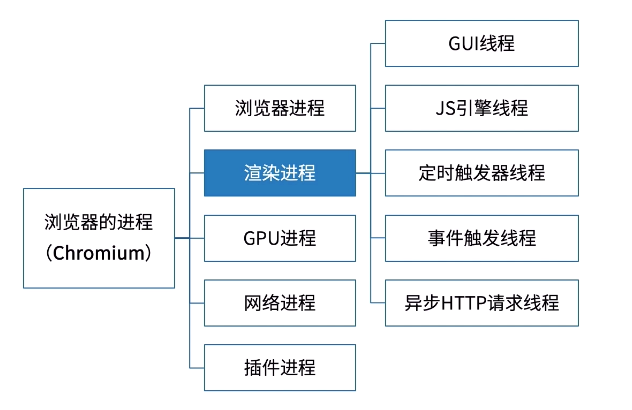
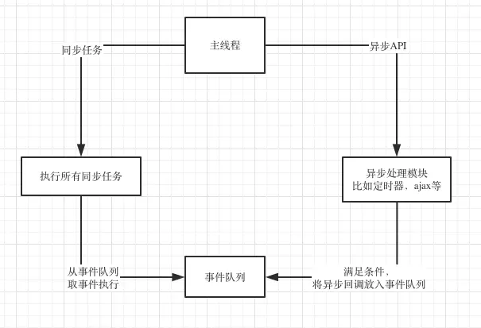
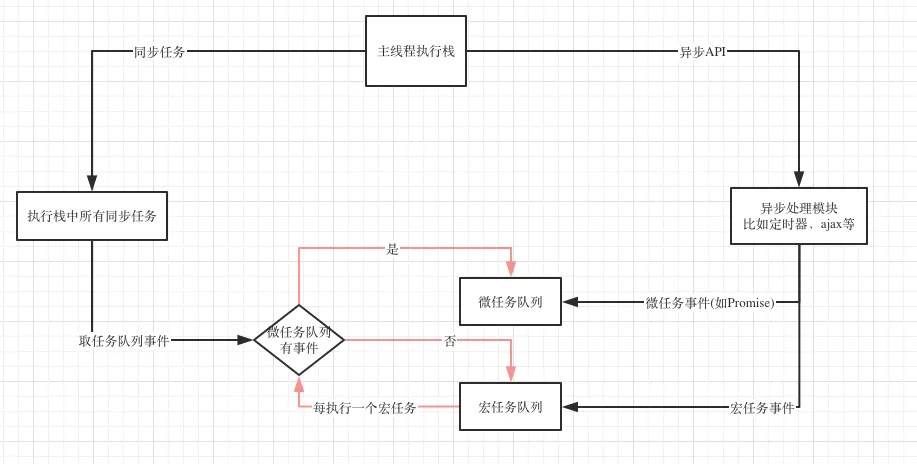

JavaScript 是一门异步非阻塞采用单线程模型的脚本语言,它不仅兼顾脚本语言的灵活性,其异步非阻塞的特性极大的提升了代码运行效率。JS 中的异步非阻塞特性是基于事件循环机制实现的,JS 执行代码时会将执行代码片段推入一个执行栈中,遵循先进后出原则,当代码片段执行完毕后就会从执行栈中弹出。

多线程是程序运行的最小调度单位,被称作轻量级进程,实现多线程架构具有充分利用 CPU 资源、便于程序建模等优点。但在 JS 诞生之日就采用了单线程模型,由于 JS 作为一门脚本语言,常用于 UI 交互、DOM 操作等场景,这决定了 JS 只能采用单线程,否则就会出现数据同步问题。即使 H5 提出了 web worker 标准,它有很多限制,受主线程控制,是 JS 主线程的子线程。如果采用多线程架构,当多个线程同时操作同一个 DOM,此时就无法区别以哪个线程操作为最终结果,这一现象被称为线程安全问题。解决线程安全的手段有锁机制、本地线程存储等同步机制,但这些操作会产生额外的开销,例如加锁、解锁、线程上下文的切换,这些都是比较耗时的操作。

JS 采用单线程也意味着无法充分利用 CPU 多核资源,其处理效率也不如多线程(某些情况下单线程比多线程效率更高,因为无需进行线程上下文切换,线程上下文切换是一个比较耗时的操作),JS 的优化是通过异步非阻塞机制提升程序执行效率。同步执行代码是指代码自上而下被执行,倘若上一行处理时间很久,就会阻塞下一行代码执行,这严重影响了程序的运行效率,而 JS 通过 Event Loop 异步执行代码,异步代码并不会阻塞其他代码执行故能大大提升程序运行效率。

## 1.同步与异步

**所谓同步即按照代码顺序执行代码片段,只有当前代码片段执行完毕后,才会执行下一个代码片段,所以同步会出现阻塞现象,简单来说同步就如同接力棒比赛,只有上一个任务执行完毕后,才会执行下一个任务,下一个任务必须等待上一个任务执行完毕,而这中间的等待过程会阻塞后续代码执行,从而影响执行效率。**

**所谓异步是指当前代码执行并不影响后续代码执行,中间无阻塞过程。当程序执行到异步代码时,会将该异步代码作为任务添加到任务队列,而非像同步代码直接推入主线程(一般以 main 来表示)的执行栈执行,等主线程执行栈执行为空时,再去任务队列中执行对应的异步任务**。在 JS 中异步处理的发展历史可分为回调函数、Promise、Generator、async/await 语法糖等几个阶段,由于回调函数嵌套过深时会产生回调地狱,所以目前最主流的异步处理方式是 Promise。

```js
console.log(1)
// setTimeout()是一个异步API
setTimeout(() => {
  console.log(3)
}, 0)
console.log(2)
```

上面例子打印`1 2 3`,可以通过[loupe](http://latentflip.com/loupe/?code=Y29uc29sZS5sb2coMSk7CnNldFRpbWVvdXQoZnVuY3Rpb24oKXsKICAgIGNvbnNvbGUsbG9nKDMpOwp9LDApOwpjb25zb2xlLmxvZygyKTs%3D!!!PGJ1dHRvbj5DbGljayBtZSE8L2J1dHRvbj4%3D)查看执行流程,解析如下:

- 执行`console.log(1)`时,此条代码入栈,执行完毕后打印`1`并出栈。
- 执行`setTimeout()`时入栈,由于`setTimeout()`是一个异步 API,延迟 0 毫秒后向任务队列添加匿名执行函数。
- 执行`console.log(2)`,此条代码添加至主线程执行栈,执行完毕后打印`2`并出栈。
- 由于主线程执行栈中为空,此时就会遍历执行任务队列中的任务,执行匿名函数入栈后打印`3`。

## 2.JS 实现异步原理

众所周知 JS 是单线程的,那单线程是如何实现异步的呢?事实上"JS 是单线程"并是指 JS 主运行线程只有一个,而不是整体环境是单线程。JS 的运行环境主要是浏览器，以 Chrome 内核为例,它不仅是多线程的,而且是多进程的。


Chrome 渲染进程包括 GUI 线程、JS 引擎线程、定时触发器线程、事件触发线程、异步 HTTP 请求线程,在浏览器中每个选项卡(Tab)都有独立的渲染进程,当打开的选项卡中出现崩溃或无响应时,表示该选项卡所对应的渲染进程可能就崩溃了,但并不会影响到其他选项卡页,所以这也是 Chrome 采用多进程架构的原因。

- **GUI 线程**:GUI 线程用于渲染页面。它可以解析 HTML 和 CSS,然后将它们构建成 DOM 树和渲染树。
- **JS 引擎线程**:此线程负责执行 JS 的主线程(一般称为 main),前面指的"js 单线程"就是这个线程。Chrome 的 V8 引擎就是在这个线程运行的。注意:此线程与 GUI 线程是互斥的。互斥的原因是 GUI 也可以操作 dom,如果 JS 线程和 GUI 线程同时操作 dom,那么会导致结果混乱,不知道到底渲染哪个结果。这带来的后果就是 JS 线程长时间运行,GUI 线程就不能运行,整个页面感觉卡死一样。
- **定时触发器线程**:例如`setTimeout`或`setInterval`就运行在此线程上,它跟 js 引擎线程不在同一个地方,所以"单线程的 js"能实现异步。
- **事件触发线程**:定时触发器线程其实只是一个计时的作用,它并不会真正执行时间到了的回调处理,真正执行这个回调是 JS 引擎线程(也就是 JS 主线程)。所以当时间到了后定时触发器线程会将这个回调事件传递给事件触发器线程,然后事件触发器线程将它添加到事件队列,最终 JS 主线程会从事件队列中取出并执行这个回调。事件触发器线程不仅可以将定时器触发线程放入事件队列,也可以将其他满足条件的事件放入任务队列。

- **异步 HTTP 请求线程**:此线程负责处理 ajax 请求,当请求处理后,它会通知事件触发线程,然后事件触发线程将事件放入事件队列,再交由 JS 主线程执行。

**JS 的异步实现是基于浏览器的多线程,当遇到异步 API 时,就将这个异步任务将由对应的线程处理,当这个异步 API 满足回调条件时,对应的线程通过事件触发器线程将事件放入事件队列,然后 JS 主线程从事件队列取出并执行。**

## 3.Event Loop

Event Loop 中文翻译是事件循环的意思,其实就是 JS 管理事件执行的一个流程,具体的处理情况根据运行环境而确定,浏览器环境和 Node 环境 EventLoop 处理也有所差异。

### 3.1 浏览器环境 Event Loop

事件循环是各个异步线程来通讯和协同的机制。各个线程为了交换信息,还有一个公用的数据区,此数据区被称为事件队列(遵循先进先出原则)。各个异步线程执行完毕后,通过事件触发线程将事件放入事件队列,JS 主线程每次处理完任务都会查看事件队列是否有事件,如果有事件就交由 JS 主线程执行,流程图如下:



流程大致如下:

- JS 主线程每次执行任务时,要先看看执行的任务是同步任务还是异步的 API。
- 如果是同步任务就顺序执行,直到执行结束。
- 如果是异步 API 就交给对应的异步线程,继续执行同步任务。
- 异步线程执行异步 API,执行结束后,会通过事件触发线程将异步回调事件放入事件队列。
- JS 主线程执行完同步任务后,会检查事件队列是否有任务。
- JS 主线程如果发现事件队列有事件,那么就执行该事件。
- 主线程不断循环上述流程,每一次循环操作被称为 tick,同一次 tick 中,微任务的执行优先级总是高于宏任务。

### 3.2 定时器不准的问题

Event Loop 执行过程中存在一些特殊的情况,最典型的问题就是总是先执行同步任务,然后再执行事件队列里面的回调,这个特性就直接影响了定时器的执行。

```js
const syncFunc = (startTime) => {
  const time = new Date().getTime()
  while (true) {
    if (new Date().getTime() - time > 5000) {
      break
    }
  }
  const offset = new Date().getTime() - startTime
  console.log(`syncFunc run, time offset: ${offset}`)
}

const asyncFunc = (startTime) => {
  setTimeout(() => {
    const offset = new Date().getTime() - startTime
    console.log(`asyncFunc run, time offset: ${offset}`)
  }, 2000)
}

const startTime = new Date().getTime()

asyncFunc(startTime)

syncFunc(startTime)

/*
 * 5s后打印 syncFunc run, time offset: ${offset}
 * 然后再打印asyncFunc run, time offset: ${offset}
 */
```

执行流程如下:

```js
(1).主线程执行同步代码。
(2).主线程遇到setTimeout,将它交给定时器线程。
(3).定时器线程开始计时,2s后通知事件触发线程。
(4).事件触发线程将定时器回调放入事件队列,异步流程到此结束。
(5).主线程如果有空,就将定时器回调拿出来执行,如果没空,定时器回调就一直放在事件队列里挂起。
```

在上面例子中由于`syncFunc()`执行时间长达 5s,`asyncFunc`在 2s 后进入了事件队列,但主线程一直在执行同步代码,一直没空,所以 5s 后执行同步代码完毕后,才会有机会执行定时器回调。当执行任务长时间占用主线程时,会影响定时器任务的执行的时机,所以编写任务时一定不要长时间占用主线程,可以将同步任务变为异步任务,或者将任务进行拆分为多个小任务。

### 3.3 Event Loop 任务分类

在 JS 中执行异步任务时会被添加到事件任务队列中,异步任务分为 **微任务(microTask)** 和 **宏任务(macroTask)** 两类以此来区分任务优先级,同一轮事件循环中,微任务的执行优先级总是高于宏任务。

宏任务分为:

- `script(整体代码)`。
- `setTimeout/setInterval`。
- `setImmediate(NodeJS)`。
- `postMessage`。
- `I/O`。
- UI 交互事件。

微任务分为:

- `Promise.then()`。
- `MutationObserver`。
- `Object.observe`。
- `process.nextTick(NodeJS)`。

执行异步任务时会根据任务事件类型将任务添加至宏任务队列或微任务队列,如果当前执行栈为空,则主线程优先查看微任务队列中是否存在任务,如果存在任务则依次执行微任务队列中的回调,直到微任务队列中所有任务执行完毕后,才会将宏任务队列中的任务逐个添加到执行栈中执行。如果微任务队列中不存在任务,则会将宏任务队列中的任务逐个添加到执行栈中执行。执行栈执行任务结束后会检查微任务队列中是否存在任务,若存在任务则优先处理微任务队列中的任务,然后再执行宏任务队列中的任务,所以在同一次事件循环中,微任务执行时机永远优于宏任务。



```js
// 注意
(1).一个 Event Loop 可以有一个或多个事件队列,但是只有一个微任务队列。
(2).微任务队列全部执行完会重新渲染一次。
(3).每个宏任务执行完都会重新渲染一次。
(4).requestAnimationFrame 处于渲染阶段,不在微任务队列,也不在宏任务队列。
(5).Promise构造函数是同步的,而Promise.then()是异步的。
```

```js
console.log('1')
setTimeout(() => {
  console.log('2')
}, 0)
Promise.resolve().then(() => {
  console.log('5')
})
new Promise((resolve) => {
  console.log('3')
  resolve()
}).then(() => {
  console.log('4')
})
// 执行结果为:1 3 5 4 2
```

流程分析:

```js
(1).第一句console.log('1')是同步代码,首先打印1。
(2).console.log('2')在setTimeout中,setTimeout是宏任务,"2"进入到宏任务队列中。
(3).console.log('5')在Promise.then中,则进入微任务队列。
(4).console.log('3')在Promise的构造函数中,这其实是同步代码,直接输出。
(5).console.log('4')在then方法中,进入微任务队列。主线程检查事件队列中是否有微任务队列,如果有就优先执行微任务队列的任务。
(6).同步代码运行是1和3。
(7).主线程检查微任务队列,输出5和4。
(8).当微任务队列的任务都执行完成后,主线程执行宏任务队列中的任务,输出2。
```

### 3.4 Node 环境 Event Loop

与浏览器环境 Event Loop 不同的是 NodeJS 中有一套自己的事件循环模型,Node 中事件循环的实现依赖 libuv 引擎。Node 的事件循环存在几个阶段。

在 Node10 及其之前版本,微任务(microtask)会在事件循环的各个阶段之间执行,也就是一个阶段执行完毕,就会去执行 微任务(microtask) 队列中的任务。

在 Node11 版本之后,Event Loop 运行原理发生了变化,一旦执行一个阶段里的一个宏任务(setTimeout,setInterval 和 setImmediate)就立刻执行微任务队列,跟浏览器 Event Loop 趋于一致。Node 事件循环模型如下:

```js
┌──────────────────────———─┐
┌─>│   timers(定时器检查)    |
│  └──────────┬────────────┘
│  ┌──────────┴────────────┐
│  │     I/O callbacks     │
|  |      (IO回调阶段)      |
│  └──────────┬────────────┘
│  ┌──────────┴────────────┐
│  │     idle, prepare     │
|  |       (闲置阶段)       |
│  └──────────┬────────────┘      ┌───────────────┐
│  ┌──────────┴────────────┐      │   incoming:   │
│  │     poll(轮询阶段)     │   <——──connections───│
│  └──────────┬────────────┘      │   data, etc.  │
│  ┌──────────┴────────────┐      └───────────────┘
│  │     check(检查阶段)    │
│  └──────────┬────────────┘
│  ┌──────────┴────────────┐
└──┤    close callbacks    │
   |     （关闭回调阶段）     |
   └───────────────────────┘
```

Node 环境 Event Loop 流程如下:

```js
外部输入数据 --> 轮询阶段（poll） --> 检查阶段(check) --> 关闭事件回调阶段(close callback)
--> 定时器检查阶段(timer) --> I/O 事件回调阶段(I/O callbacks)
--> 闲置阶段(idle, prepare) --> 轮询阶段
```

**定时器检测阶段(timers)**:这个阶段执行定时器队列中的回调如 setTimeout() 和 setInterval()。进入这个阶段后,主线程会检查一下当前时间,是否满足定时器的条件,如果满足就执行回调函数,否则就离开这个阶段。
**I/O 事件回调阶段(I/O callbacks)**: 这个阶段执行几乎所有的回调。但是不包括 close 事件,定时器(setTimeout 和 setInterval)和 setImmediate()的回调。
**闲置阶段(idle, prepare)**: 这个阶段仅在内部使用,可以不必理会。
**轮询阶段(poll)**: 等待新的 I/O 事件,node 在一些特殊情况下会阻塞在这里。此阶段用于等待还未返回的 I/O 事件,比如服务器的回应、用户移动鼠标等等。此阶段的时间会比较长,如果没有其他异步任务要处理(比如到期的定时器),会一直停留在这个阶段,等待 I/O 请求返回结果。

**检查阶段(check)**: setImmediate()的回调会在这个阶段执行。
**关闭事件回调阶段(close callbacks)**: 例如 socket.on('close', ...)这种 close 事件的回调。

Promise.nextTick()、setTimeout()、setImmedia()的区别:

- Promise.nextTick:Process.nextTick 是一个独立于 eventLoop 的任务队列。在每一个 eventLoop 阶段完成后会去检查 nextTick 队列,如果里面有任务,会让这部分任务优先于微任务执行,所以是所有异步任务中执行优先级最高的。

- setTimeout:setTimeout()方法是定义一个回调,并且希望这个回调在所指定的时间间隔后第一时间去执行。

- setImmediate:setImmediate()方法从意义上将是立刻执行的意思,但是实际上它却是在一个固定的阶段才会执行回调,即 poll 阶段之后。

### 3.5 Node Event Loop 例题

```js
async function async1() {
  console.log('async1 start')
  await async2()
  console.log('async1 end')
}
async function async2() {
  console.log('async2')
}
console.log('script start')
setTimeout(function () {
  console.log('setTimeout')
}, 0)
async1()
new Promise(function (resolve) {
  console.log('promise1')
  resolve()
}).then(function () {
  console.log('promise2')
})
console.log('script end')

/*
 * 执行结果如下:
 * "script start"
 * "async1 start"
 * "async2"
 * "promise1"
 * "script end"
 * "async1 end"
 * "promise2"
 * "setTimeout"
 */
```

解析:

- 代码从上而下执行,优先执行同步代码,所以先打印"script start"。
- 执行 setTimeout()时会将回调函数添加到宏任务队列。
- 然后向下执行`async1()`,打印"async1 start",执行`await async2()`时使用 await 关键字,则会使用同步的方式调用`async2()`,所以打印"async2",而`await async2()`后面的`console.log("async1 end")`会被添加到微任务队列。
- 接着执行`new Promise()`,由于 Promise 构造函数是同步的,所以打印"promise1"。遇到 Promise.then()时会将回调添加到微任务队列。
- 继续向下执行`console.log("script end")`,打印"script end"。
- 由于 JS 执行栈中代码已全部执行完毕(执行栈为空),所以将向事件队列中获取队列执行,现在微任务队列中包含`console.log("async1 end")`和`console.log("promise2")`两个任务,宏任务仅包含`console.log("setTimeout");`一个任务,同一次事件循环中微任务的执行优先级高于宏任务,所以先打印"async1 end",然后打印"promise2",最后打印"setTimeout"。

```js
console.log('start')
setTimeout(() => {
  console.log('children2')
  Promise.resolve().then(() => {
    console.log('children3')
  })
}, 0)

new Promise(function (resolve, reject) {
  console.log('children4')
  setTimeout(function () {
    console.log('children5')
    resolve('children6')
  }, 0)
}).then((res) => {
  console.log('children7')
  setTimeout(() => {
    console.log(res)
  }, 0)
})

/*
 * 执行结果如下:
 * "start"
 * "children4"
 * "children2"
 * "children3"
 * "children5"
 * "children7"
 * "children6"
 */
```

- 查看上面例子中,只包含`console.log("start")`和`console.log("children4")`两个同步代码,其余代码都是异步的,所以先打印"start"和"children4"。
- 上面例子包含三个`setTimeout`且都是延时 0ms 执行。同步代码执行完毕后,首先执行第一个`setTimeout`,打印"children2",由于第一个`setTimeout`中包含一个 fulliled 状态的 Promise,所以会立马执行 then()打印"children3"。
- 执行第二个`setTimeout`时打印"children5",然后调用`resolve("children6")`将 pending 状态的 Promise 修改为 fulliled 状态,Promise 状态为 fulliled 时就会调用 then(),并将 resolve 函数的参数作为 then()的入参,所以先打印"children7",执行第三个`setTimeout`后打印"children6"。

```js
const p = function () {
  return new Promise((resolve, reject) => {
    const p1 = new Promise((resolve, reject) => {
      setTimeout(() => {
        resolve(1)
      }, 0)
      resolve(2)
    })
    p1.then((res) => {
      console.log(res)
    })
    console.log(3)
    resolve(4)
  })
}
p().then((res) => {
  console.log(res)
})
console.log('end')

/*
 * 执行结果如下:
 * 3
 * "end"
 * 2
 * 4
 */
```

- 执行上述代码时,由于函数返回一个 Promise,且 Promise 中又嵌套一个 Promise,上述代码只有`resolve(2)`、`console.log(3)`、`resolve(4)`、`console.log("end")`四段代码是同步的,由于调用`resolve()`会执行`then()`将任务添加至微任务队列,只有执行栈中的被执行完毕时才会执行事件队列中的任务,所以先打印 3 和"end"。
- 执行栈中同步代码执行完毕后,此时优先从事件队列中取出任务执行,微任务队列包含`resolve(2)`和`resolve(4)`两个任务,调用`resolve(2)`会执行`p1.then()`打印 2,由于 Promise 状态一旦变化就不可逆的特性,即使 p1 中的`setTimeout`被执行,也无法触发`then()`。调用`resolve(4)`会执行`p().then()`打印 4。

```js
const p = function () {
  return new Promise((resolve, reject) => {
    const p1 = new Promise((resolve, reject) => {
      setTimeout(() => {
        resolve(1)
      }, 0)
    })
    p1.then((res) => {
      console.log(res)
    })
    console.log(3)
    resolve(4)
  })
}
p().then((res) => {
  console.log(res)
})
console.log('end')

/*
 * 执行结果如下:
 * 3
 * "end"
 * 4
 * 1
 */
```

## 4.requestAnimationFrame

requestAnimationFrame（通常缩写为 rAF）是一个浏览器提供的用于执行动画和其他需要高性能的操作的 API。它允许在下一次浏览器重绘之前调用指定的函数,以确保动画和渲染操作在浏览器的优化帧绘制周期内进行。使用 `setTimeout` 控制动画时,由于 `setTimeout` 并不能保证回调函数的执行时机,当主线程执行时间过长时,可能会导致 `setTimeout` 回调函数延迟执行,从而造成掉帧卡顿。**而 `requestAnimationFrame` 支持渲染每一帧(FPS 表示画面播放数率,60FPS 可以提供更加平滑流畅的画面,谷歌浏览器默认一帧的刷新时间为 16.7ms=60ms/1000,即每秒 60 帧)都会调用该回调函数**。注意:想在浏览器下次重绘之前继续更新下一帧动画，那么回调函数自身必须再次调用`window.requestAnimationFrame()`。`requestAnimationFrame` 优点如下:

- **使得动画更加流畅,防止动画失帧情况**。`requestAnimationFrame()`可以保证回调函数每一帧都能被调用,而`setTimeout`可能会被延迟执行,从而造成掉帧卡顿。
- **CPU 节能**:使用 setTimeout 实现的动画,当页面被隐藏或最小化时,setTimeout 仍然在后台执行动画任务,由于此时页面处于不可见或不可用状态,刷新动画是没有意义的,完全是浪费 CPU 资源。而 requestAnimationFrame 则完全不同,当页面处理未激活的状态下,该页面的屏幕刷新任务也会被系统暂停,因此跟着系统步伐走的 requestAnimationFrame 也会停止渲染,当页面被激活时,动画就从上次停留的地方继续执行,有效节省了 CPU 开销。
- **函数节流**:在高频率事件(resize,scroll 等)中,为了防止在一个刷新间隔内发生多次函数执行,使用 requestAnimationFrame 可保证每个刷新间隔内,函数只被执行一次,这样既能保证页面流畅性,也能更好的节省函数执行的开销。一个刷新间隔内函数执行多次是没有意义的,因为显示器每 16.7ms 刷新一次,多次绘制并不会在屏幕上体现出来。

```js
const element = document.getElementById('animate')
let position = 0
let direction = 1

function animate() {
  // 移动元素的位置
  position += direction
  element.style.left = position + 'px'

  // 当元素到达边界时，改变方向
  if (position >= window.innerWidth - element.clientWidth || position <= 0) {
    direction *= -1
  }

  // 使用 requestAnimationFrame 安排下一帧动画
  requestAnimationFrame(animate)
}

// 启动动画
animate()
```

## 5.总结

- 所谓"JS 是单线程的"是指主线程只有一个,并不是整个运行环境都是单线程。
- JS 异步依靠多线程实现。
- 不同的异步 API 对应不同的实现线程。
- 异步线程与主线程通讯靠的是 Event Loop。
- 异步线程完成任务后将其放入任务队列。
- 主线程不断轮询任务队列,拿出任务执行。
- 事件队列可分为宏任务队列和微任务队列 2 种,同一次 tick(事件循环)中微任务队列的优先级更高,所有微任务处理完后才会处理宏任务,在事件队列中只有一个微任务队列。
- Promise 构造函数属于同步代码,而`Promise.then`属于微任务。
