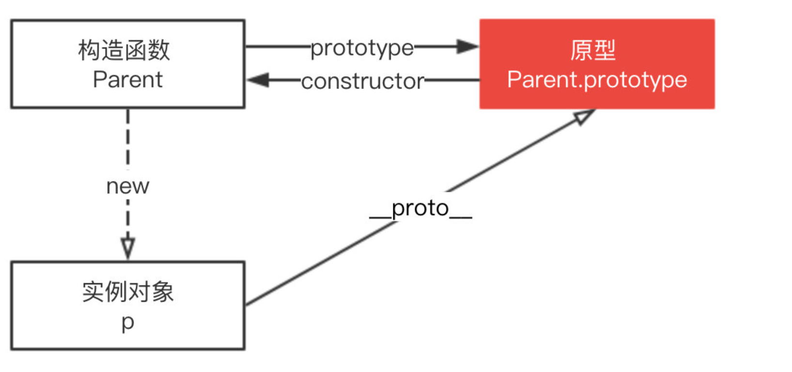

## 1.什么是原型?

JavaScript 是一种基于原型的语言 (prototype-based language)。在 js 中每个对象都有原型对象,对象以其原型为模板,从原型继承方法和属性,这些属性和方法定义在对象的构造器函数的 `prototype` 属性上,而非对象实例本身。简单来说 js 中每个对象都拥有原型对象`__proto__`,`__proto__`指向当前对象的原型对象(父对象)。每个函数都拥有一个原型对象(即 函数的`prototype`属性,其他类型是上不存在 `prototype`属性),对象的属性和定义的方法在存储在对象构造器函数的 `prototype` 上,`prototype` 被称为对象的显示原型,而`__proto__`被称为对象的隐式原型,每个对象上都存在`__proto__`,即每个对象都有隐式原型。

```js
const user = { name: "z乘风" };
console.log(user.prototype); // undefined 对象上不存在prototype属性,prototype是函数的原型对象
console.log(user.__proto__); // user的指向Object,而Object的__proto__为null
/*
 {
    constructor: ƒ Object(),
    hasOwnProperty: ƒ hasOwnProperty(),
    isPrototypeOf: ƒ isPrototypeOf(),
    propertyIsEnumerable: ƒ propertyIsEnumerable(),
    toLocaleString: ƒ toLocaleString(),
    toString: ƒ toString(),
    valueOf: ƒ valueOf(),
    __proto__:null
}
*/

function fn() {
  console.log("hello");
}

// 函数不仅有显示原型(prototype),同时也具有隐式原型(__proto__),因为函数是一个特殊的对象
console.log(fn.prototype); // {constructor: ƒ fn(),[[Prototype]]: Object}
console.log(fn.__proto__); // ƒ () { [native code] }
```

## 2.prototype、**proto**、constructor 三者之间的关系

**prototype**:只有函数才有`prototype`属性,`prototype` 是一个对象,它有 2 个属性,第一个属性是函数的构造函数,第二个是`proto`属性,它指向当前函数的父原型对象。允许函数所实例化的对象们都可以找到公用的属性和方法。

```js
// 声明一个函数
function Person() {}
// 对Person函数进行实例化,得到一个Person函数实例
var p = new Person();
/*
 * 只有函数才有prototype属性,函数的prototype属性由constructor函数和__proto__属性构成,
 * constructor属性指向实例化对象的构造函数,实例化对象的__proto__指向它父对象的原型(prototype),
 * 即p.__proto === Person.prototype
 */
console.log(Person.prototype); // {constructor: ƒ Person(),__proto__: Object}

/*
 * 因为p实例是由Person函数实例化而来,Person是p的父对象,
 * 所以p.__proto__指向的是Person.prototype
 */
console.log(p.__proto__ === Person.prototype); //true
```

**`__proto__`**:每个对象都有一个`__proto__`属性,`__proto__`属性保存着大量对象的信息,其中`__proto__`.constructor 指向对象的构造函数。

```js
var num = 111;
console.log(num.__proto__); // Number {0, constructor: ƒ, toExponential: ƒ, toFixed: ƒ, toPrecision: ƒ, …}

var str = "z乘风";
console.log(str.__proto__); // String {"", constructor: ƒ, anchor: ƒ, big: ƒ, blink: ƒ, …}

/* 函数的__proto__ */
function Person() {}
var p = new Person();
console.log(p.__proto__); // {constructor: ƒ Person(),**proto**: Object}
console.log(p.__proto__.constructor === p.constructor); // true
```

**constructor**:constructor 属性也是对象才拥有的,它表示当前对象的构造函数。

```js
var num = 111;
console.log(num.constructor); // ƒ Number() { [native code] }
console.log(num.constructor === Number); // true
```

三者关系图如下:


## 3.什么是原型链?

**每个对象都拥有一个原型对象(即`proto`),它指向父对象的原型对象,并从中继承方法和属性。当访问对象的属性或方法时,优先会查找当前对象是否有目标属性或方法,如果存在则直接返回并终止查找,如果未查找到,就查找当前对象的父原型对象,如果查找到了就直接返回终止查找,否则就一直向上查找其父原型,如果查找到 Object (Object 的父原型为 null)还未查找到就直接返回 undefined 并终止查找,而这一系列的向上查找父原型的过程就被称为原型链**。

```js
function Person() {}
// 在Person原型上声明属性
Person.prototype.age = 20;
// 在Object原型上声明方法
Object.prototype.hello = () => {
  console.log("你真帅");
};
var p = new Person();
p.name = "zxp";
// 查当前对象,有就返回,没有就一直查询父原型,直到查找到Object的父原型为止
console.log(p.name); //zxp
// 当前对象和向上原型都没有address属性
console.log(p.address); //undefined
// 虽然p对象没有age属性,但p的向上原型有age属性
console.log(p.age); //20
// 原型链查找最多查找到Object的原型,Object的父原型为null
p.hello(); //你真帅
console.log(Object.prototype.__proto__); //null
```

## 4.原型机制的应用之继承

原型链继承的本质是重写原型对象,代之以一个新类型的实例。原型链继承是基于 JS 原型机制实现的继承方式,在原型机制中构造函数、原型和实例之间的关系为:每个构造函数都有一个原型对象,原型对象都包含一个指向构造函数的指针,而实例都包含一个原型对象的指针,即`原型对象.constructor === 构造函数`,`实例对象.prototype === 其原型对象`。

```js
// 创建父函数
function Super() {
  this.name = "super";
}
// 在父函数的原型上创建方法
Super.prototype.getName = function () {
  return this.name;
};
// 创建子函数
function Sub() {
  this.subName = "sub";
}
/*
 * 关键:创建Super的实例,并将该实例赋值给Sub.prototype,于是Sub的实例就拥有了Super实例和原型上的方法与属性
 */
Sub.prototype = new Super();

// 在子函数原型上创建方法
Sub.prototype.getSubName = function () {
  return this.subName;
};
// 实例化子函数
var instance = new Sub();
// 此方法继承自Super原型上的getName()
console.log(instance.getName()); // super
console.log(instance.getSubName()); // sub
```

原型链方案存在的缺点:多个实例对引用类型的操作会被篡改。

```js
function Super() {
  this.languages = ["Java", "JavaScript", "Go"];
}
function Sub() {}
Sub.prototype = new Super();

// 创建实例1
var sub01 = new Sub();
sub01.languages.push("Rust");
console.log(sub01.languages); // ["Java", "JavaScript", "Go", "Rust"]

// 创建实例2
var sub02 = new Sub();
// 由于实例1修改了父函数的引用数据,导致影响了实例2
console.log(sub02.languages); // ["Java", "JavaScript", "Go", "Rust"]
```
