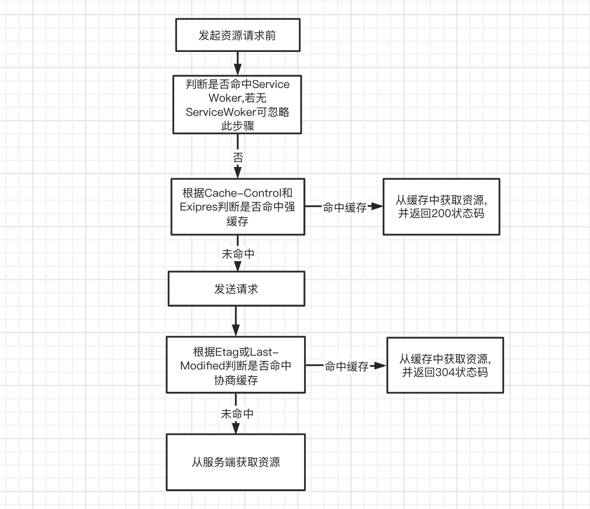
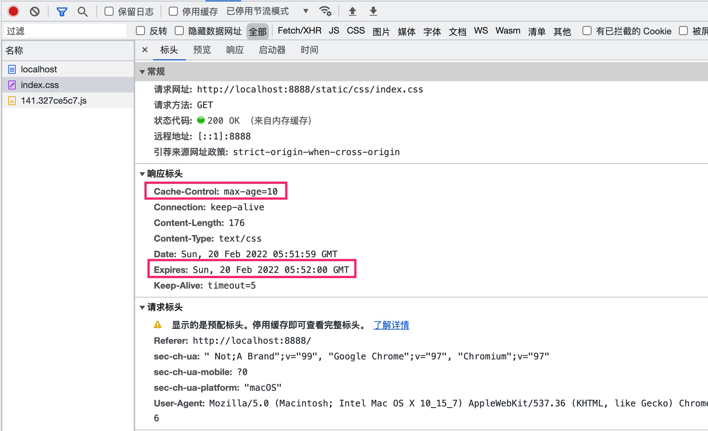

**HTTP 是超文本传输协议(Hyper Text Transfer Protocol)的英文缩写,HTTP 采用请求-响应架构模式,基于 TCP 协议的且无状态的应用层协议(HTTP 协议位于 OSI 模型中的应用层)。在 HTTP 中以超文本作为数据进行传输,HTTP 中的超文本泛指文本、图片、视频、压缩包等数据。简单来说 HTTP 是计算机中用于两端(服务端与客户端)之间传输超文本(文本、图片、视频、音频、压缩包)数据的通讯约定或规范。** HTTP 的发展历史如下:

- 0.9 版本。0.9 版本的 HTTP 协议就是一个交换信息的无序协议,仅仅限于文字。由于无法进行内容的协商,在双发的握手和协议中,并有规定双发的内容是什么,也就是图片是无法显示和处理的。
- 1.0 版本。到了 1.0 协议阶段,也就是在 1982 年,Tim Berners-Lee 提出了 HTTP/1.0。在此后的不断丰富和发展中,HTTP/1.0 成为最重要的面向事务的应用层协议。该协议对每一次请求/响应建立并拆除一次连接。其特点是简单、易于管理,所以它符合了大家的需要,得到了广泛的应用。
- 1.1 版本。在 1.0 协议中,双方规定了连接方式和连接类型,这已经极大扩展了 HTTP 的领域,但对于互联网最重要的速度和效率,并没有太多的考虑。毕竟,作为协议的制定者,当时也没有想到 HTTP 会有那么快的普及速度。目前大多数网站都是基于 HTTP1.1 版本。
- 2.0 版本。HTTP2.0 的前身是 HTTP1.0 和 HTTP1.1。虽然之前仅仅只有两个版本,但这两个版本所包含的协议规范之庞大,足以让任何一个有经验的工程师为之头疼。网络协议新版本并不会马上取代旧版本。实际上,1.0 和 1.1 在之后很长的一段时间内一直并存,这是由于网络基础设施更新缓慢所决定的。

HTTP 连接流程如下:

#### HTTP 1.1 与 HTTP1.0 协议的区别:

- 连接方面。HTTP1.0 默认采用非持久连接,而 HTTP1.1 默认采用持久连接。在 HTTP1.1 中通过使用持久连接来使多个 HTTP 请求复用同一个 TCP 连接,以此避免每次使用非持久连接时建立连接的开销。
- HTTP1.1 相比较 HTTP1.0 支持更多请求方法,例如 PUT、HEAD、OPTIONS。

#### HTTPS 与 HTTP 协议的区别?

- HTTPS 协议需要 CA 证书,而 HTTP 无需 CA 证书。
- HTTP 协议是超文本传输协议,信息是明文传输的,HTTPS 则是具有安全性的 SSL 加密传输协议。
- 不同的连接方式,默认端口也不同,HTTP 协议的默认端口为 80,HTTPS 的默认端口协议是 443。
- HTTP 协议模型比较简单,且是无状态的,HTTPS 协议是有 SSL 和 HTTP 协议构建的可进行加密传输、身份认证的网络协议,比 HTTP 更安全。

#### HTTP 2.0 对于 HTTP 1.x 协议的区别？

- 二进制协议。HTTP 是一个二进制协议,而 HTTP1.1 是一个超文本协议。在 HTTP1.1 中,报文头信息必须是文本(ASCII 编码),数据体允许是文本数据,也可以是二进制数据,优点是可读性好,但缺点是携带数据量占用体积大。在 HTTP2 是一个完全的二进制协议,头信息和数据体都是二进制,并统称为"帧"(帧可分为头信息帧和数据帧),帧是实现 HTTP2 多路复用的基础。

- 多路复用。多路复用允许同时通过单一的 HTTP/2 连接发起多重的请求-响应消息。由于 HTTP 1.x 的时代中,浏览器向同一域名下发送的 HTTP 请求数量是受限的,当超出数量限制时,请求会被阻塞,大大降低了用户体验。而 HTTP/2 的多路复用允许同时通过单一的 HTTP/2 连接发起多重的请求-响应消息。
- 首部压缩。HTTP/2 引入了 HPACK 算法对头部进行压缩,大大减小了数据发送的字节数。
- 服务器推送。

### HTTP 的组成部分

在 HTTP 中传输的数据被称为报文,由于 HTTP 基于请求与响应模型,所以在 HTTP 中分为服务端和客户端两个角色,客户端向服务端发送的数据叫做请求报文,请求报文由请求头和请求体组成。服务端向客户端响应的数据叫做响应报文,响应报文由响应头和响应体组成。HTTP 报文本身是由多行(用 CR+LR 作为换行符)数据构成的字符串文本,HTTP 报文大致分为可分为报文首部(header)和报文主体(body)两块。两者由最初出现的空行(CR+LR)来划分,通常,报文中并不一定需要报文主体。

### HTTP 状态码

HTTP 状态码由三个十进制数字组成,第一个十进制数字定义了状态码的类型。响应分为五类:信息响应(100–199),成功响应(200–299),重定向(300–399),客户端错误(400–499)和服务器错误(500–599):
|分类 | 描述 |
|-|-|
|1**|信息,服务器收到请求,需要请求者继续执行操作|
|2**|成功,操作被成功接收并处理|
|3**|重定向,需要进一步的操作以完成请求|
|4**|客户端错误,请求包含语法错误或无法完成请求|
|5\*\*|服务器错误,服务器在处理请求的过程中发生了错误|

HTTP 状态码列表:
| 状态码 |状态码英文名称| 描述 |
|-|-|-|
|100|Continue|继续。客户端应继续其请求|
|101|Switching Protocols|切换协议。服务器根据客户端的请求切换协议。只能切换到更高级的协议，例如，切换到 HTTP 的新版本协议|
|200|OK|请求成功。一般用于 GET 与 POST 请求|
|201|Created|已创建。成功请求并创建了新的资源|
|202|Accepted|已接受。已经接受请求,但未处理完成|
|203|Non-Authoritative Information|已创建。成功请求并创建了新的资源|
|204|No Content|无内容。服务器成功处理，但未返回内容。在未更新网页的情况下,可确保浏览器继续显示当前文档|
|205|Reset Content|重置内容。服务器处理成功，用户终端(例如:浏览器)应重置文档视图。可通过此返回码清除浏览器的表单域|
|206|Partial Content| 部分内容。服务器成功处理了部分 GET 请求|
|300| Multiple Choices| 多种选择。请求的资源可包括多个位置，相应可返回一个资源特征与地址的列表用于用户终端（例如:浏览器）选择|
|301| Moved Permanently| 永久移动。请求的资源已被永久的移动到新 URI,返回信息会包括新的 URI,浏览器会自动定向到新 URI。今后任何新的请求都应使用新的 URI 代替|
|302| Found| 临时移动。与 301 类似。但资源只是临时被移动。客户端应继续使用原有 URI|
|303| See Other| 查看其它地址。与 301 类似。使用 GET 和 POST 请求查看|
|304| Not Modified| 未修改。所请求的资源未修改，服务器返回此状态码时，不会返回任何资源。客户端通常会缓存访问过的资源，通过提供一个头信息指出客户端希望只返回在指定日期之后修改的资源|
|305 |Use Proxy| 使用代理。所请求的资源必须通过代理访问|
|306 |Unused| 已经被废弃的 HTTP 状态码|
|307 |Temporary Redirect |临时重定向。与 302 类似。使用 GET 请求重定向|
|400 |Bad Request| 客户端请求的语法错误，服务器无法理解|
|401 |Unauthorized| 请求要求用户的身份认证|
|402 |Payment Required| 保留,将来使用|
|403 |Forbidden| 服务器理解请求客户端的请求,但是拒绝执行此请求|
|404 |Not Found| 服务器无法根据客户端的请求找到资源(网页)。通过此代码,网站设计人员可设置"您所请求的资源无法找到"的个性页面|
|405 |Method Not Allowed| 客户端请求中的方法被禁止|
|406 |Not Acceptable|服务器无法根据客户端请求的内容特性完成请求|
|407 |Proxy Authentication Required| 请求要求代理的身份认证，与 401 类似,但请求者应当使用代理进行授权|
|408 |Request Time-out| 服务器等待客户端发送的请求时间过长,超时|
|409 |Conflict| 服务器完成客户端的 PUT 请求时可能返回此代码,服务器处理请求时发生了冲突|
|410 |Gone| 客户端请求的资源已经不存在。410 不同于 404，如果资源以前有现在被永久删除了可使用 410 代码，网站设计人员可通过 301 代码指定资源的新位置|
|411 | Length Required| 服务器无法处理客户端发送的不带 Content-Length 的请求信息|
|412 | Precondition Failed| 客户端请求信息的先决条件错误|
|413| Request Entity Too Large| 由于请求的实体过大，服务器无法处理，因此拒绝请求。为防止客户端的连续请求，服务器可能会关闭连接。如果只是服务器暂时无法处理,则会包含一个 Retry-After 的响应信息|
|414| Request-URI Too Large| 请求的 URI 过长(URI 通常为网址),服务器无法处理|
|415| Unsupported Media Type| 服务器无法处理请求附带的媒体格式|
|416| Requested range not satisfiable| 客户端请求的范围无效|
|417| Expectation Failed| 服务器无法满足 Expect 的请求头信息|
|500| Internal Server Error| 服务器内部错误，无法完成请求|
|501| Not Implemented| 服务器不支持请求的功能，无法完成请求|
|502| Bad Gateway| 作为网关或者代理工作的服务器尝试执行请求时，从远程服务器接收到了一个无效的响应|
|503| Service Unavailable| 由于超载或系统维护，服务器暂时的无法处理客户端的请求。延时的长度可包含在服务器的 Retry-After 头信息中|
|504| Gateway Time-out| 充当网关或代理的服务器，未及时从远端服务器获取请求|
|505| HTTP Version not supported| 服务器不支持请求的 HTTP 协议的版本，无法完成处理|

### GET 请求与 POST 请求的区别?

- POST 请求相比较 GET 请求更加安全。由于 GET 请求的参数会作为 URL 的一部分,且会被缓存保存在服务器日志及浏览器浏览器记录中,而 POST 请求则不会。
- POST 发送的数据更大。由于 GET 请求发送的数据包含在请求 URL 中,一般 URL 限制长度是 2KB 左右,而 POST 请求将请求数据包含在请求体中,HTTP 并没有限制请求体的长度,这意味着可以传输任意大小的数据。POST 请求能发送更多的数据类型,GET 请求只能发送 ASCII 字符。
- POST 请求用于写入、修改操作,GET 请求用于查询检索操作,在 GET 请求下若请求资源是静态资源,那么会进行缓存,如果请求资源是数据则不会缓存。
- POST 请求会产生两个 TCP 数据包,而 GET 请求仅会产生一个 TCP 数据包,所以 POST 请求比 GET 请求更慢。POST 请求下浏览器先发送 header,服务器响应 100 continue 后,浏览器再发送 data,服务器响应 200 OK(返回数据)。注意并不是所有浏览器都会在 POST 请求中发送两次数据包,Firefox 就只发送一次。

### HTTP 缓存

HTTP 缓存又称浏览器缓存,是指当客户端向服务器请求资源时,会先抵达浏览器缓存,如果浏览器有"要请求资源"的副本,则会从浏览器缓存中读取,从而跳过从原始服务器中读取该资源。HTTP 缓存分为协商缓存和强缓存两种:

- 强缓存:用户发送的请求,直接从用户客户端缓存读取,不发送到服务端,无需与服务端交互。命中缓存后返回 200 状态码,且 F5 刷新浏览器不会使强缓存失败。
- 协商缓存:用户发送的请求会发送到服务端,由服务端根据参数判断是否让客户端从客户端缓存读取。协商缓存无法减少请求开销,但可减少返回的正文大小。命中缓存后返回 304 状态码,F5 刷新浏览器会使强缓存失败。

HTTP 缓存工作流程图如下:


#### 强缓存

强制缓存在缓存数据未失效的情况下(即 Cache-Control 的 max-age 没有过期或者 Expires 的缓存时间没有过期),那么就会直接使用浏览器的缓存数据,不会再向服务器发送任何请求。强制缓存生效时,http 状态码为 200。这种方式页面的加载速度是最快的,性能也是很好的,但是在这期间,如果服务器端的资源修改了,则无法获取到最新的资源,因为它不会再向服务器发请求了。

强缓存可通过请求头的 Pragma、Cache-Control、Expires 设置:

- Pragma:Pragma 是一个在 HTTP/1.0 中规定的通用首部,这个首部的效果依赖于不同的实现,所以在“请求-响应”链中可能会有不同的效果。它用来向后兼容只支持 HTTP/1.0 协议的缓存服务器,那时候 HTTP/1.1 协议中的 Cache-Control 还没有出来。
- Cache-Control:通用消息头字段,被用于在 http 请求和响应中,通过指定指令来实现缓存机制。缓存指令是单向的,这意味着在请求中设置的指令,不一定被包含在响应中。
- Expires:用于设置资源过期时间(一个 GMT 时间),如果在 Cache-Control 响应头设置了 `"max-age"` 或者 `"s-max-age"` 指令,那么 Expires 头会被忽略。

| HTTP header 属性 | 可选值                                                                                                                                                                                                                                                        | 优先级 | 支持版本 | 优缺点                                                                                                             |
| ---------------- | ------------------------------------------------------------------------------------------------------------------------------------------------------------------------------------------------------------------------------------------------------------- | ------ | -------- | ------------------------------------------------------------------------------------------------------------------ |
| Pragma           | no-cache:不直接使用缓存,根据新鲜度来使用缓存                                                                                                                                                                                                                  | 最高   | HTTP1.0  | (1).响应头不支持该字段。<br>(2).该字段为了兼容 HTTP1.0 客户端。<br>(3).该字段在 HTTP1.1 被废除                     |
| Cache-Control    | (1).no-cache:不直接使用缓存,根据新鲜度来使用缓存。<br>(2).no-store:不使用缓存,每次请求都会下载新资源。<br>(3).max-age:设置缓存过期使用,单位毫秒。<br>(4).public/privite:是否只能被单个用户使用,默认为 private。<br>(5).must-relalidate:每次访问需要缓存检验。 | 高     | HTTP1.1  | (1).请求头和响应头都支持此属性。<br>(2).不适用 HTTP1.0。<br>(3).在缓存未失效前,获取不到修改后的资源。              |
| Expires          | GMT 时间                                                                                                                                                                                                                                                      | 低     | HTTP1.0+ | (1).如果服务端与客户端时间不一致时会出问题。<br>(2).适用于 HTTP1.0+。<br>(3).在缓存未失效前,获取不到修改后的资源。 |

```js
// 强缓存例子
const Koa = require('koa')
const fs = require('fs')
const path = require('path')
const mimes = {
  css: 'text/css',
  less: 'text/css',
  gif: 'image/gif',
  html: 'text/html',
  ico: 'image/x-icon',
  jpeg: 'image/jpeg',
  jpg: 'image/jpeg',
  js: 'text/javascript',
  json: 'application/json',
  pdf: 'application/pdf',
  png: 'image/png',
  svg: 'image/svg+xml',
  swf: 'application/x-shockwave-flash',
  tiff: 'image/tiff',
  txt: 'text/plain',
  wav: 'audio/x-wav',
  wma: 'audio/x-ms-wma',
  wmv: 'video/x-ms-wmv',
  xml: 'text/xml',
}

// 获取文件的类型
function parseMime(url) {
  // path.extname获取路径中文件的后缀名
  let extName = path.extname(url)
  extName = extName ? extName.slice(1) : 'unknown'
  return mimes[extName]
}

// 将文件转成传输所需格式
const parseStatic = (dir) => {
  return new Promise((resolve) => {
    resolve(fs.readFileSync(dir), 'binary')
  })
}

const app = new Koa()
app.use(async (ctx) => {
  const url = ctx.request.url
  if (url === '/') {
    // 访问根路径返回index.html
    ctx.set('Content-Type', 'text/html')
    const htmlPath = path.join(__dirname, './index.html')
    ctx.body = await parseStatic(htmlPath)
  } else {
    const filePath = path.resolve(__dirname, `.${url}`)
    // 设置类型
    ctx.set('Content-Type', parseMime(url))

    /**
     * HTTP 请求头配置Expires、Cache-Control设置强缓存。
     * 在缓存时间内除首次请求会向服务端请求资源,其余请求都会
     * 访问浏览器缓存,命中缓存则返回该资源,并返回200状态码。
     */
    // 设置 Expires 请求头,缓存过期时间为 1000毫秒,
    const time = new Date(Date.now() + 1000).toUTCString()
    ctx.set('Expires', time)
    // 设置 Cache-Control 请求头,缓存过期时间为10秒
    ctx.set('Cache-Control', 'max-age=10')

    // 设置传输
    ctx.body = await parseStatic(filePath)
  }
})

app.listen(8888, () => {
  console.log('start at port 8888')
})
```




### 协商缓存

当第一次请求时服务器返回的响应头中没有 Cache-Control 和 Expires,或者 Cache-Control 和 Expires 过期及它的属性设置为 no-cache 时(即不走强缓存),那么浏览器第二次请求时就会与服务器进行协商,与服务器端对比判断资源是否进行了修改更新。如果服务器端的资源没有修改(通过 Etag/If-None-Match 和 Last-Modified/If-Modified-Since 作为缓存判断依赖),那么就会返回 304 状态码,告诉浏览器可以使用缓存中的数据,这样就减少了服务器的数据传输压力。如果数据有更新就会返回 200 状态码,服务器就会返回更新后的资源并且将缓存信息一起返回。跟协商缓存相关的 header 头属性有(ETag/If-None-Match 、Last-Modified/If-Modified-Since)请求头和响应头需要成对出现,ETag/If-None-Match 是根据请求资源内容是否变化来判断是否命中缓存,而 Last-Modified/If-Modified-Since 则根据请求资源根据最后修改时间来判断是否命中缓存。

- Etag:Etag 是 HTTP 响应头是资源的特定版本的标识符,一般是一个 hash 戳,用于描述资源的内容。Etag 可以让缓存更高效,并节省带宽，因为如果内容没有改变,Web 服务器不需要发送完整的响应。而如果内容发生了变化.使用 ETag 有助于防止资源的同时更新相互覆盖。
- If-None-Match:If-None-Match 是一个条件式请求首部。对于 GETGET 和 HEAD 请求方法来说,当且仅当服务器上没有任何资源的 ETag 属性值与 If-None-Match 相匹配的时候,服务器端才会返回所请求的资源，响应码为 200 。如果 Etag 与 If-None-Match 相匹配时则返回从缓存中返回资源,并响应 304 状态码。
- Last-Modified:资源最后一次修改时间。
- If-Modified-Since:是一个条件式请求首部。是上一次的 Last-Modified。

| HTTP header 属性                | 可选值   | 优先级 | 支持版本 | 优缺点                                                                                                                                                                     |
| ------------------------------- | -------- | ------ | -------- | -------------------------------------------------------------------------------------------------------------------------------------------------------------------------- |
| Etag/If-None-Match              | 校验值   | 高     | HTTP1.1  | (1).默认使用 hash 算法,在分布式环境下可能会出现不同服务器生成的 ETag 值不一致。<br>(2).精确的判断资源是否被修改,可识别一秒内容的修改次数。<br>(3).计算 ETag 需要消耗性能。 |
| Last-Modified/If-Modified-Since | GMT 时间 | 低     | HTTP1.1  | (1).只要资源修改无论资源是否有变化,都将资源返回至客户端。<br>(2).以时刻为标识,无法识别一秒内容的修改变化。<br>(3).某些服务器不能准确获取最后的修改时间。                   |

#### Last-Modified/If-Modified-Since

Last-Modified/If-Modified-Since 的工作流程如下:

- 第一次请求资源时,服务端会把所请求的资源的最后一次修改时间当成响应头中 Last-Modified 的值发到浏览器并在浏览器存起来。
- 第二次请求资源时,浏览器会把刚刚存储的时间当成请求头中 If-Modified-Since 的值传到服务端,服务端拿到这个时间跟所请求的资源的最后修改时间进行比对。
- 比对结果如果两个时间相同,则说明此资源没修改过,那就是命中缓存,那就返回 304,如果不相同,则说明此资源修改过了,则未命中缓存,则返回修改过后的新资源。

```js
const Koa = require('koa')
const fs = require('fs')
const path = require('path')
const mimes = {
  css: 'text/css',
  less: 'text/css',
  gif: 'image/gif',
  html: 'text/html',
  ico: 'image/x-icon',
  jpeg: 'image/jpeg',
  jpg: 'image/jpeg',
  js: 'text/javascript',
  json: 'application/json',
  pdf: 'application/pdf',
  png: 'image/png',
  svg: 'image/svg+xml',
  swf: 'application/x-shockwave-flash',
  tiff: 'image/tiff',
  txt: 'text/plain',
  wav: 'audio/x-wav',
  wma: 'audio/x-ms-wma',
  wmv: 'video/x-ms-wmv',
  xml: 'text/xml',
}

// 获取文件的类型
function parseMime(url) {
  // path.extname获取路径中文件的后缀名
  let extName = path.extname(url)
  extName = extName ? extName.slice(1) : 'unknown'
  return mimes[extName]
}

// 将文件转成传输所需格式
const parseStatic = (dir) => {
  return new Promise((resolve) => {
    resolve(fs.readFileSync(dir), 'binary')
  })
}
// 获取文件信息
const getFileStat = (path) => {
  return new Promise((resolve) => {
    fs.stat(path, (_, stat) => {
      resolve(stat)
    })
  })
}
const app = new Koa()
app.use(async (ctx) => {
  const url = ctx.request.url
  if (url === '/') {
    // 访问根路径返回index.html
    ctx.set('Content-Type', 'text/html')
    const htmlPath = path.join(__dirname, './index.html')
    ctx.body = await parseStatic(htmlPath)
  } else {
    // 获取请求资源路径
    const filePath = path.resolve(__dirname, `.${url}`)
    // 设置类型
    ctx.set('Content-Type', parseMime(url))

    // 获取请求头的if-modified-since
    const ifModifiedSince = ctx.request.header['if-modified-since']
    const fileStat = await getFileStat(filePath)
    console.log('文件最后一次修改时间戳:', fileStat.mtime.toGMTString())
    /**
     * 如果当前请求的if-modified-since(相当于资源上次修改时间)与文件最后修改时间一致,
     * 则说明文件无变化,命中协商缓存,状态码返回304。
     *
     * 若没有命中协商缓存,说明请求资源内容发生变化,则重新设置Last-Modified的值为文件
     * 文件最后一次修改时间,然后返回最新的请求资源文件。
     */
    console.log(ifModifiedSince === fileStat.mtime.toGMTString())
    if (ifModifiedSince === fileStat.mtime.toGMTString()) {
      ctx.status = 304
    } else {
      ctx.set('Last-Modified', fileStat.mtime.toGMTString())
      ctx.body = await parseStatic(filePath)
    }
  }
})

app.listen(8888, () => {})
```

首次加载由于 ifModifiedSince 与请求资源最后修改时间不一致,所以会向服务端请求返回资源,状态码返回 200,第二次 ifModifiedSince 与请求资源最后修改时间一致,则从缓存中获取资源,状态码返回 304。当修改请求资源内容时,保存后最后修改时间也会发生变化,所以请求资源 ifModifiedSince 与请求资源最后修改时间不一致,状态码返回 200,如果再次请求资源则会命中缓存,返回 304 状态码。


#### Etag/If-None-Match

Etag/If-None-Match 的工作流程跟 Last-Modified/If-Modified-Since 类似,只不过 Etag/If-None-Match 是根据请求资源内容来判断是否命中缓存。

```js
/**
 * 协商缓存:Etag/If-None-Match
 */
const Koa = require('koa')
const fs = require('fs')
const path = require('path')
const crypto = require('crypto')
const mimes = {
  css: 'text/css',
  less: 'text/css',
  gif: 'image/gif',
  html: 'text/html',
  ico: 'image/x-icon',
  jpeg: 'image/jpeg',
  jpg: 'image/jpeg',
  js: 'text/javascript',
  json: 'application/json',
  pdf: 'application/pdf',
  png: 'image/png',
  svg: 'image/svg+xml',
  swf: 'application/x-shockwave-flash',
  tiff: 'image/tiff',
  txt: 'text/plain',
  wav: 'audio/x-wav',
  wma: 'audio/x-ms-wma',
  wmv: 'video/x-ms-wmv',
  xml: 'text/xml',
}

// 获取文件的类型
function parseMime(url) {
  // path.extname获取路径中文件的后缀名
  let extName = path.extname(url)
  extName = extName ? extName.slice(1) : 'unknown'
  return mimes[extName]
}

// 将文件转成传输所需格式
const parseStatic = (dir) => {
  return new Promise((resolve) => {
    resolve(fs.readFileSync(dir), 'binary')
  })
}
// 获取文件信息
const getFileStat = (path) => {
  return new Promise((resolve) => {
    fs.stat(path, (_, stat) => {
      resolve(stat)
    })
  })
}

const app = new Koa()

app.use(async (ctx) => {
  const url = ctx.request.url
  if (url === '/') {
    // 访问根路径返回index.html
    ctx.set('Content-Type', 'text/html')
    const htmlPath = path.join(__dirname, './index.html')
    ctx.body = await parseStatic(htmlPath)
  } else {
    // 获取请求资源路径
    const filePath = path.resolve(__dirname, `.${url}`)
    // 设置类型
    ctx.set('Content-Type', parseMime(url))
    ctx.set('Cache-Control', 'no-cache')

    const fileBuffer = await parseStatic(filePath)
    // 从请求头上获取if-none-match,if-none-match是上一次请求的etag
    const ifNoneMatch = ctx.request.header['if-none-match']
    // 生成内容hash值
    const hash = crypto.createHash('md5')
    hash.update(fileBuffer)
    const etag = `"${hash.digest('hex')}"`

    console.log('文件hash:', etag)
    /**
     * 如果当前请求的if-none-match(相当于资源上次内容hash)与文件内容hash一致,
     * 则说明文件无变化,命中协商缓存,状态码返回304。
     *
     * 若没有命中协商缓存,说明请求资源内容发生变化,则重新设置etag的值为文件
     * 文件最后一次修改时间,然后返回最新的请求资源文件。
     */

    if (ifNoneMatch === etag) {
      ctx.status = 304
    } else {
      ctx.set('etag', etag)
      ctx.body = await parseStatic(filePath)
    }
  }
})

app.listen(8888, () => {})
```
