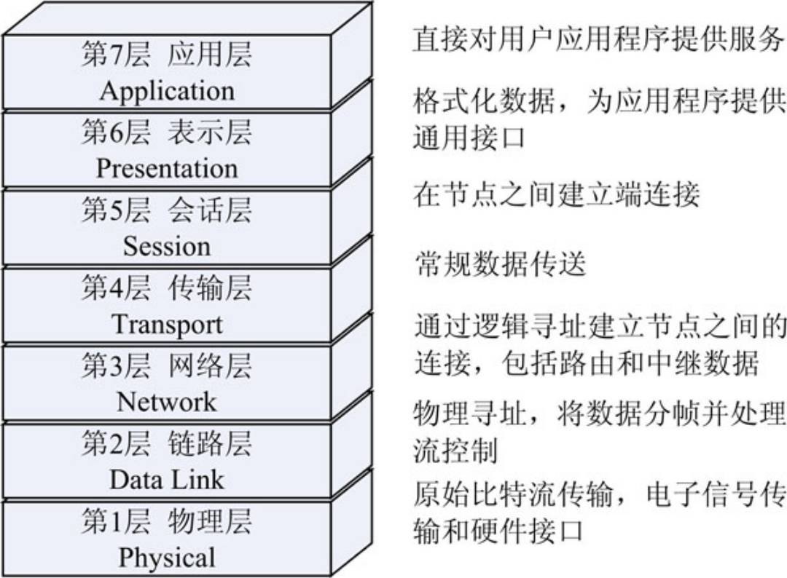

### 1.网络的发展历史

随着 1946 年世界上第一台电子计算机问世后的十多年时间内，由于价格很昂贵，电脑数量极少。早期所谓的计算机网络主要是为了解决这一矛盾而产生的，其形式是将一台计算机经过通信线路与若干台终端直接连接，我们也可以把这种方式看做为最简单的局域网雏形。
最早的 Internet，是由美国国防部高级研究计划局（ARPA）建立的。现代计算机网络的许多概念和方法，如分组交换技术都来自 ARPAnet。 ARPAnet 不仅进行了租用线互联的分组交换技术研究，而且做了无线、卫星网的分组交换技术研究-其结果导致了 TCP/IP 问世。1977-1979 年，ARPAnet 推出了目前形式的 TCP/IP 体系结构和协议。1980 年前后 ARPAnet 上的所有计算机开始了 TCP/IP 协议的转换工作，并以 ARPAnet 为主干网建立了初期的 Internet。1983 年，ARPAnet 的全部计算机完成了向 TCP/IP 的转换，并 UNIX（BSD4.1）上实现了 TCP/IP。ARPAnet 在技术上最大的贡献就是 TCP/IP 协议的开发和应用。2 个著名的科学教育网 CSNET 和 BITNET 先后建立。1984 年，美国国家科学基金会 NSF 规划建立了 13 个国家超级计算中心及国家教育科技网。随后替代了 ARPANET 的骨干地位。 1988 年 Internet 开始对外开放。1991 年 6 月，在连通 Internet 的计算机中，商业用户首次超过了学术界用户，这是 Internet 发展史上的一个里程碑，从此 Internet 成长速度一发不可收拾。

目前绝大多数网络都采用 TCP/IP 协议,TCP/IP 是目前最完整的、被普遍接受的通信协议标准。它可以使不同硬件结构、不同操作系统的计算机之间相互通信,TCP/IP 协议还有一个更加专业的名字——Internet 协议。

为保证通知正常进行,事先必须做出一些规定,要求通信双方正确执行这些规则和约定被称为协议(或规程)。网络通信协议能够协调网络的运转,使之达到互通、互控和互换的目的。网络协议由以下三部分组成:

- 语义(Semantics):规定双方完成通信需要的控制信息及应执行的动作。
- 语法(Syntax):规定通信双方交换的数据或控制信息的格式和结构。
- 时序(Timing):规定通信双方彼此的应答关系,包括速度的匹配和顺序。

由于协议十分复杂、涉及面广,因此指定协议时通常采用分层法,每一层分别负责不同通信功能。层次和协议的集合可称为网络的体系结构。OSI()就是一个通用的网络体系结构。除了协议外,还有协议组件(协议簇),它是一组不同层次上的多个协议的集合。

### 2.OSI 模型

OSI 是 Open System Interconnection Reference Model 英文的简称,中文译为开放式系统互联通信参考模型。OSI 不是规范,而是一个抽象的参考模型,或者说是一个概念框架。OSI 采用分层结构,一共分为 7 层,从下往上(从底层到高层)分为物理层、数据链路层(简称链路层)、网络层、传输层、会话层、表示层、应用层,其中每一层都由上一层支配,并从上一层接收数据,为上一层提供服务而 TCP/IP 协议就位于传输层。

第 1 层至第 3 层主要是完成数据交换和数据传输,称为网络低层,即通信子网;第 5 层至第 7 层主要是完成信息处理服务的功能,称为网络高层;低层与高层之间由第 4 层衔接。通常也将会话层、表示层和应用层统称为应用层,将传输层及以下各层统称为数据传输层。
