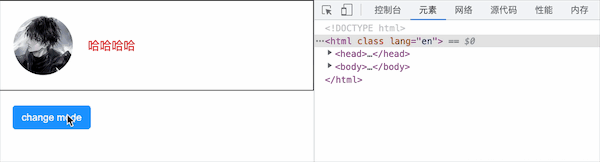
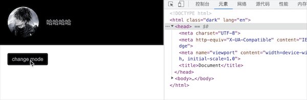

暗黑模式的实现方式通常分为两种,第一种是基于 CSS filter(滤镜)反转颜色,另一种是基于 CSS 变量定制。

### 1. CSS filter 实现暗黑模式

- invert:反转输入图像。值定义转换的比例。100%(或 1)将完全转换:黑色变为白色,白色变为黑色,其它颜色类似。
- hue-rotate:hue-rotate 可以帮助我们处理非黑白的其它颜色,色调旋转 180 度,确保网页的颜色主题不改变,而只是削弱它的颜色。这种做法唯一的缺点是:它还会反转网页中所有的图像。因此,需要将页面中所有的图像添加相同的规则,以修复这个问题。

```html
<body>
  <div class="container">
    
    <div>哈哈哈哈</div>
  </div>
  <button id="btn">change mode</button>
</body>

<style>
  * {
    padding: 0;
    margin: 0;
  }
  html,
  body {
    position: relative;
    height: 100%;
    width: 100%;
    transition: filter 0.5s;
  }
  .dark {
    filter: invert(90%) hue-rotate(180deg);
  }
  .dark img,
  .dark video,
  .dark svg,
  .dark div[class*="language-"] {
    filter: invert(110%) hue-rotate(180deg);
    opacity: 0.8;
  }
  .container {
    display: flex;
    align-items: center;
    padding: 20px;
    color: red;
    background-color: #fff;
    border: 1px solid #000;
  }
  .container img {
    height: 80px;
    width: 80px;
    border-radius: 50%;
    margin-right: 20px;
  }
  button {
    display: inline-block;
    height: 32px;
    padding: 4px 12px;
    border-radius: 4px;
    outline: none;
    border: none;
    margin: 20px;
    background-color: #1890ff;
    color: #fff;
  }
</style>

<script>
  const btn = document.querySelector("button");
  btn.onclick = function () {
    document.documentElement.classList.toggle("dark");
  };
</script>
```



### 2.基于 CSS 变量实现暗黑模式

```html
<body>
  <div class="container">
    
    <div>哈哈哈哈</div>
  </div>
  <button id="btn">change mode</button>
</body>

<style>
  * {
    padding: 0;
    margin: 0;
  }
  html,
  body {
    position: relative;
    height: 100%;
    width: 100%;
    transition: filter 0.5s;
  }

  .dark * {
    transition: all 0.5s;
  }
  .dark {
    --color: #999;
    --bg-color: #000;
    --border-color: #ccc;
    --btn-color: #999;
    --btn-bg-color: #000;
  }
  .container {
    display: flex;
    align-items: center;
    padding: 20px;
    color: var(--color, red);
    background-color: var(--bg-color, #fff);
    border: 1px solid var(--border-color, #000);
  }
  .container img {
    height: 80px;
    width: 80px;
    border-radius: 50%;
    margin-right: 20px;
  }
  button {
    display: inline-block;
    height: 32px;
    padding: 4px 12px;
    border-radius: 4px;
    outline: none;
    border: none;
    margin: 20px;
    background-color: var(--btn-bg-color, #1890ff);
    color: var(--btn-color, #fff);
  }
</style>

<script>
  const btn = document.querySelector("button");
  btn.onclick = function () {
    document.documentElement.classList.toggle("dark");
  };
</script>
```


