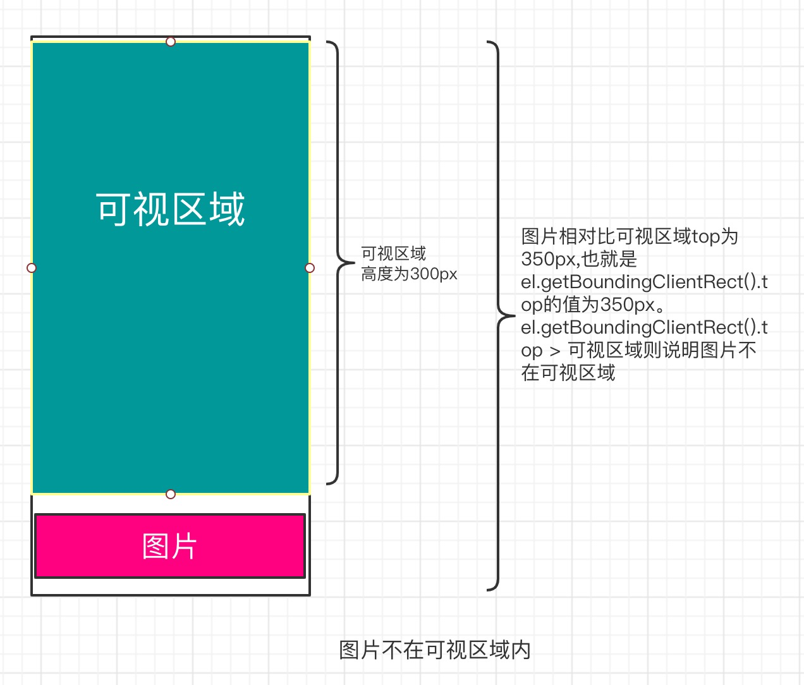
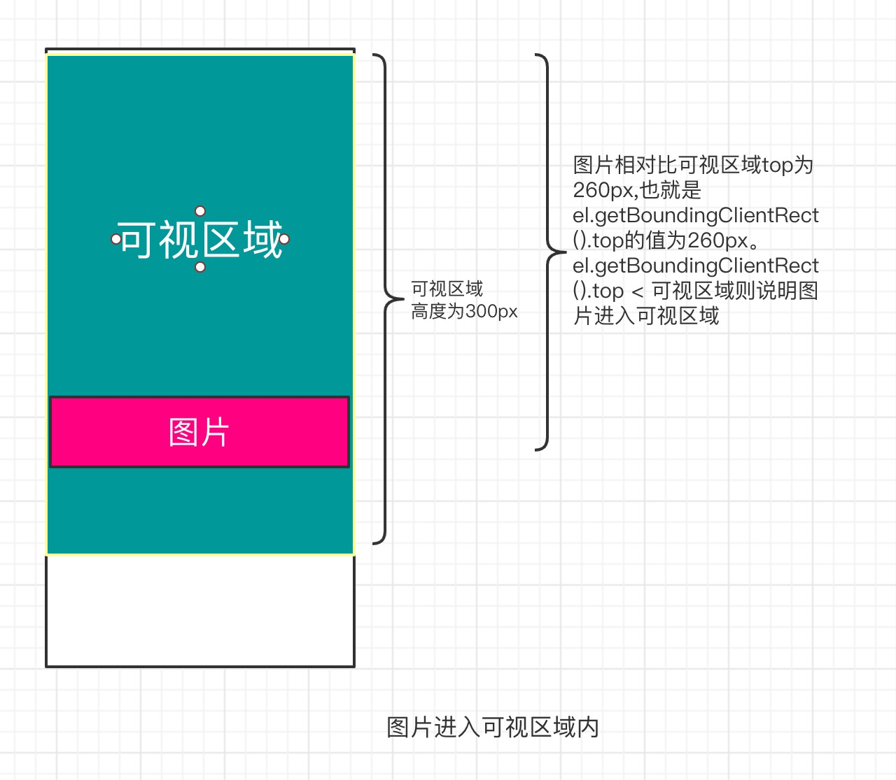

### 1.图片懒加载

图片的优化是程序优化不可忽视的一部分,常用的图片优化手段如下:

- 使用正确的图片编码。webp 格式的图片相比较 png、jpg 格式的图片体积小 40%,且兼容性不错。
- 图片放在 CDN,CDN 加速能大大提升图片下载速度,减少图片白屏时间。
- 图片压缩,使用`<picture>`指定所需图片大小等等。
- 图片懒加载。对于图片较多且大多数图片不在可视区域内,此时就可以使用图片懒加载。使用图片懒加载可以忽视一些未在可视区域的图片进行加载,避免一次性加载过多图片造成请求阻塞(浏览器一般对同一域名下的并发请求的连接数有限制),这样可以提高程序加载速度,提升用户体验。

图片懒加载的实现原理:**初始加载图片时将图片的 URL 设置在 img 元素自定义属性上,当图片处于可见区域时才设置 img 元素的 src,从而达到图片懒加载**。图片懒加载的实现方案有监听 onscroll 滚动事件和 IntersectionObserver 两种,而 IntersectionObserver 性能相较于 onscroll 事件性能更好,但兼容性较差,所以 onscroll 方式被做为兜底方案。

#### 1.1 监听 onScroll 事件实现图片懒加载

onScroll 事件实现图片懒加载流程:初始加载图片时可以将图片的路径挂载到 img 标签非 src 属性上(例如 dataset-src),当触发滚动事件时,判断 img 元素是否进入可视区域,如果进入可视区域就设置 img 的 src 属性加载图片,,此时 img 会根据 src 属性的路径进行图片加载。

判断元素是否进入可视区域需要依赖于`Element.getBoundingClientRect()`,`Element.getBoundingClientRect()` 方法返回元素的大小及其相对于视口的位置。包含当前元素的 left、top、right、bottom、x、 y、 width、height 这几个以像素为单位的只读属性。当`el.getBoundingClientRect().top < 可视区域的高度`则说明 el 进入可视区域,可视区域的高度可以通过`documentElement.clientHeight` 和 `body.clientHeight`获取。




```html
<!-- html结构 -->
<div>
      
</div>

<script>
  // 获取可视区域的高度
  const getClientHeight = () => {
    const clientH = document.documentElement.clientHeight;
    const bodyClientH = document.body.clientHeight;
    return clientH && bodyClientH
      ? bodyClientH < clientH
        ? bodyClientH
        : clientH
      : bodyClientH > clientH
      ? bodyClientH
      : clientH;
  };

  // 判断元素是否进入可视区域
  const isElementInViewport = (el: HTMLElement) => {
    if (typeof el.getBoundingClientRect !== "function") return true;
    const rect = el.getBoundingClientRect();
    // 如果react.top < getClientHeight() 表示el元素处于可视区域中
    return rect.top < getClientHeight();
  };

  const loadImg = () => {
    const imgsEl = document.querySelectorAll(".lazy-img");
    const imgs = Array.prototype.slice.call(imgsEl);
    for (let i = 0, len = imgs.length; i < len; i++) {
      // 如果目标元素在可视区域且图片src为空
      if (isElementInViewport(imgs[i]) && imgs[i].src === "") {
        // 将img的dataset-src属性值赋值给img.src,从而发起请求
        imgs[i].src = imgs[i].getAttribute("dataset-src");
        // 删除当前设置了src的图片
        imgs.slice(i, 1);
      }
    }
  };

  // 为了加载初始位置就在可视区的图片所以调用一次,可通过防抖函数进行优化
  loadImg();
  window.onscroll = () => {
    loadImg();
  };
</script>
```

onscroll 方式实现图片懒加载的优点在于兼容性好,但性能不佳,需要持续监听滚动事件;实现不太优雅,代码量大。

#### 1.2 使用 IntersectionObserver 实现图片懒加载

在以前检测一个元素是否可见或者两个元素是否相交并不容易,不是不可靠或者就是性能不佳。好在 Intersection Observer API 出现解决了这一问题,它提供了一种异步检测目标元素与祖先元素或 viewport 相交情况变化的方法,祖先元素与视窗(viewport)被称为根(root)。相交检测场景如下:

- 图片懒加载——当图片滚动到可见时才进行加载。
- 内容无限滚动——也就是用户滚动到接近内容底部时直接加载更多，而无需用户操作翻页，给用户一种网页可以无限滚动的错觉。
- 检测广告的曝光情况——为了计算广告收益，需要知道广告元素的曝光情况。
- 在用户看见某个区域时执行任务或播放动画。

当一个 IntersectionObserver 对象被创建时,其被配置为监听根中一段给定比例的可见区域。一旦 IntersectionObserver 被创建,则无法更改其配置,所以一个给定的观察者对象只能用来监听可见区域的特定变化值;然而,可以在同一个观察者对象中配置监听多个目标元素
。
IntersectionObserver 通过的构造函数创建一个新的 IntersectionObserver 对象,IntersectionObserver 构造函数接收一个函数做为回调函数,该回调函数接收 IntersectionObserverEntry 数组和 IntersectionObserver 对象两个参数。其中 IntersectionObserverEntry 为观察目标的数组对象,IntersectionObserver 为新创建的 IntersectionObserver 对象。当其监听到目标元素的可见部分穿过了一个或多个阈(thresholds)时,会执行指定的回调函数,所以必须使用新创建的 IntersectionObserver 对象调用 observe()监听目标元素,且监听目标可见部分穿过了一个或多个阈(thresholds)时才会执行回调函数。

IntersectionObserverEntry 对象具有如下属性:

- boundingClientRect:返回包含目标元素的边界信息的 DOMRectReadOnly,边界的计算方式与 Element.getBoundingClientRect()相同。
- intersectionRatio:返回 intersectionRect 与 boundingClientRect 的比例值。intersectionRect 大于 0 说明元素进入可视区域了。
- isIntersecting:返回一个布尔值, 如果目标元素与交叉区域观察者对象(intersection observer) 的根相交,则返回 true .如果返回 true, 则 IntersectionObserverEntry 描述了变换到交叉时的状态; 如果返回 false,那么可以由此判断,变换是从交叉状态到非交叉状态。简单来说 isIntersecting 属性可以用来判断元素是否处于可见,可见返回 true。 当 isIntersecting 的返回值从 false 变为 true,说明元素从不可见状态变为可见状态。
- rootBounds:返回一个 DOMRectReadOnly 用来描述交叉区域观察者(intersection observer)中的根,如果不设置根则默认使用顶级文档的视窗(body)。假设 rootBounds 的值为{bottom: 719,height: 719,left: 0,right: 599,top: 0,width: 599,x: 0,y: 0},则表示 body 的宽是 599px,height 是 719px。
- target:与根出现相交区域改变的元素。
- time:返回一个记录从 IntersectionObserver 的时间原点(time origin)到交叉被触发的时间的时间戳(DOMHighResTimeStamp)。

```html
<div id="container" style="width:200px;height:200px;background-color:red">
  IntersectionObserve监听元素
</div>

<script>
  /**
   * 使用IntersectionObserver构造函数实例化IntersectionObserver对象,构造函数接收一个
   * 回调函数做为参数,该回调函数接收IntersectionObserverEntry数组和IntersectionObserver
   * 对象两个参数。其中IntersectionObserverEntry为观察目标的数组对象,
   * IntersectionObserver为新创建的IntersectionObserver对象。
   */
  const containerObserver = new IntersectionObserver((entries, observer) => {
    entries.forEach((entry, index) => {
      /*
       * entry.intersectionRatio用于判断监听的元素是否可见,大于0为可见,小于0为不可见
       */
      console.log("监听元素是否可见:", entry.intersectionRatio > 0); // true,上面div是可见的

      /**
       * 可以使用entry.isIntersecting来判断监听的元素是否可见,可见返回true,否则返回false。
       * entry.isIntersecting的值从false变为true时表示从不可见状态转变为可见状态,
       * entry.isIntersecting的值从true变为false时表示从可见状态转变为不可见状态。
       */
      console.log("监听元素是否可见:", entry.isIntersecting);
      // 获取与根区域相交的目标元素,如果监听的元素为可见那么entry.target就是监听的元素
      console.log("获取与根区域相交的目标元素:", entry.target);
    });
  });

  //------------- IntersectionObserver对象的方法
  const container = document.getElementById("container");

  /**
   * observe()用于监听元素,只有监听了元素且监听元素可见部分穿过了一个或多个阈(thresholds)
   * 时才会执行 IntersectionObserver构造函数中的回调函数
   */
  containerObserver.observe(container);

  /**
   * IntersectionObserver 的disconnect()方法终止对所有目标元素可见性变化的观察
   */
  containerObserver.disconnect();
  /**
   * IntersectionObserver 的方法takeRecords()返回一个 IntersectionObserverEntry
   * 对象数组,每个对象的目标元素都包含每次相交的信息,可以显式通过调用此方法或隐式地
   * 通过观察者的回调自动调用.
   */
  containerObserver.takeRecords();
  /*
   * unobserve()方法命令IntersectionObserver停止对一个元素的观察。
   */
  containerObserver.unobserve(container);

  //-------------IntersectionObserver对象的属性;
  /**
   * IntersectionObserver.root,用于设置所监听对象的具体祖先元素(element)。
   * 如果未传入值或值为null,则默认使用顶级文档的视窗。root属性是只读的
   */
  containerObserver.root = document.body;
  /**
   * IntersectionObserver.rootMargin,计算交叉时添加到根(root)边界盒bounding box(en-US)的
   * 矩形偏移量，可以有效的缩小或扩大根的判定范围从而满足计算需要。此属性返回的值可能与调用构造
   * 函数时指定的值不同，因此可能需要更改该值，以匹配内部要求。所有的偏移量均可用像素(pixel)(px)
   * 或百分(percentage)(%)来表达,默认值为"0px 0px 0px 0px"。rootMargin是只读的。
   */
  containerObserver.rootMargin = "0px 0px 0px 0px";
  /**
   * IntersectionObserver.thresholds一个包含阈值的列表, 按升序排列,列表中的每个阈值都是监听
   * 对象的交叉区域与边界区域的比率。当监听对象的任何阈值被越过时，都会生成一个通知(Notification)。
   * 如果构造器未传入值,则默认值为0。
   **/
  containerObserver.thresholds = 0;
</script>
```

IntersectionObserver 实现懒加载:

```html
<style>
  .lazy-img {
    height: 200px;
    width: 400px;
  }
</style>

<body>
  <div>
    <div>图片懒加载</div>
    
    
    
    
    
    
    
    
    
    
    
    
    
    
    
    
    
    
    
    
    
    
    
    
    
    
    
    
    
    
    
    
    
    
    
    
    
    
    
    
    
    
    
    
    
  </div>
</body>
<script>
  const lazyImageHandler = () => {
    if ("IntersectionObserver" in window) {
      const lazyImageObserve = new IntersectionObserver((entries, observer) => {
        entries.forEach((entry, index) => {
          // 如果元素可见
          if (entry.intersectionRatio > 0) {
            let lazyImage = entry.target;
            // 如果目标图片已经设置过了src就忽略监听
            if (!lazyImage.src) {
              lazyImage.src = lazyImage.getAttribute("dataset-src");
              // 设置src后取消监听图片元素
              lazyImageObserve.unobserve(lazyImage);
            }
          }
        });
      });
      // 获取所有图片
      const imgsElement = document.querySelectorAll(".lazy-img");
      const imgList = Array.prototype.slice.call(imgsElement);
      imgList.forEach((img) => {
        lazyImageObserve.observe(img);
      });
    }
  };
  lazyImageHandler();
</script>
```

效果图:


IntersectionObserver 实现图片懒加载具有性能佳、简单、代码量少的优点,缺点是兼容性差，IE 完全不支持，在 safari 也需要 12 以上才支持。所以可以将 onScroll 方案和 IntersectionObserver 方案结合起来,如果浏览器支持 IntersectionObserver 那么就使用 IntersectionObserver 方案,否则使用 onScroll 方案。

#### 1.3 onScroll 与 IntersectionObserver 结合实现图片懒加载

```html
<script>
  class LazyImage {
    constructor(selector) {
      // 获取所有图片
      this.imgList = this.getImageList(selector);
      this.init();
    }
    getImageList(selector) {
      return (this.imgList = Array.prototype.slice.call(
        document.querySelectorAll(selector)
      ));
    }
    init() {
      "IntersectionObserver" in window
        ? this.observeImage()
        : this.onScrollImage();
    }
    // IntersectionObserver方案加载图片
    observeImage() {
      const lazyImageObserve = new IntersectionObserver((entries, observer) => {
        entries.forEach((entry, index) => {
          if (entry.intersectionRatio > 0) {
            const lazyImageTarget = entry.target;
            if (!lazyImageTarget.src) {
              lazyImageTarget.src = lazyImageTarget.getAttribute("dataset-src");
              lazyImageObserve.unobserve(lazyImageTarget);
            }
          }
        });
      });
      this.imgList.forEach((img) => {
        lazyImageObserve.observe(img);
      });
    }

    // onscroll方案懒加载图片
    onScrollImage() {
      const handler = () => {
        this.imgList.forEach((img, index) => {
          // 如果图片可见且图片未设置src属性
          if (this.isElementInViewport(img) && !img.src) {
            img.src = img.getAttribute("dataset-src");
            this.imgList.slice(index, 1);
          }
        });
      };
      // scroll事件有时候可能遇到触底加载的场景,所以当触底加载数据时要重新获取图片列表
      document.addEventListener("scroll", throttle(handler).bind(this));
    }
    // 获取可视区域高度
    getClientHeight() {
      const clientH = document.documentElement.clientHeight;
      const bodyClientH = document.body.clientHeight;
      return clientH && bodyClientH
        ? bodyClientH < clientH
          ? bodyClientH
          : clientH
        : bodyClientH > clientH
        ? bodyClientH
        : clientH;
    }
    // 判断元素是否可见,通过el.getBoundingClientRect().top < getClientHeight() 表示可见
    isElementInViewport(el) {
      if (typeof el.getBoundingClientRect !== "function") return true;
      const rect = el.getBoundingClientRect();
      return rect.top < this.getClientHeight();
    }
  }
  const lazyImage = new LazyImage(".lazy-img");
</script>
```
