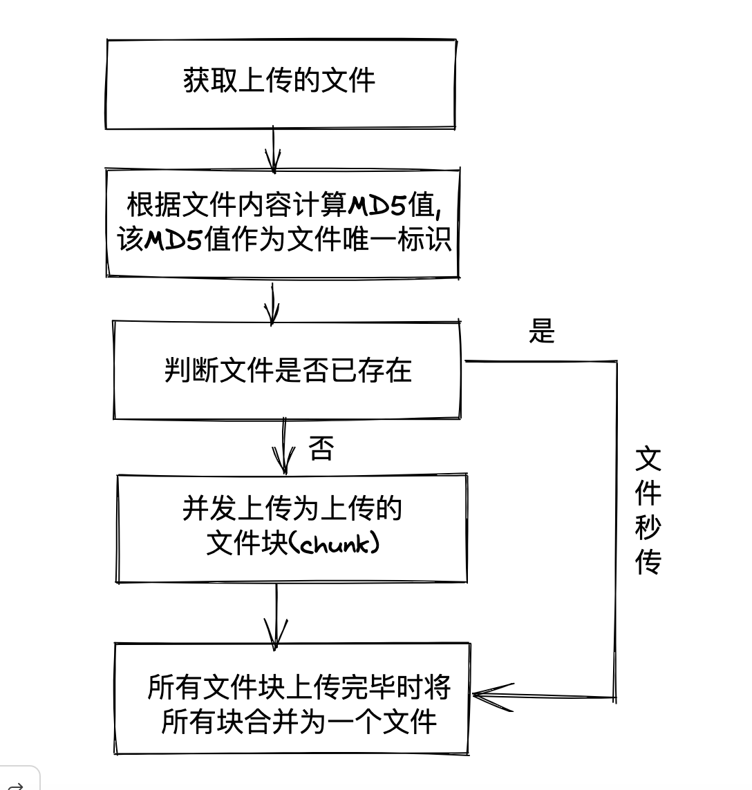

文件上传是应用开发中最为常见的功能,大致可分为以下几种:

- **单文件上传**:利用 input 元素的 `accept` 属性限制上传文件的类型、利用 JS 检测文件的类型实现单文件上传。
- **多文件上传**:利用 input 元素的 `multiple` 属性支持选择多文件实现多文件上传。
- **目录上传**:利用 input 元素上的 `webkitdirectory` 属性支持目录上传实现上传。
- **压缩目录上传**:在目录上传的基础上,利用 `JSZip` 实现压缩目录上传的功能。
- **拖拽上传**:利用拖拽事件和 `DataTransfer` 对象实现拖拽上传的功能。
- **粘贴板上传**:利用剪贴板事件和 `Clipboard API` 实现剪贴板上传的功能。
- **大文件分块上传**:分块上传是将一个文件通过`Blob.slice()`将其分割为多个文件 chunk(块),多个文件 chunk 可以通过`async-pool` 实现文件并发上传。多个文件由于被分成多个 chunk,当上传中断后(因为网络问题、或者强制中断上传)再次进行上传时服务端应秒传已上传的 chunk,所以服务端需要根据文件的 md5 值判断上传文件和文件 chunk 是否已上传,若上传则直接秒传,否则进行正常的文件上传,文件的 MD5 可通过`SparkMD5`根据文件内容生成,只要文件内容发生变化,生成的 MD5 也会不同。
  - **文件秒传**:文件秒传是指上传前根据文件名和文件 MD5 值检查文件是否被上传,若已上传则直接跳过。
  - **断点续传**:断点续传是指上传文件时因为网络等原因导致上传中断,仅上传一部分文件 chunk,当再次进行文件上传时,已上传的文件 chunk 会被秒传,而未被上传的文件 chunk 则需要上传到服务器。断点续传
- **服务端文件上传**:利用第三方库 `form-data` 实现服务端文件流式上传的功能。

## 1.单文件上传

单文件上传场景下将 input 元素的 type 属性设置为 file 表示设置文件上传,input 元素的`accept`属性可以限制上传文件的类型(accept 属性不支持 IE9)。例如 `accept="image/\*"`表示只能选择图片文件,当然也可以设置为具体的图片类型,比如 `image/png` 或 `image/png,image/jpeg`。

::: details 封装上传逻辑

```ts
import axios from 'axios'
import { nextTick, ref, Ref } from 'vue'

export type Option = {
  // 上传文件元素
  el: Ref<HTMLInputElement | HTMLDivElement | undefined>
  // 上传文件接口url
  url: string
  // 上传文件参数文件名字段,默认是files
  fieldName?: string
  // 上传文件参数文件path字段
  fieldPath?: string | ((relativePath: string) => string)
  // 上传成功回调
  onSuccess?: (res: any) => void
  // 上传进度完成(进度100%)回调
  onCompleted?: () => void
  // 上传进度回调,percent一个数字用于表示当前文件上传进度
  onProgress?: (percent: number) => void
  // 上传错误回调
  onError?: (e: Error) => void
}

/**
 * 上传文件hook,支持单文件和多文件上传
 * @param option 配置项
 */
export const useUploadFile = (option: Option) => {
  const {
    el,
    url,
    fieldName = 'files',
    fieldPath,
    onSuccess,
    onCompleted,
    onProgress,
    onError,
  } = option
  // 用于存储已选择文件
  let files = ref<File[]>([])

  const onChange = (e: Event) => {
    const target = e.target as HTMLInputElement
    // 获取已选中文件列表
    files.value = Array.from(target.files!)
  }

  nextTick(() => {
    if (!el.value) return
    // 获取元素标签名,单文件上传和多文件上传el元素必须是input元素
    const tagName = el.value.tagName
    if (tagName === 'INPUT') {
      // 监听change事件,获取已选中文件列表
      el.value.addEventListener('change', onChange)
    }
  })

  const upload = () => {
    if (!el.value || files.value.length === 0) return
    const formData = new FormData()

    // 设置formdata参数
    files.value.forEach((file) => {
      const path = typeof fieldPath === 'function' ? fieldPath(file.webkitRelativePath) : fieldPath
      formData.append(fieldName!, file, path)
    })

    axios
      .post(url, formData, {
        // 监听上传进度事件
        onUploadProgress(e: ProgressEvent) {
          const percentCompleted = Math.round((e.loaded * 100) / e.total)
          onProgress && onProgress(percentCompleted)
          if (percentCompleted === 100) {
            onCompleted && onCompleted()
          }
        },
      })
      .then((res) => {
        const { code, message } = res.data
        if (code === 0) {
          onError && onError(new Error(message))
        }
        onSuccess && onSuccess(res)
      })
      .catch((e) => onError && onError(e))
  }

  // 返回上传函数与已选中文件列表
  return {
    upload,
    files,
  }
}
```

:::

::: details 单文件上传组件

```vue
<!-- 单文件上传组件 -->
<template>
  <div class="upload">
    <div class="upload-container">
      <label for="signle" id="label"> 单文件上传 </label>
      <input ref="uploadRef" id="signle" type="file" accept="images/*" />
    </div>
    <div class="tag">已选{{ files.length }}个文件</div>
    <button @click="upload" class="btn">单文件上传</button>
  </div>
</template>

<script setup lang="ts">
  import { ref } from 'vue'
  import { useUploadFile } from '../hooks/useUploadFile'

  const url = 'http://localhost:8000/upload/single'
  const uploadRef = ref<HTMLInputElement>()

  /**
   * 获取单个File对象,File对象包含了如下几个属性:
   * lastModified:最后修改日期,是一个时间戳。
   * lastModifiedDate:最后修改日期,是一个Date对象。
   * name:文件名称。
   * size:文件大小,单位Byte。
   * type:文件类型。例如image/gif、image/png等等。
   * webkitRelativePath:规定了文件的路径,相对于input元素而言
   */
  const { upload, files } = useUploadFile({
    el: uploadRef,
    url,
    onCompleted() {
      files.value = []
    },
    onSuccess() {
      console.log('单文件上传成功')
    },
  })
</script>
```

:::

上面代码通过 files 属性获取已选择文件列表中的第一个 File 对象,然后将 File 封装成 FormData 对象(FormData 对象用以将数据解析成键值对结构数据,主要用于发送表单数据),再通过 Axios 的 post 方法向服务端发送请求。若想监听文件的上传进度可以配置请求配置对象的 `onUploadProgress`事件,`onUploadProgress` 对应值是一个回调函数,该回调接收一个 `ProgressEvent` 对象(上传进度事件)作为函数,可以通过 `ProgressEvent` 对象获取当前文件上传进度。

### 1.1 Node 实现单文件上传

::: details 安装项目依赖

- koa:一个轻量级 Web 框架。
- koa-static:处理静态资源的中间件。
- @koa/cors:处理跨域请求的中间件。
- @koa/multer:处理 multipart/form-data 的中间件。
- @koa/router:处理路由的中间件。

```shell
npm i koa koa-static @koa/cors @koa/multer @koa/router
```

:::

::: details 服务端文件上传处理逻辑

```js
const path = require('path')
const Koa = require('koa')
const Router = require('@koa/router')
const Serve = require('koa-static')
const Cors = require('@koa/cors')
const Multer = require('@koa/multer')

const app = new Koa()
const router = new Router()
const PORT = 8000
// 上传后资源地址
const RESOURCE_URL = `http://localhost:${PORT}`
// 存储上传文件的目录
const UPLOAD_DIR = path.join(__dirname, '/public/upload')

// 文件上传配置
const storage = Multer.diskStorage({
  destination: async function (req, file, cb) {
    // 设置文件的存储目录
    cb(null, 'public/upload')
  },
  filename: function (req, file, cb) {
    // 设置文件名
    cb(null, file.originalname)
  },
})
// 加载配置
const multerUpload = Multer({ storage })

router.post('/upload/single', multerUpload.single('files'), async (ctx, next) => {
  try {
    await next()
    ctx.body = {
      code: 1,
      msg: '文件上传成功',
      url: `${RESOURCE_URL}/${ctx.file.originalname}`,
    }
  } catch (e) {
    ctx.body = {
      code: 0,
      msg: '文件上传失败',
    }
  }
})

// 注册中间件
app.use(Cors())
app.use(Serve(UPLOAD_DIR))
app.use(router.routes()).use(router.allowedMethods())
app.listen(PORT, () => {
  console.log(`app starting at port ${PORT}`)
})
```

:::

### 1.1 Java 实现单文件上传

::: details pom.xml

```xml
<parent>
    <groupId>org.springframework.boot</groupId>
    <artifactId>spring-boot-starter-parent</artifactId>
    <version>2.3.4.RELEASE</version>
</parent>
<dependencies>
    <!-- 提供Web开发场景所需的底层所有依赖 -->
    <dependency>
        <groupId>org.springframework.boot</groupId>
        <artifactId>spring-boot-starter-web</artifactId>
    </dependency>
    <!-- 减少getter、setter冗余代码 -->
    <dependency>
        <groupId>org.projectlombok</groupId>
         <artifactId>lombok</artifactId>
    </dependency>
</dependencies>
```

:::

::: details application.properties

```properties
server.port=3000
# 开启多文件上传
spring.servlet.multipart.enabled=true
# 设置单个文件的大小,默认为1MB,若超出1MB则会抛出org.apache.tomcat.util.http.fileupload.impl.FileSizeLimitExceededException异常
spring.servlet.multipart.max-file-size=10MB
# 单次请求文件总数大小,默认为10MB
spring.servlet.multipart.max-request-size=100MB
```

:::

::: details 服务端文件上传处理逻辑

```java

/**
 * 处理逻辑如下:
 * 1.第一通过@CrossOrigin注解标识当前控制器类,使得控制器类中所有方法均允许跨域请求,
 * 这里为了简单故使用@CrossOrigin注解解决跨域,除了@CrossOrigin注解也可以使用实现Filter接口方式解决跨域。
 * 2.第二通过Spring提供的MultipartFile类接收客户端传递的文件,然后通过MultipartFile类
 * 的transferTo方法将MultipartFile对象内的文件输出到指定的路径中。
 * MultipartFile是Spring提供用于接收客户端传递过来的文件类型,代表HTML中
 * form data方式上传的文件,包含二进制数据+文件名称。transferTo()用于将
 * MultipartFile对象内的文件输出到指定的路径中。
*/

package com.fly.controller;
import lombok.AllArgsConstructor;
import lombok.Data;
import lombok.NoArgsConstructor;
import org.springframework.web.bind.annotation.*;
import org.springframework.web.multipart.MultipartFile;

import java.io.File;

@CrossOrigin(origins = "http://localhost:3000",allowedHeaders = "*",allowCredentials = "true",
        maxAge = 3600,methods = {
        RequestMethod.POST,
        RequestMethod.DELETE,
        RequestMethod.HEAD,
        RequestMethod.PUT,
        RequestMethod.PATCH})
@RestController
public class UploadController {
    // 上传文件存放目录
    public final static String UPLOAD_DIR=System.getProperty("user.dir")+"/upload";

    @Data
    @AllArgsConstructor
    @NoArgsConstructor
    public static class Result{
        private Integer code;
        private String msg;
        private Object data;
        static Result success(String message,Object data){
            return new Result(200,message,data);
        }
        static Result error(String message){
            return new Result(201,message,null);
        }
    }

    @PostMapping("/upload/single")
    public Object uploadSingleFile(@RequestParam("file") MultipartFile file){
        if(file.isEmpty()){
            return Result.error("请选择文件");
        }
        String fileName=file.getOriginalFilename();
        File file1=new File(UPLOAD_DIR+"/"+fileName);
        try {
            // 将MultipartFile对象内的文件输出到file1中
            file.transferTo(file1);
            return Result.success("文件上传成功","filePath:"+file1.getPath());
        }catch (Exception e){
            e.printStackTrace();
        }
        return Result.error("文件上传失败");
    }
}
```

:::

## 2.多文件上传

相比较单文件上传,多文件上传只是在 input 元素新增了`multiple`属性,然后使用`Array.from()`将选择的文件转为文件数组,再遍历挨个添加到 FormData 对象传递给服务端。
::: details 多文件上传组件

```vue
<!-- 多文件上传组件 -->
<template>
  <div class="upload">
    <form class="upload-container">
      <!-- 在vue3环境下 label标签for连接上传元素无法使用进行多选 -->
      <label for="multiple" multiple>多文件上传 </label>
      <input ref="uploadRef" id="multiple" type="file" accept="images/*" multiple />
    </form>
    <div class="tag">已选{{ files.length }}个文件</div>
    <button @click="upload" class="btn">多文件上传</button>
  </div>
</template>

<script setup lang="ts">
  import { ref } from 'vue'
  import { useUploadFile } from '../hooks/useUploadFile'

  const url = 'http://localhost:8000/upload/multiple'
  const uploadRef = ref<HTMLInputElement>()

  const { upload, files } = useUploadFile({
    el: uploadRef,
    url,
    fieldName: 'file',
    onCompleted() {
      files.value = []
    },
    onSuccess() {
      console.log('多文件上传成功')
    },
  })
</script>
```

:::

### 2.1 Node 实现多文件上传

::: details 服务端多文件上传处理逻辑

```js
const multerUploadFields = multerUpload.fields([
  {
    name: 'file', // 与FormData对象配置的key相对应
  },
])
/**
 * 对于多文件上传新增了一个/upload/multiple路由方法,通过multerUpload.fields()
 * 根据字段名获取客户端传递的FormData对象内容,上传成功会将文件地址返回至客户端。
 */
router.post('/upload/multiple', multerUploadFields, async (ctx, next) => {
  try {
    await next()
    urls = ctx.files.file.map((file) => `${RESOURCE_URL}/${file.originalname}`)
    ctx.body = {
      code: 1,
      msg: '文件上传成功',
      urls,
    }
  } catch (e) {
    ctx.body = {
      code: 0,
      msg: '文件上传失败',
    }
  }
})
```

:::

### 2.2 Java 实现多文件上传

::: details 服务端实现多文件上传逻辑

```java
@PostMapping("/upload/multiple")
public Result uploadMultipleFile(@RequestParam("files") MultipartFile[] multipartFiles){
    System.out.println(multipartFiles.length);
    if(multipartFiles.length == 0){
        return Result.error("请选择文件");
    }
    StringBuilder sb=new StringBuilder();
    try{
        for(MultipartFile multipartFile:multipartFiles){
            String fileName=multipartFile.getOriginalFilename();
            File file=new File(UPLOAD_DIR+"/"+fileName);
            multipartFile.transferTo(file);
            sb.append(file.getPath()+";");
        }
        return Result.success("文件上传成功","文件地址:"+sb.toString());
    } catch (Exception e) {
          e.printStackTrace();
    }
    return Result.error("文件上传失败");
}
```

## 3.目录上传

目录上传需要设置 input 元素的`webkitdirectory`属性,但是`webkitdirectory`的兼容性较差,不支持 IE11 以下版本。为了让服务端能按照实际的目录结构来存放对应的文件,在添加表单项时需要把当前文件的路径提交到服务端。此外,为了确保`@koa/multer` 能正确处理文件的路径,需要对路径进行特殊处理,即把`/`替换为`@`符号。

::: details 目录上传组件

```vue
<!-- 目录上传组件 -->
<template>
  <div class="upload">
    <div class="upload-container">
      <label for="directory" id="label">目录上传</label>
      <input ref="uploadRef" id="directory" type="file" accept="images/*" webkitdirectory />
    </div>
    <div class="tag">已选{{ files.length }}个文件</div>
    <button @click="upload" class="btn">目录上传</button>
  </div>
</template>

<script setup lang="ts">
  import { ref } from 'vue'
  import { useUploadFile } from '../hooks/useUploadFile'
  // 目录上传本质是就是多文件上传
  const url = 'http://localhost:8000/upload/multiple'
  const uploadRef = ref<HTMLInputElement>()

  const { upload, files } = useUploadFile({
    el: uploadRef,
    url,
    // filePath替换
    fieldPath: (relativePath) => relativePath.replace(/\//g, '@'),
    onCompleted() {
      files.value = []
    },
    onSuccess() {
      console.log('目录上传成功')
    },
  })
</script>
```

:::

## 4.压缩目录上传

当上传文件体积过大时,可以先在客户端将文件进行压缩后再上传至服务器,然后在服务器进行解压,这样可以节省带宽、提升上传效率。在目录上传的基础上,利用 `JSZip` 实现压缩目录上传的功能。

::: details 封装上传逻辑

```ts
import axios from 'axios'
import { nextTick, ref, Ref } from 'vue'
import JSZip, { JSZipGeneratorOptions } from 'jszip'

type ZipOption = {
  fileName?: string | ((relativePath: string) => string)
}

export type Option = {
  // 上传文件元素
  el: Ref<HTMLInputElement | HTMLDivElement | undefined>
  // 上传文件接口url
  url: string
  // 上传文件参数文件名字段,默认是files
  fieldName?: string
  // 上传文件参数文件path字段
  fieldPath?: string | ((relativePath: string) => string)
  // 上传成功回调
  onSuccess?: (res: any) => void
  // 上传进度完成(进度100%)回调
  onCompleted?: () => void
  // 上传进度回调,percent一个数字用于表示当前文件上传进度
  onProgress?: (percent: number) => void
  // 上传错误回调
  onError?: (e: Error) => void
  // 文件zip压缩配置,不为空则开启文件压缩
  zipOption?: ZipOption
}

/**
 * 根据文件对象生成zip压缩文件
 * @param zipName zipName压缩名称
 * @param files 文件列表
 * @param options 配置项
 */
function generateZipFile(
  files: File[],
  zipName?: string,
  options: JSZipGeneratorOptions = { type: 'blob', compression: 'DEFLATE' },
): Promise<File> {
  return new Promise((resolve, reject) => {
    const zip = new JSZip()
    for (let i = 0, len = files.length; i < len; i++) {
      zip.file(files[i].webkitRelativePath, files[i])
    }
    const defaultZipName = files[0].webkitRelativePath.split('/')[0] + '.zip'
    zip
      .generateAsync(options)
      .then((blob) => {
        zipName = zipName || defaultZipName || Date.now() + '.zip'
        const zipFile = new File([blob], zipName, { type: 'application/zip' })
        resolve(zipFile)
      })
      .catch((e) => {
        reject(e)
      })
  })
}

/**
 * 上传文件hook,支持单文件和多文件上传
 * @param option 配置项
 */
export const useUploadFile = (option: Option) => {
  const {
    el,
    url,
    fieldName = 'files',
    fieldPath,
    onSuccess,
    onCompleted,
    onProgress,
    onError,
    zipOption,
  } = option
  // 用于存储已选择文件
  let files = ref<File[]>([])

  const onChange = (e: Event) => {
    const target = e.target as HTMLInputElement
    // 获取已选中文件列表
    files.value = Array.from(target.files!)
  }

  nextTick(() => {
    if (!el.value) return
    // 获取元素标签名,单文件上传和多文件上传el元素必须是input元素
    const tagName = el.value.tagName
    if (tagName === 'INPUT') {
      // 监听change事件,获取已选中文件列表
      el.value.addEventListener('change', onChange)
    }
  })

  const upload = async () => {
    if (!el.value || files.value.length === 0) return
    const formData = new FormData()

    // 处理zip压缩
    if (zipOption) {
      const file = await generateZipFile(files.value)
      files.value = [file]
    }

    // 设置formdata参数
    files.value.forEach((file) => {
      const path = typeof fieldPath === 'function' ? fieldPath(file.webkitRelativePath) : fieldPath
      formData.append(fieldName!, file, path)
    })

    axios
      .post(url, formData, {
        // 监听上传进度事件
        onUploadProgress(e: ProgressEvent) {
          const percentCompleted = Math.round((e.loaded * 100) / e.total)
          onProgress && onProgress(percentCompleted)
          if (percentCompleted === 100) {
            onCompleted && onCompleted()
          }
        },
      })
      .then((res) => {
        const { code, message } = res.data
        if (code === 0) {
          onError && onError(new Error(message))
        }
        onSuccess && onSuccess(res)
      })
      .catch((e) => onError && onError(e))
  }

  // 返回上传函数与已选中文件列表
  return {
    upload,
    files,
  }
}
```

:::

::: details 压缩目录上传组件

```vue
<template>
  <div class="upload">
    <div class="upload-container">
      <label for="zipDirectory" id="label">zip压缩目录上传</label>
      <input ref="uploadRef" id="zipDirectory" type="file" accept="images/*" webkitdirectory />
    </div>
    <div class="tag">已选{{ files.length }}个文件</div>
    <button @click="upload" class="btn">zip压缩目录上传</button>
  </div>
</template>

<script setup lang="ts">
  import { ref } from 'vue'
  import { useUploadFile } from '../hooks/useUploadFile'

  const url = 'http://localhost:8000/upload/single'
  const uploadRef = ref<HTMLInputElement>()
  const { upload, files } = useUploadFile({
    el: uploadRef,
    url,
    zipOption: {},
    onCompleted() {
      files.value = []
    },
    onSuccess() {
      console.log('压缩目录上传成功')
    },
  })
</script>
```

:::

## 5.拖拽上传

文件拖拽上传的流程是监听 body 元素与目标区域元素`drop`、`dragenter`、`dragover`、`dragleave`等拖拽相关事件,当拖拽文件到目标元素松开时就会触发`drop`,通过该事件 Event 对象的`dataTransfer.files`获取拖拽的文件列表进行文件上传(dataTransfer 用于存储拖拽过程中产生的数据)。
::: details 封装上传逻辑

```ts
import axios from 'axios'
import { nextTick, ref, Ref, onMounted } from 'vue'
import JSZip, { JSZipGeneratorOptions } from 'jszip'

type ZipOption = {
  fileName?: string | ((relativePath: string) => string)
}
type DragOption = {
  activeClass?: string
  // 开始拖拽事件
  onDragstart?: (e: DragEvent) => void
  // 拖拽结束事件
  onDragend?: (e: DragEvent) => void
  // 拖拽进入目标区域事件
  onDragenter?: (e: DragEvent) => void
  // 拖拽到目录区域事件
  onDragover?: (e: DragEvent) => void
  // 拖拽离开目标区域事件
  onDragleave?: (e: DragEvent) => void
  // 拖拽元素松开事件
  onDrop?: (e: DragEvent) => void
}

export type Option = {
  // 上传文件元素
  el: Ref<HTMLInputElement | HTMLDivElement | undefined>
  // 上传文件接口url
  url: string
  // 上传文件参数文件名字段,默认是files
  fieldName?: string
  // 上传文件参数文件path字段
  fieldPath?: string | ((relativePath: string) => string)
  // 上传成功回调
  onSuccess?: (res: any) => void
  // 上传进度完成(进度100%)回调
  onCompleted?: () => void
  // 上传进度回调,percent一个数字用于表示当前文件上传进度
  onProgress?: (percent: number) => void
  // 上传错误回调
  onError?: (e: Error) => void
  // 文件zip压缩配置,不为空则开启文件压缩
  zipOption?: ZipOption
  // 拖拽上传配置,不为空则开启拖拽文件上传
  dragOption?: DragOption
}

// 拖拽事件列表
const drapEvents = ['onDragenter', 'onDragover', 'onDragleave', 'onDrop'] as const
type DrapEvents = (typeof drapEvents)[number]

// 阻止浏览器默认行为
const preventDefaults = (e: Event) => {
  e.preventDefault()
  e.stopPropagation()
}

/**
 * 根据文件对象生成zip压缩文件
 * @param zipName zipName压缩名称
 * @param files 文件列表
 * @param options 配置项
 */
function generateZipFile(
  files: File[],
  zipName?: string,
  options: JSZipGeneratorOptions = { type: 'blob', compression: 'DEFLATE' },
): Promise<File> {
  return new Promise((resolve, reject) => {
    const zip = new JSZip()
    for (let i = 0, len = files.length; i < len; i++) {
      zip.file(files[i].webkitRelativePath, files[i])
    }
    const defaultZipName = files[0].webkitRelativePath.split('/')[0] + '.zip'
    zip
      .generateAsync(options)
      .then((blob) => {
        zipName = zipName || defaultZipName || Date.now() + '.zip'
        const zipFile = new File([blob], zipName, { type: 'application/zip' })
        resolve(zipFile)
      })
      .catch((e) => {
        reject(e)
      })
  })
}

/**
 * 字符串首字母大小写
 * @param str 字符串
 */
function firstUpperCase(str: string) {
  return str.charAt(0).toUpperCase() + str.slice(1)
}

/**
 * 上传文件hook,支持单文件和多文件上传
 * @param option 配置项
 */
export const useUploadFile = (option: Option) => {
  const {
    el,
    url,
    fieldName = 'files',
    fieldPath,
    onSuccess,
    onCompleted,
    onProgress,
    onError,
    zipOption,
    dragOption,
  } = option
  // 用于存储已选择文件
  let files = ref<File[]>([])

  const onChange = (e: Event) => {
    const target = e.target as HTMLInputElement
    // 获取已选中文件列表
    files.value = Array.from(target.files!)
  }

  const dragHandle = (e: Event) => {
    preventDefaults(e)
    const { activeClass = '' } = dragOption || {}
    const eventType = `on${firstUpperCase(e.type)}` as DrapEvents
    // 拖拽目标元素区域时则添加class,否则则删除class
    if (activeClass) {
      drapEvents.slice(0, 2).includes(eventType)
        ? el.value?.classList.add(activeClass)
        : el.value?.classList.remove(activeClass)
    }
    // 如果事件是drop,则通过e.dataTransfer.files获取拖拽文件列表
    if (e.type === 'drop') {
      const dt = (e as DragEvent).dataTransfer
      files.value = Array.from(dt!.files)
    }
    if (!dragOption![eventType]) return
    // 执行拖拽相关回调函数
    dragOption![eventType]!(e as DragEvent)
  }
  // 根元素与目标区域元素注册拖拽相关事件
  const registerDragHandle = (el: HTMLDivElement) => {
    drapEvents.forEach((drapEventName) => {
      const eventName = drapEventName.substring(2).toLowerCase()
      // 监听根元素与目标元素拖拽事件
      document.body.addEventListener(eventName, preventDefaults, false)
      el.addEventListener(eventName, dragHandle, false)
    })
  }

  nextTick(() => {
    if (!el.value) return
    // 获取元素标签名,单文件上传和多文件上传el元素必须是input元素
    const tagName = el.value.tagName
    if (tagName === 'INPUT') {
      // 监听change事件,获取已选中文件列表
      el.value.addEventListener('change', onChange)
    }
    // 处理拖拽文件上传
    dragOption && registerDragHandle(el.value)
  })

  onMounted(() => {
    // 解绑拖拽事件
    if (dragOption) {
      drapEvents.forEach((eventType) => {
        const eType = eventType.substring(2).toLowerCase()
        document.body.removeEventListener(eType, preventDefaults)
        el.value?.removeEventListener(eType, dragHandle)
      })
    }
  })

  const upload = async () => {
    if (!el.value || files.value.length === 0) return
    const formData = new FormData()

    // 处理zip压缩
    if (zipOption) {
      const file = await generateZipFile(files.value)
      files.value = [file]
    }

    // 设置formdata参数
    files.value.forEach((file) => {
      const path = typeof fieldPath === 'function' ? fieldPath(file.webkitRelativePath) : fieldPath
      formData.append(fieldName!, file, path)
    })

    axios
      .post(url, formData, {
        // 监听上传进度事件
        onUploadProgress(e: ProgressEvent) {
          const percentCompleted = Math.round((e.loaded * 100) / e.total)
          onProgress && onProgress(percentCompleted)
          if (percentCompleted === 100) {
            onCompleted && onCompleted()
          }
        },
      })
      .then((res) => {
        const { code, message } = res.data
        if (code === 0) {
          onError && onError(new Error(message))
        }
        onSuccess && onSuccess(res)
      })
      .catch((e) => onError && onError(e))
  }

  // 返回上传函数与已选中文件列表
  return {
    upload,
    files,
  }
}
```

:::

::: details 拖拽上传组件

```vue
<!-- 拖拽上传 -->
<template>
  <div class="upload">
    <div ref="dropAreaRef" class="upload-container">拖拽文件上传</div>
    <div class="tag">已选{{ files.length }}个文件</div>
    <ul ref="previewRef" class="preview"></ul>
  </div>
</template>

<script setup lang="ts">
  import { ref } from 'vue'
  import { useUploadFile } from '../hooks/useUploadFile'
  const url = 'http://localhost:8000/upload/multiple'

  // 区域元素与预览元素
  const dropAreaRef = ref<HTMLDivElement>(),
    previewRef = ref<HTMLDivElement>()

  const { upload, files } = useUploadFile({
    el: dropAreaRef,
    url,
    fieldName: 'file',
    dragOption: {
      activeClass: 'highlighted',
      onDrop() {
        files.value.forEach((file) => previewImage(file, previewRef.value!))
        upload()
      },
    },
    onCompleted() {
      files.value = []
    },
    onSuccess(res) {
      console.log('拖拽文件上传成功')
    },
  })

  // 根据File对象转为图片文件进行预览
  const previewImage = (file: File, container: Element) => {
    container.innerHTML = ''
    // 图片格式常用正则
    const IMAGE_MIME_REGEX = /^image\/(jpe?g|gif|png)$/i
    if (IMAGE_MIME_REGEX.test(file.type)) {
      // 创建FileReader对象,它可以读取 File 或 Blob 对象到内存中。
      const reader = new FileReader()
      // 监听reader读取事件
      reader.onload = (e: Event) => {
        const img = document.createElement('img')
        img.src = (e.target! as any).result
        img.classList.add('img')
        const li = document.createElement('li')
        li.append(img)
        container.append(li)
      }
      /**
       * readAsDataURL用于读取指定的Blob或File对象,读取操作完毕后readyState会变成已完成DONE,
       * 并触发onLoad事件,同时目标对象的result属性将包含一个data:URL格式的字符串（base64编码）
       * 以表示所读取文件的内容。
       */
      reader.readAsDataURL(file)
    }
  }
</script>
<style>
  .preview {
    list-style: none;
    width: 180px;
    margin: auto;
    display: flex;
    flex-wrap: wrap;
    justify-content: space-evenly;
  }
  .preview li {
    width: 52px;
    height: 52px;
    border-radius: 8px;
    overflow: hidden;
  }
  .img {
    display: inline-block !important;
    width: 100%;
    height: 100%;
    border: 1px solid #ddd;
    border-radius: 2px;
  }
  .highlighted {
    border-color: #18a058;
    background-color: #18a058;
    color: #fff;
  }
</style>
```

:::

## 6.粘贴板上传

粘贴板上传依赖于`Clipboard` API,在 Web 应用程序中,Clipboard API 可用于实现剪切、复制和粘贴功能。实现粘贴板上传流程如下:

- 监听目标容器的粘贴(paste)事件。
- 读取并解析剪贴板中的内容。在生产中无需手动创建 Clipboard 对象,而是通过 navigator.clipboard 来获取 Clipboard 对象,创建 Clipboard 对象后通过 read()读取剪贴板中的内容,由于剪贴板中的内容可能是文字、视频、HTML,所以这一步需要对剪贴板内容的 MIME 类型进行过滤。
- 动态构建 FormData 对象并上传。

::: details 封装上传逻辑

```ts
import axios from 'axios'
import { nextTick, ref, Ref, onMounted } from 'vue'
import JSZip, { JSZipGeneratorOptions } from 'jszip'

type ZipOption = {
  fileName?: string | ((relativePath: string) => string)
}
type DragOption = {
  activeClass?: string
  // 开始拖拽事件
  onDragstart?: (e: DragEvent) => void
  // 拖拽结束事件
  onDragend?: (e: DragEvent) => void
  // 拖拽进入目标区域事件
  onDragenter?: (e: DragEvent) => void
  // 拖拽到目录区域事件
  onDragover?: (e: DragEvent) => void
  // 拖拽离开目标区域事件
  onDragleave?: (e: DragEvent) => void
  // 拖拽元素松开事件
  onDrop?: (e: DragEvent) => void
}

export type Option = {
  // 上传文件元素
  el: Ref<HTMLInputElement | HTMLDivElement | undefined>
  // 上传文件接口url
  url: string
  // 上传文件参数文件名字段,默认是files
  fieldName?: string
  // 上传文件参数文件path字段
  fieldPath?: string | ((relativePath: string) => string)
  // 上传成功回调
  onSuccess?: (res: any) => void
  // 上传进度完成(进度100%)回调
  onCompleted?: () => void
  // 上传进度回调,percent一个数字用于表示当前文件上传进度
  onProgress?: (percent: number) => void
  // 上传错误回调
  onError?: (e: Error) => void
  // 文件zip压缩配置,不为空则开启文件压缩
  zipOption?: ZipOption
  // 拖拽上传配置,不为空则开启拖拽文件上传
  dragOption?: DragOption
  // 粘贴上传配置,不为空这开启剪切板文件上传
  clipboard?: { onPaste: (e: ClipboardEvent) => void }
}

// 拖拽事件列表
const drapEvents = ['onDragenter', 'onDragover', 'onDragleave', 'onDrop'] as const
type DrapEvents = (typeof drapEvents)[number]

// 文本mime类型
const textMimeTypes = ['text/plain', 'text/html', 'text/css']

// 阻止浏览器默认行为
const preventDefaults = (e: Event) => {
  e.preventDefault()
  e.stopPropagation()
}

/**
 * 根据文件对象生成zip压缩文件
 * @param zipName zipName压缩名称
 * @param files 文件列表
 * @param options 配置项
 */
function generateZipFile(
  files: File[],
  zipName?: string,
  options: JSZipGeneratorOptions = { type: 'blob', compression: 'DEFLATE' },
): Promise<File> {
  return new Promise((resolve, reject) => {
    const zip = new JSZip()
    for (let i = 0, len = files.length; i < len; i++) {
      zip.file(files[i].webkitRelativePath, files[i])
    }
    const defaultZipName = files[0].webkitRelativePath.split('/')[0] + '.zip'
    zip
      .generateAsync(options)
      .then((blob) => {
        zipName = zipName || defaultZipName || Date.now() + '.zip'
        const zipFile = new File([blob], zipName, { type: 'application/zip' })
        resolve(zipFile)
      })
      .catch((e) => {
        reject(e)
      })
  })
}

/**
 * 字符串首字母大小写
 * @param str 字符串
 */
function firstUpperCase(str: string) {
  return str.charAt(0).toUpperCase() + str.slice(1)
}

/**
 * 上传文件hook,支持单文件和多文件上传
 * @param option 配置项
 */
export const useUploadFile = (option: Option) => {
  const {
    el,
    url,
    fieldName = 'files',
    fieldPath,
    onSuccess,
    onCompleted,
    onProgress,
    onError,
    zipOption,
    dragOption,
    clipboard,
  } = option
  // 用于存储已选择文件
  let files = ref<File[]>([])

  const onChange = (e: Event) => {
    const target = e.target as HTMLInputElement
    // 获取已选中文件列表
    files.value = Array.from(target.files!)
  }

  const dragHandle = (e: Event) => {
    preventDefaults(e)
    const { activeClass = '' } = dragOption || {}
    const eventType = `on${firstUpperCase(e.type)}` as DrapEvents
    // 拖拽目标元素区域时则添加class,否则则删除class
    if (activeClass) {
      drapEvents.slice(0, 2).includes(eventType)
        ? el.value?.classList.add(activeClass)
        : el.value?.classList.remove(activeClass)
    }
    // 如果事件是drop,则通过e.dataTransfer.files获取拖拽文件列表
    if (e.type === 'drop') {
      const dt = (e as DragEvent).dataTransfer
      files.value = Array.from(dt!.files)
    }
    if (!dragOption![eventType]) return
    // 执行拖拽相关回调函数
    dragOption![eventType]!(e as DragEvent)
  }
  // 根元素与目标区域元素注册拖拽相关事件
  const registerDragHandle = (el: HTMLDivElement) => {
    drapEvents.forEach((drapEventName) => {
      const eventName = drapEventName.substring(2).toLowerCase()
      // 监听根元素与目标元素拖拽事件
      document.body.addEventListener(eventName, preventDefaults, false)
      el.addEventListener(eventName, dragHandle, false)
    })
  }

  // 目标区域元素粘贴事件处理
  const pasteHandle = async (e: Event) => {
    e.preventDefault()
    if (navigator.clipboard) {
      // 读取剪切板上的数据,返回一个ClipboardItem数组
      const clipboardItems = await navigator.clipboard.read()
      for (const clipboardItem of clipboardItems) {
        for (const type of clipboardItem.types) {
          // 过滤文本
          if (!['text/html'].includes(type)) {
            const blob = await clipboardItem.getType(type)
            const file = new File([blob], Date.now().toString(), {
              type: blob.type,
            })
            files.value.push(file)
          }
        }
      }
    } else {
      // 兼容性处理
      const items = (e as ClipboardEvent).clipboardData!.items
      for (let i = 0, len = items.length; i < len; i++) {
        if (!textMimeTypes.includes(items[i].type)) {
          const file = items[i].getAsFile()!
          files.value.push(file)
        }
      }
    }
    clipboard?.onPaste && clipboard.onPaste(e as ClipboardEvent)
  }

  nextTick(() => {
    if (!el.value) return
    // 获取元素标签名,单文件上传和多文件上传el元素必须是input元素
    const tagName = el.value.tagName
    if (tagName === 'INPUT') {
      // 监听change事件,获取已选中文件列表
      el.value.addEventListener('change', onChange)
    }
    // 处理拖拽文件上传
    dragOption && registerDragHandle(el.value)
    // 处理粘贴板上传
    clipboard && el.value.addEventListener('paste', pasteHandle, false)
  })

  onMounted(() => {
    // 解绑拖拽事件
    if (dragOption) {
      drapEvents.forEach((eventType) => {
        const eType = eventType.substring(2).toLowerCase()
        document.body.removeEventListener(eType, preventDefaults)
        el.value?.removeEventListener(eType, dragHandle)
      })
    }
    // 解绑paste事件
    if (clipboard) {
      el.value?.removeEventListener('paste', pasteHandle)
    }
  })

  const upload = async () => {
    if (!el.value || files.value.length === 0) return
    const formData = new FormData()

    // 处理zip压缩
    if (zipOption) {
      const file = await generateZipFile(files.value)
      files.value = [file]
    }

    // 设置formdata参数
    files.value.forEach((file) => {
      const path = typeof fieldPath === 'function' ? fieldPath(file.webkitRelativePath) : fieldPath
      formData.append(fieldName!, file, path)
    })

    axios
      .post(url, formData, {
        // 监听上传进度事件
        onUploadProgress(e: ProgressEvent) {
          const percentCompleted = Math.round((e.loaded * 100) / e.total)
          onProgress && onProgress(percentCompleted)
          if (percentCompleted === 100) {
            onCompleted && onCompleted()
          }
        },
      })
      .then((res) => {
        const { code, message } = res.data
        if (code === 0) {
          onError && onError(new Error(message))
        }
        onSuccess && onSuccess(res)
      })
      .catch((e) => onError && onError(e))
  }

  // 返回上传函数与已选中文件列表
  return {
    upload,
    files,
  }
}
```

:::
::: details 剪切板上传组件

```vue
<!-- 剪切板上传组件 -->
<template>
  <div class="img-container">
    
    
  </div>
  <div class="upload">
    <div ref="uploadAreaRef" class="upload-container">剪切板上传</div>
  </div>
  <div ref="previewRef" class="preview"></div>
</template>

<script setup lang="ts">
  import { ref } from 'vue'
  import { useUploadFile } from '../hooks/useUploadFile'
  const url = 'http://localhost:8000/upload/single'

  // 区域元素与预览元素
  const uploadAreaRef = ref<HTMLDivElement>(),
    previewRef = ref<HTMLDivElement>()

  const { upload, files } = useUploadFile({
    el: uploadAreaRef,
    url,
    clipboard: {
      onPaste(e) {
        upload()
      },
    },
    onCompleted() {
      files.value.forEach((file) => previewImage(file, previewRef.value!))
      files.value = []
    },
    onSuccess(res) {
      console.log('剪切板文件上传成功')
    },
  })

  // 粘贴事件触发图片文件进行预览
  const previewImage = (file: File, container: Element) => {
    container.innerHTML = ''
    // 图片格式常用正则
    const IMAGE_MIME_REGEX = /^image\/(jpe?g|gif|png)$/i
    if (IMAGE_MIME_REGEX.test(file.type)) {
      // 创建FileReader对象,它可以读取 File 或 Blob 对象到内存中。
      const reader = new FileReader()
      reader.onload = (e: Event) => {
        const img = document.createElement('img')
        img.src = (e.target! as any).result
        img.classList.add('img')
        const li = document.createElement('li')
        li.append(img)
        container.append(li)
      }
      reader.readAsDataURL(file)
    }
  }
</script>
<style scoped>
  .img-container {
    margin: auto;
    padding-top: 20px;
    width: 180px;
    display: flex;
    flex-wrap: wrap;
    justify-content: space-evenly;
  }
  .img-container img {
    width: 52px;
    height: 52px;
    border-radius: 8px;
    overflow: hidden;
  }

  .preview {
    list-style: none;
    width: 180px;
    margin: auto;
    display: flex;
    flex-wrap: wrap;
    justify-content: space-evenly;
  }
  .preview li {
    width: 52px;
    height: 52px;
    border-radius: 8px;
    overflow: hidden;
  }
  .img {
    display: inline-block !important;
    width: 100%;
    height: 100%;
    border: 1px solid #ddd;
    border-radius: 2px;
  }
</style>
```

:::

## 7.大文件分片上传

文件分片上传是指将一个大文件分成几个小的文件块(chunk),然后通过网络将这些文件片段上传到服务器。这种方式比一次性上传整个文件更加可靠,能够更好地处理网络中断、传输错误等情况。上传流程图:


- 客户端上传文件前首先根据文件的摘要信息判断是否已经被上传,如果被上传则直接秒传。
- 客户端上传文件时将文件分成若干小块(chunk),并为每个块生成唯一的标识符(根据文件块的内容生成 MD5 摘要)。
- 客户端逐个或并发上传小片段到服务端,上传文件块时会携带 fileName(文件名称)、chunkTotal(文件分块总数量)、fileMD5(文件 MD5 值)等信息。
- 服务端接收到文件块后,将其保存在一个临时目录中,此文件的 MD5 值作为目录名称,该目录用于存放对应的文件 chunk。
- 客户端上传文件时服务端会使用一个容器存储文件对应 chunk 上传成功的次数,如果 chunk 上传成功次数与 chunkTotal 相等,则说明文件块已全部上传完毕,此时可以进行文件合并操作。文件合并首先会读取保存文件块的临时目录下的所有文件,获取文件列表后会对文件进行顺序排序,最后读取文件并通过写入流写入到一个文件中,写入成功后将删除已合并的分块。

::: details 封装大文件分片上传逻辑

```ts
import SparkMD5 from 'spark-md5'
import { nextTick, ref, Ref } from 'vue'
import axios from 'axios'

const request = axios.create({
  baseURL: 'http://localhost:8000/',
  timeout: 5000,
})

request.interceptors.response.use((res) => {
  return res.data
})

/**
 * 用于计算文件对象内容的md5加密值,此步骤比较耗时可通过WebWorker处理
 * @param file 文件对象
 * @param chunkSize 文件分块大小 默认为2MB
 */
const calcFileMD5 = (file: File, chunkSize: number) => {
  return new Promise<string>((resolve, reject) => {
    // 分块的数量
    let chunks = Math.ceil(file.size / chunkSize),
      // 当前分块下标
      currentChunk = 0,
      // spark实例
      spark = new SparkMD5.ArrayBuffer(),
      // fileReader用于读取file对象
      fileReader = new FileReader()

    // fileReader读取文件
    fileReader.onload = (e) => {
      spark.append(e.target!.result as ArrayBuffer)
      currentChunk++
      if (currentChunk < chunks) {
        loadNext()
      } else {
        resolve(spark.end())
      }
    }
    // fileReader分块读取文件错误则终止读取
    fileReader.onerror = (e) => {
      reject(fileReader.error)
      fileReader.abort()
    }
    // 使用file.slice()分块文件,fileReader中用于加载文件,并读取到ArrayBuffer中
    const loadNext = () => {
      const start = currentChunk * chunkSize,
        end = start + chunkSize >= file.size ? file.size : start + chunkSize
      fileReader.readAsArrayBuffer(file.slice(start, end))
    }
    loadNext()
  })
}

/**
 * asyncPool用于实现异步任务并发控制
 * @param poolLimit 限制的并发数量
 * @param tasks 任务数组
 * @param iteratorFn 迭代函数
 */
const asyncPool = async (
  poolLimit: number,
  tasks: Array<any>,
  iteratorFn: (index: number, tasks: Array<any>) => Promise<unknown>,
) => {
  // 存储所有异步任务
  const ret = [],
    // 存储正在执行的异步任务
    executing: Array<Promise<any>> = []
  for (const item of tasks) {
    const p = Promise.resolve().then(() => iteratorFn(item, tasks))
    // 保存新的异步任务
    ret.push(p)

    // 当poolLimit值小于或等于总任务个数时,进行并发控制
    if (poolLimit <= tasks.length) {
      const e = p.then(() =>
        // 当任务完成后,从正在执行的任务数组中移除已完成的任务
        executing.splice(executing.indexOf(e), 1),
      ) as Promise<any>
      // 保存正在执行的异步任务
      executing.push(e)
      if (executing.length >= poolLimit) {
        await Promise.race(executing)
      }
    }
  }
  return Promise.all(ret)
}

/**
 * 根据文件name和md5值检查文件是否已上传,若已上传则秒传,否则返回已上传的分块ID列表
 * @param url 检查文件是否上传请求url
 * @param name 文件名称
 * @param md5 文件内容md5值
 */
const checkFileExist = (url: string, fileName: string, fileMD5: string) => {
  return request.get(url, {
    params: {
      fileName,
      fileMD5,
    },
  })
}

type UploadOption = {
  url: string
  file: File
  fileMD5: string
  chunkSize: number
  poolLimit?: number
}
const upload = async ({ url, file, fileMD5, chunkSize, poolLimit = 1 }: UploadOption) => {
  // 获取分块数量
  const chunks = Math.ceil(file.size / chunkSize) || 1

  return asyncPool(poolLimit, [...new Array(chunks).keys()], (i) => {
    // 获取文件切割开始和结束下标
    let start = i * chunkSize,
      end = i + 1 == chunks ? file.size : (i + 1) * chunkSize
    // 对文件进行切割,返回一个Blob对象
    const chunk = file.slice(start, end)
    // 上传chunk
    return uploadChunk({
      url,
      chunk,
      chunkIndex: i,
      totalChunk: chunks,
      fileMD5,
      fileName: file.name,
    })
  })
}

type UploadChunkOption = {
  url: string
  chunk: Blob
  chunkIndex: number
  totalChunk: number
  fileMD5: string
  fileName: string
}
const uploadChunk = ({
  url,
  chunk,
  chunkIndex,
  totalChunk,
  fileMD5,
  fileName,
}: UploadChunkOption) => {
  let formData = new FormData()
  formData.set('file', chunk, fileMD5 + '-' + chunkIndex)
  formData.set('fileName', fileName)
  // 文件MD5值
  formData.set('fileMD5', fileMD5)
  formData.set('timestamp', Date.now().toString())
  // chunk的总数量,用于服务端判断所有chunk是否都上传完毕
  formData.set('chunkTotal', String(totalChunk))

  return request.post(url, formData)
}

interface Option {
  el: Ref<HTMLInputElement | HTMLDivElement | undefined>
  url: string
  slice?: {
    chunkSize?: number
  }
}

export const useUploadFile = (option: Option) => {
  const { el, slice } = option
  // 分块大小
  const chunkSize = slice?.chunkSize || 2 * 1024 * 1024
  let files = ref<File[]>([])

  const onChange = (e: Event) => {
    const target = e.target as HTMLInputElement
    files.value = Array.from(target.files!)
  }

  nextTick(async () => {
    if (!el.value) return
    const tagName = el.value.tagName
    if (tagName === 'INPUT') {
      el.value.addEventListener('change', onChange)
    }
  })

  const uploadFile = async (url: string) => {
    if (files.value.length === 0) return
    const file = files.value[0]
    // 获取文件md5值
    const fileMD5 = await calcFileMD5(file, chunkSize)
    const fileStatus = await checkFileExist(
      // 判断文件是否已存在
      'upload/exists',
      file.name,
      fileMD5,
    )

    if (fileStatus.data && fileStatus.data.isExists) {
      alert('文件已上传[秒传]')
      return
    }

    upload({ url, file, fileMD5, chunkSize })
  }

  function concatFile(url: string, fileName: string, fileMD5: string) {
    return request.get(url, {
      params: {
        fileName,
        fileMD5,
      },
    })
  }
  const mergerFile = async (url: string) => {
    if (files.value.length === 0) return
    const file = files.value[0]
    // 获取文件md5值
    const fileMD5 = await calcFileMD5(file, chunkSize)
    concatFile(url, file.name, fileMD5)
  }
  return { uploadFile, mergerFile }
}
```

:::

::: details 分片上传组件

```vue
<template>
  <div class="upload">
    <div class="upload-container">
      <label for="slice" id="label"> 分片文件上传 </label>
      <input ref="uploadRef" id="slice" type="file" accept="images/*" />
    </div>
    <button @click="uploadFile('upload/fileChunk')" class="btn">分片文件上传</button>
    <button @click="mergerFile('upload/concatFileChunks')" class="btn">合并文件</button>
  </div>
</template>

<script setup lang="ts">
  import { ref } from 'vue'
  import { useUploadFile } from '../hooks/useSliceUploadFile'

  const uploadRef = ref<HTMLInputElement>()
  const { uploadFile, mergerFile } = useUploadFile({
    el: uploadRef,
    url: '',
    slice: {
      chunkSize: 2 * 1024 * 1024,
    },
  })
</script>
```

:::

### 7.1 Node 实现大文件分片上传

```js
const fs = require('fs')
const path = require('path')
const util = require('util')
const Koa = require('koa')
const cors = require('@koa/cors')
const multer = require('@koa/multer')
const Router = require('@koa/router')
const serve = require('koa-static')
const fse = require('fs-extra')
const readdir = util.promisify(fs.readdir)
const unlink = util.promisify(fs.unlink)
const PORT = 8000

const app = new Koa(),
  router = new Router(),
  // 临时目录
  TMP_DIR = path.join(__dirname, 'tmp'),
  // 上传文件存放目录
  UPLOAD_DIR = path.join(__dirname, '../public/upload'),
  // 忽略的文件列表
  IGNORES = ['.DS_Store'],
  /**
   * 定义一个map容器用于存储文件所上传成功块的数量,key为文件的MD5值,
   * value为上传成功块的数量
   */
  fileMap = new Map()

// 定义文件的存储方式和存储路径
const storage = multer.diskStorage({
  // 用于定义文件存储的目标目录
  destination: async function (req, file, cb) {
    let fileMd5 = file.originalname.split('-')[0]
    const fileDir = path.join(TMP_DIR, fileMd5)
    await fse.ensureDir(fileDir)
    cb(null, fileDir)
  },
  // 用于定义文件在存储目录中的名称
  filename: function (req, file, cb) {
    let chunkIndex = file.originalname.split('-')[1]
    cb(null, `${chunkIndex}`)
  },
})

const multerUpload = multer({ storage })

const resOK = (ctx, message = '') => {
  ctx.body = {
    status: 'success',
    message,
  }
}
const resError = (ctx, message = '') => {
  ctx.body = {
    status: 'error',
    message,
  }
}

/**
 * 合并多个文件块
 * @param {*} sourceDir 源文件目录
 * @param {*} targetPath 目标path
 */
async function concatFiles(sourceDir, targetPath) {
  // 读取文件到只写流中
  const readFile = (file, ws) =>
    new Promise((resolve, reject) => {
      // 创建只读流
      fs.createReadStream(file)
        .on('data', (data) => ws.write(data))
        .on('end', resolve)
        .on('error', reject)
    })
  // 读取指定目录下的所有文件,返回一个文件列表
  const files = await readdir(sourceDir)

  // 对文件进行排序
  const sortedFiles = files.filter((file) => IGNORES.indexOf(file) === -1).sort((a, b) => a - b)
  // 创建只写流
  const writeStream = fs.createWriteStream(targetPath)
  // 遍历文件列表
  for (const file of sortedFiles) {
    let filePath = path.join(sourceDir, file)
    // 读取文件
    await readFile(filePath, writeStream)
    // 删除已合并的分块
    await unlink(filePath)
  }
  // 关闭只写流
  writeStream.end()
}

/**
 * 判断文件是否存在,若文件存在则直接返回文件URL,
 * 否则检查该文件的chunk是否存在,若存在chunk则返回
 * chunk列表
 */
router.get('/upload/exists', async (ctx) => {
  const { fileName, fileMD5 } = ctx.query
  // 获取所有文件块合并为文件的存储路径
  const filePath = path.join(UPLOAD_DIR, fileName)
  // 如果存在该路径则说明该文件已上传,无需上传(秒传)
  const isExists = await fse.pathExists(filePath)
  if (isExists) {
    ctx.body = {
      status: 'success',
      data: {
        isExists: true,
        url: `http://localhost:3000/${fileName}`,
      },
    }
    return
  }

  let chunkIds = []
  // 获取chunk存放路径
  const chunksPath = path.join(TMP_DIR, fileMD5)
  // 判断chunk存放路径是否存在
  const hasChunksPath = await fse.pathExists(chunksPath)
  if (hasChunksPath) {
    // 根据chunks的路径读取目录下所有文件,返回一个文件列表
    let files = await readdir(chunksPath)
    chunkIds = files.filter((file) => IGNORES.indexOf(file) === -1)
  }
  ctx.body = {
    status: 'success',
    data: {
      isExists: false,
      chunkIds,
    },
  }
})

/**
 * 上传文件块
 */
router.post('/upload/fileChunk', multerUpload.single('file'), async (ctx, next) => {
  // 获取文件名称、时间戳、chunk总数量、文件MD5值
  const { fileName, timestamp, chunkTotal, fileMD5 } = ctx.request.body
  const total = Number(chunkTotal)
  if (!Number.isInteger(total)) {
    resError(ctx, 'chunkTotal参数非法')
    return
  }
  // 根据文件MD5值获取文件的chunk上传数量
  const chunkSuccessNumber = fileMap.get(fileMD5) || 1
  // 如果与上传chunk数量与分块的总数量相等则进行文件合并
  if (chunkSuccessNumber === total) {
    fileMap.delete(fileMD5)
    await concatFiles(path.join(TMP_DIR, fileMD5), path.join(UPLOAD_DIR, fileName))
    resOK(ctx, '文件合并成功')
    return
  }
  // 上传成功后chunk上传成功数量+1
  fileMap.set(fileMD5, chunkSuccessNumber + 1)
  resOK(ctx, '文件chunk上传成功')
})

/**
 * 创建上传目录,用于存放上传文件
 * @param dirPath 上传目录路径
 */
function createUploadMkdir(dirPath) {
  fs.exists(dirPath, (e) => {
    fs.mkdir(dirPath, { recursive: true }, (err) => {
      if (err) {
        console.error(err)
      }
    })
  })
}

/**
 * 合并多个文件块(File chunk)为一个文件
 */
router.get('/upload/concatFileChunks', async (ctx) => {
  const { fileName, fileMD5 } = ctx.query
  await concatFiles(path.join(TMP_DIR, fileMD5), path.join(UPLOAD_DIR, fileName))
  resOK(ctx, `http://localhost:3000/${fileMD5}`)
})

// 注册中间件
app.use(cors())
app.use(serve(UPLOAD_DIR))
app.use(router.routes()).use(router.allowedMethods())

app.listen(PORT, () => {
  // 项目启动时创建上传目录
  createUploadMkdir(UPLOAD_DIR)
  console.log(`app starting at port ${PORT}`)
})
```

### 7.2 Java 实现大文件分片上传

## 8.服务器文件上传

服务器上传就是把文件从一台服务器上传到另外一台服务器,在 Node 环境可以借助`form-data`实现服务器文件上传。在 Java 环境下可以基于实现服务器文件上传。

### 8.1 Node 实现服务器文件上传

::: details 单文件上传

```js
const fs = require('fs')
const path = require('path')
const FormData = require('form-data')

const form = new FormData()
form.append('file', fs.createReadStream(path.join(__dirname, 'images/image-1.jpeg')))
form.submit('http://localhost:3000/upload/single', (error, response) => {
  if (error) {
    console.log('单图上传失败')
    return
  }
  console.log('单图上传成功')
})
```

:::

::: details 多文件上传

```js
const fs = require('fs')
const path = require('path')
const FormData = require('form-data')
const form = new FormData()
form.append('file', fs.createReadStream(path.join(__dirname, 'images/image-2.jpeg')))
form.append('file', fs.createReadStream(path.join(__dirname, 'images/image-3.jpeg')))
form.submit('http://localhost:3000/upload/multiple', (error, response) => {
  if (error) {
    console.log('多图上传失败')
    return
  }
  console.log('多图上传成功')
})
```

:::

### 8.2 Java 实现多文件上传
