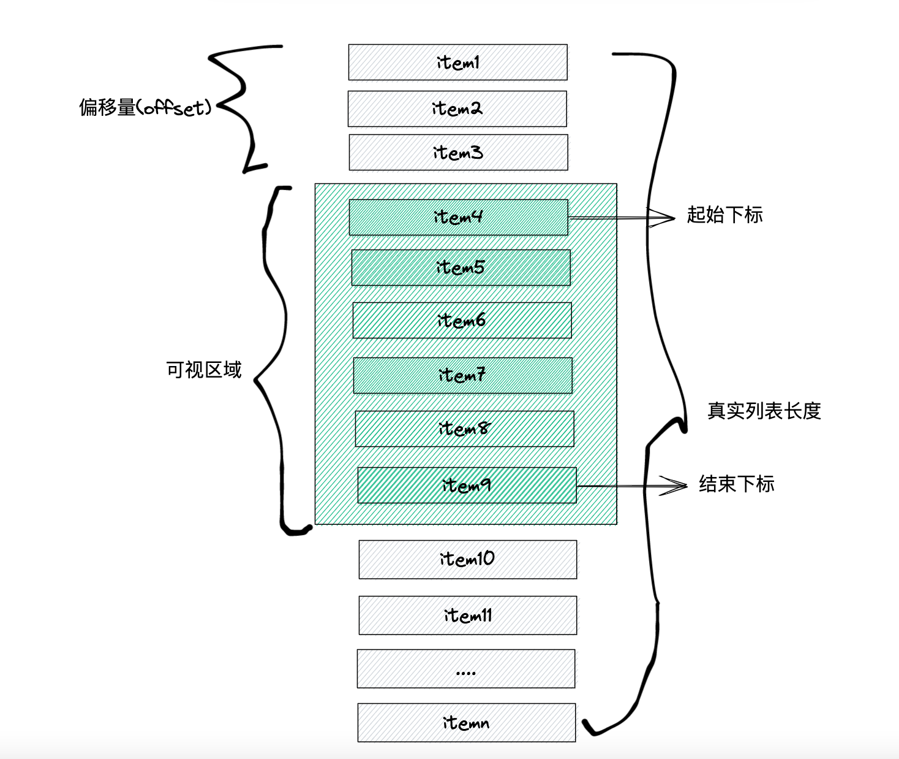
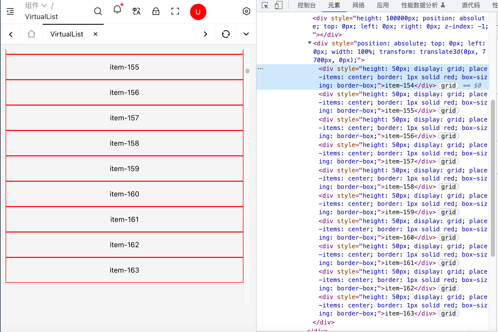
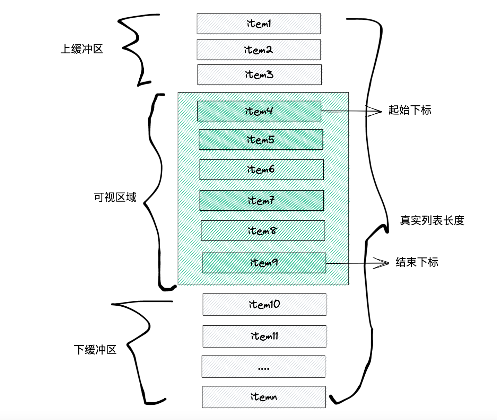

长列表渲染是开发中常遇到的场景之一,即使服务端对响应数据进行了分页优化,如果客户端一直分页加载(下拉刷新加载),则可能会导致客户端的渲染大量节点,从而出现长列表渲染的性能问题。解决大数量渲染的方案如下:

- 分片渲染。分片渲染是一种渐进式渲染数据的策略,核心思想是将渲染数据分为多个小段分批次渲染,避免一次性渲染所有数据造成的卡顿,从而提升性能。分片渲染虽然能提升渲染性能,但是无法避免渲染大量节点,在渲染大量节点场景下,仍会造成性能问题。
- 虚拟列表。

## 1.分片渲染

分片渲染是指将一个较大的数据列表分成多个片段,初始渲染时并不会一次性渲染所有数据,而是渐进式的渲染数据片段,从而提升渲染性能。

### 1.1 一次性渲染

```js
;<ul id="container"></ul>

// 记录渲染开始时间
let now = Date.now()
// 插入十万条数据
const total = 100000
// 获取容器元素
const ul = document.querySelector('#container')
// 将数据插入容器中
for (let i = 0; i < total; i++) {
  let li = document.createElement('li')
  li.innerText = `item-${i}`
  ul.appendChild(li)
}
console.log('JS运行时间:', Date.now() - now) // JS运行时间:145
/**
 * 在 JS 的Event Loop(事件循环)中,当JS引擎所管理的执行栈中的事件以及所有微任务
 * 事件全部执行完后,才会触发渲染线程对页面进行渲染,而setTimeout属于宏任务,
 * 它的触发时间是在渲染完成后,即在下一次Event Loop中执行,因此setTimeout中的
 * console.log()能计算总运行时长。
 */
setTimeout(() => {
  console.log('总运行时间:', Date.now() - now) // 总运行时间:4101
}, 0)
```

从执行结果来看,对于大量数据渲染的时候,JS 运算并不是性能的瓶颈,性能的瓶颈主要在于渲染阶段。

### 1.2 使用 setTimeout 分片渲染

```js
// 插入十万条数据
let total = 100000
// 每次渲染条数
let count = 20
// 每条记录的索引
let index = 0
// 获取容器元素
const ul = document.querySelector('#container')

function shardRender(total, index) {
  if (total <= 0) return false
  // 计算每页渲染多少条数
  let pageCount = Math.min(total, count)
  setTimeout(() => {
    for (let i = 0; i < total; i++) {
      let li = document.createElement('li')
      li.innerText = `item-${i}`
      ul.appendChild(li)
    }
    shardRender(total - pageCount, index + pageCount)
  }, 10)
}
shardRender(total, index)
```

分片渲染(增量渲染)比一次性渲染(全量渲染)的效率高很多,但是快速滚动容器时,可能会出现闪屏或白屏的现象。这是因为人眼看到的连续画面都是由一幅幅静止画面组成的,每幅画面称为一帧,FPS 是描述帧变化速度的物理量,帧率能够达到 50 ～ 60 FPS 的动画将会相当流畅。大多数电脑显示器的刷新频率是 60Hz,大概相当于每秒钟重绘 60 次,FPS 为 60frame/s,为这个值的设定受屏幕分辨率、屏幕尺寸和显卡的影响。大多数浏览器都会对重绘操作加以限制,不超过显示器的重绘频率,因为即使超过那个频率用户体验也不会有提升。因此,最平滑动画的最佳循环间隔是 1000ms/60,约等于 16.6ms。简单来说为了保持交互流畅,处理任务的时间不应该超过 16.6ms,超过 16.6ms 可能发生卡顿现象。

- 由于 setTimeout 的执行时间并不是确定的,在 JS 中,setTimeout 任务被放进事件队列中,只有主线程执行完才会去检查事件队列中的任务是否需要执行,因此 setTimeout 的实际执行时间可能会比其设定的时间晚一些。

- 刷新频率受屏幕分辨率和屏幕尺寸的影响,因此不同设备的刷新频率可能会不同,而 setTimeout 只能设置一个固定时间间隔,这个时间不一定和屏幕的刷新时间相同。

以上两种情况都会导致 setTimeout 的执行步调和屏幕的刷新步调不一致。在 setTimeout 中操作 DOM,必须要等到屏幕下次绘制时才能更新到页面上,如果两者处理时机不一致,可能导致中间某一帧的操作被跨越过去,而直接更新下一帧的元素,从而导致丢帧现象,引发白屏或者闪屏问题。

### 1.3 使用 requestAnimationFrame 优化分片渲染

`requestAnimationFrame`是一个在网页浏览器中用于执行动画的 JavaScript 方法。它是浏览器提供的一种优化的动画循环方式,用于在适当的时机更新动画帧,并利用浏览器的刷新频率进行动画渲染。与 setTimeout 不同是它通过与浏览器的刷新频率同步,确保在下一次浏览器渲染之前更新动画。它能够充分利用浏览器的硬件加速和优化,提供更平滑、更高效的动画效果。

```js
// 插入十万条数据
let total = 100000
// 每次渲染条数
let count = 20
// 每条记录的索引
let index = 0
// 获取容器元素
const ul = document.querySelector('#container')

function shardRender(total, index) {
  if (total <= 0) return false
  // 计算每页渲染多少条数
  let pageCount = Math.min(total, count)
  window.requestAnimationFrame(() => {
    for (let i = 0; i < total; i++) {
      let li = document.createElement('li')
      li.innerText = `item-${i}`
      ul.appendChild(li)
    }
    shardRender(total - pageCount, index + pageCount)
  })
}
shardRender(total, index)
```

### 1.4 使用 DocumentFragment 优化渲染

DocumentFragment 是一个 DOM 对象,它允许将一组 DOM 节点打包在一起,以便一起插入到文档中。它本身不是文档树中的一部分,因此不会影响文档的布局,但是可以对其进行操作,例如添加和删除节点。**它通常用于优化 DOM 操作,可以减少浏览器重排和重绘的次数,从而提高性能**。

当 append 元素到 document 中时,被 append 进去的元素的样式表的计算是同步发生的,此时调用 getComputedStyle()可以得到样式的计算值。而 append 元素到 documentFragment 中时,是不会计算元素的样式表,因此 DocumentFragment 性能更优。得益于浏览器的优化,当 append 元素到 document 中后,没有访问 getComputedStyle()之类的方法时,现代浏览器也可以把样式表的计算推迟到脚本执行之后。

```js
// 插入十万条数据
let total = 100000
// 每次渲染条数
let count = 20
// 每条记录的索引
let index = 0
// 获取容器元素
const ul = document.querySelector('#container')

function shardRender(total, index) {
  if (total <= 0) return false
  // 计算每页渲染多少条数
  let pageCount = Math.min(total, count)
  window.requestAnimationFrame(() => {
    // 创建文件碎片
    const fragment = document.createDocumentFragment()
    for (let i = 0; i < total; i++) {
      let li = document.createElement('li')
      li.innerText = `item-${i}`
      fragment.appendChild(li)
    }
    ul.append(fragment)
    shardRender(total - pageCount, index + pageCount)
  })
}
shardRender(total, index)
```

## 2.虚拟列表

分片渲染虽然可以优化渲染效率,但是长列表渲染的瓶颈在于页面会渲染大量节点,可能会导致如下问题:

- 渲染性能差。随着列表的长度增加,对每个列表项进行渲染所需的时间也会相应地增加。如果列表过长,这将会影响页面的加载速度和用户的体验。
- 内存占用大。长列表会占用大量内存,特别是在移动设备等资源有限的环境下,内存占用会更加明显。
- 滚动性能差。在长列表中进行滚动操作时,页面需要不断地重新渲染页面,这也会影响滚动的流畅性。

虚拟列表是指一种优化滚动性能的技术,它仅渲染用户当前可见区域内的列表项,而非将整个列表都渲染出来。当用户滚动列表时,虚拟列表会根据用户的滚动位置重新渲染列表项,从而提高滚动性能和渲染效率。这种技术常用于应对大型数据集合的列表、表格等容器组件,它可以有效地减少浏览器渲染的压力,会渲染少量节点,提高应用程序的性能和用户体验。虚拟列表原理如下图:


虚拟列表根据渲染项的长度(宽或高)有固定长度和动态长度两种实现方式。

### 2.1 虚拟列表之固定长度

虚拟列表之固定长度是指列表项的长度(宽高,纵向表示高,横向表示宽)都是固定的,根据列表项的长度非常容易计算列表的总高度、可视区域显示的列表项数量以及滚动时的显示数据与对应的偏移量。具体流程如下:

- 初次渲染时,首先计算列表的总体长度用于容器中的占位形成滚动条,然后获取外部容器的`clientHeight`,根据外部容器的`clientHeight`(可视区域的高度)计算得到可视区域显示的列表项数据量,最终截取渲染数据中从开始下标到结束下标(列表项数据量)的元素作为实际渲染数据。
  - 列表的总长度 = 渲染数据的长度 / 列表项长度 = data.length / itemSize。
  - 可视区域显示的列表项数据量 = 外部容器的 clientHeight / 列表项的长度 = screenHeight / itemSize。
  - 开始下标初始值为 0,结束下标为 `开始下标 + 列表项数据量`。
- 监听外部容器的滚动事件,获取外部容器的偏移距离(scrollTop),根据偏移距离计算得到可视区域的开始索引(`Math.floor(偏移距离 / 列表项长度)`)和结束索引(`开始下标 + 列表项数据量`),将偏移距离设置列表容器的滚动距离,最终截取渲染数据中从开始下标到结束下标的元素作为实际渲染数据。

```tsx
import React, { useState, useMemo, useEffect, useRef } from 'react'
interface VirtualListProps {
  /**
   * @desc 列表数据
   * @default []
   */
  data?: any[]
  /**
   * @desc 外部容器长度
   * @default 500
   */
  size?: number
  /**
   * @desc 列表项的长度
   * @default 50
   */
  itemSize?: number
}

const VirtualList: React.FC<VirtualListProps> = ({ data = [], size = 500, itemSize = 50 }) => {
  const [position, setPosition] = useState({
    // 可视区域的高度
    screenHeight: 0,
    // 偏移量
    offset: 0,
    // 起始索引
    start: 0,
    // 结束索引
    end: 0,
  })

  // 定义ref,用于引用外部容器
  const containerRef = useRef<HTMLDivElement>(null)

  // 计算列表总长度(纵向获取高度,横向获取宽度)
  const listHeight = useMemo(() => data.length * itemSize, [data, itemSize])
  // 计算显示区域的列表项数量
  const visibleCount = useMemo(() => {
    return Math.ceil(position.screenHeight / itemSize)
  }, [position.screenHeight, itemSize])
  // 获取真实显示列表数据,从渲染数据中截取start到end的之间的元素,这部分元素是可见的
  const visibleData = useMemo(() => {
    const { start, end } = position
    return data.slice(start, Math.min(end || visibleCount, data.length))
  }, [data, position])
  // 获取偏移量设置style
  const getTransform = useMemo(() => {
    return `translate3d(0,${position.offset}px,0)`
  }, [position])

  useEffect(() => {
    // 获取外部容器的clientHeight
    const screenHeight = containerRef.current?.clientHeight!
    setPosition({ ...position, screenHeight, start: 0, end: visibleCount })
  }, [])

  // 处理外部容器滚动事件,可以使用节流函数优化
  const handleScroll: React.UIEventHandler<HTMLDivElement> = (e) => {
    // 获取当前滚动的距离
    let scrollTop = containerRef.current?.scrollTop!
    // 计算可视区域的开始索引和结束索引,计算可能得到小数,使用Math.floor()四舍五入
    const start = Math.floor(scrollTop / itemSize),
      end = start + visibleCount
    // 计算偏移量
    const offset = scrollTop - (scrollTop % itemSize)
    setPosition({ ...position, start, end, offset })
  }

  return (
    /** 外部容器 */
    <div
      ref={containerRef}
      style={{ height: size, position: 'relative', overflow: 'auto' }}
      onScroll={handleScroll}
    >
      {/** 容器内的占位,高度为总列表高度,用于形成滚动条 */}
      <div
        style={{
          height: listHeight,
          position: 'absolute',
          top: 0,
          left: 0,
          right: 0,
          zIndex: -1,
        }}
      ></div>
      {/** list列表 */}
      <div
        style={{
          position: 'absolute',
          top: 0,
          left: 0,
          width: '100%',
          transform: getTransform,
        }}
      >
        {visibleData.map((item, index) => {
          return (
            <div
              key={index}
              style={{
                height: itemSize,
                display: 'grid',
                placeItems: 'center',
                border: '1px solid red',
                boxSizing: 'border-box',
              }}
            >
              {item}
            </div>
          )
        })}
      </div>
    </div>
  )
}

export default VirtualList
```

::: details 使用虚拟组件

```tsx
import React from 'react'
import VirtualList from '@/components/VirtualList'

const data = Array.from({ length: 2000 }).map((_, i) => `item-${i}`)

export default function () {
  return (
    <div>
      <VirtualList data={data} />
    </div>
  )
}
```

:::

从渲染结果来看,虽然渲染数据为 2000 条,但实际上只渲染了 10 个节点。

### 2.2 虚拟列表之动态长度

实际应用的时候,列表项中的内容不同长度(宽高)也会不一样,无法确定列表的总高度、可视区域显示的列表项数量等信息。在虚拟列表中应用动态长度的解决方案一般有如下三种:

- 对组件属性 itemSize 进行扩展,支持传递类型为数字、数组、函数。这种方式虽然有比较高的灵活度,但仅适用于可以预先知道或可以通过计算得知列表项高度的情况,依然无法解决列表项高度由内容撑开的情况。
- 将列表项渲染到屏幕外,对其高度进行测量并缓存,然后再将其渲染至可视区域内。由于预先渲染至屏幕外,再渲染至屏幕内,这导致渲染成本增加一倍,这对于低端移动设备上产生性能瓶颈。
- 以预估高度先行渲染,然后获取真实高度并缓存(推荐)。首先根据预估高度初始化所有元素的位置信息(positions)并缓存,渲染元素根据预估高度先行渲染,当元素渲染后获取元素的真实高度并更新元素位置缓存。当滚动容器时根据滚动距离(scrollTop)从元素位置缓存中获取可视区域的开始索引和结束索引,从而渲染可视区域的数据。

基于节点动态长度实现的虚拟列表,当滚动过快时(滚动的时间快于节点渲染时间),会出现短暂的白屏现象。为了使页面平滑滚动并减少白屏现象,可以在可见区域的上方和下方设置缓冲区。实际渲染数据包含可见区域、上缓冲区、下缓冲区三部分,由于渲染的节点变多,出现白屏的几率也会变小,但仍不能保证百分之百不会出现白屏。滚动过快产生白屏的原因是因为滚动的速度快于节点渲染的速度,此时节点还未渲染完毕,节点还未生成,因此会产生白屏现象。有一种方式可以完美解决白屏,即监听 wheel 事件(该事件在滚动鼠标滚轮触发)模拟元素的滚动(H5 环境下通过监听 touch 事件模拟滚动),当节点渲染完毕后再设置滚动条的距离。


```tsx
import React, { useState, useMemo, useRef } from 'react'
import { useMount, useUpdateEffect } from 'ahooks'
import { throttle } from 'lodash-es'

export interface VirtualListProps {
  /**
   * @desc 列表数据
   * @default []
   */
  data?: any[]
  /**
   * @desc 外部容器长度
   * @default 500
   */
  size?: number
  /**
   * @desc 列表项的长度
   * @default 50
   */
  itemSize?: number
  /**
   * @desc 列表项的预估长度
   * @default 50
   */
  estimatedItemSize?: number

  /**
   * @desc 接收缓冲区数据与可视区数据的比例
   * @default 1
   */
  bufferScale?: number
}

interface Position {
  index: number
  height: number
  top: number
  bottom: number
}

/**
 * 二分查找法,从positions中根据scrollTop获取开始下标
 * @param positions 元素位置信息缓存
 * @param scrollTop 滚动距离
 */
function binarySearch(positions: Position[], scrollTop: number) {
  let start = 0
  let end = positions.length - 1
  let tempIndex = -1
  while (start <= end) {
    let midIndex = parseInt((start + end) / 2 + '')
    let midValue = positions[midIndex].bottom
    if (midValue === scrollTop) {
      return midIndex + 1
    } else if (midValue < scrollTop) {
      start = midIndex + 1
    } else if (midValue > scrollTop) {
      if (tempIndex === -1 || tempIndex > midIndex) {
        tempIndex = midIndex
      }
      end = end - 1
    }
  }
  return tempIndex
}

const VirtualList: React.FC<VirtualListProps> = ({
  data = [],
  size = 500,
  itemSize = 50,
  estimatedItemSize = 50,
  bufferScale = 1,
}) => {
  const listRef = useRef<HTMLDivElement>(null),
    contentRef = useRef<HTMLDivElement>(null)

  const [state, setState] = useState({
    // 可视区域高度
    screenHeight: 0,
    // 显示数据的开始索引
    start: 0,
    // 显示数据的结束索引
    end: 0,
  })

  // 用于缓存元素的预估位置,当获取元素真实位置时更新
  const [positions, setPositions] = useState<Position[]>([])
  const initPositions = () => {
    const positions = data.map((item, index) => {
      return {
        index,
        height: estimatedItemSize,
        top: index * estimatedItemSize,
        bottom: (index + 1) * estimatedItemSize,
      } as Position
    })
    setPositions(positions)
  }

  // 可视区域显示的元素数量
  const visibleCount = useMemo(() => {
    return Math.ceil(state.screenHeight / estimatedItemSize)
  }, [state, estimatedItemSize])
  // 上缓冲区数量
  const upperBufferCount = useMemo(() => {
    return Math.min(state.start, bufferScale * visibleCount)
  }, [bufferScale, state])
  // 下缓冲区数量
  const lowerBuffer = useMemo(() => {
    return Math.min(data.length - state.end, bufferScale * visibleCount)
  }, [bufferScale, state, data])

  // 可视区域显示的数据
  const visibleData = useMemo(() => {
    const start = state.start - upperBufferCount
    const end = state.end + lowerBuffer
    return data.slice(start, end)
  }, [state, data])

  useMount(() => {
    initPositions()
    setState({
      ...state,
      screenHeight: listRef.current!.clientHeight,
      start: 0,
      end: visibleCount,
    })
  })

  // 根据元素集合获取每一个元素真实高度,并更新元素位置缓存
  const getElementRealHeight = (nodes: NodeListOf<HTMLElement>, positions: Position[]) => {
    nodes.forEach((node, index) => {
      let rect = node.getBoundingClientRect(),
        height = rect.height
      // 获取预估高度
      let oldHeight = positions[index].height
      // 获取元素预估高度与元素真实高度的偏差值
      let dValue = oldHeight - height
      // 如果存在偏差值,则重新计算positions中每项元素的bottom、height、top
      if (dValue) {
        positions[index].bottom = positions[index].bottom - dValue
        positions[index].height = height
        for (let k = index + 1; k < positions.length; k++) {
          positions[k].top = positions[k - 1].bottom
          positions[k].bottom = positions[k].bottom - dValue
        }
      }
    })
    setPositions(positions)
    return positions
  }

  // 获取当前的偏移量
  const setStartOffset = (el: HTMLElement, start: number) => {
    function animate() {
      const startOffset = start >= 1 ? positions[start - 1].bottom : 0
      el.style.transform = `translate3d(0,${startOffset}px,0)`
    }
    animate()
  }

  useUpdateEffect(() => {
    if (!contentRef.current) return
    const nodes = contentRef.current.childNodes as NodeListOf<HTMLElement>
    const newPositions = getElementRealHeight(nodes, positions)
    // 更新列表总高度,撑开滚动条
    const placeholderElement = contentRef.current.previousElementSibling as HTMLElement
    placeholderElement.style.height = newPositions.at(-1)?.bottom! + 'px'
    setStartOffset(contentRef.current, state.start)
  }, [positions])

  // 处理外部容器滚动事件,使用节流函数优化
  const handleScroll: React.UIEventHandler<HTMLDivElement> = throttle((e) => {
    if (!listRef.current) return
    // 获取当前滚动位置
    let scrollTop = listRef.current.scrollTop
    // 根据滚动位置从positions中获取可视区域的开始下标
    const start = binarySearch(positions, scrollTop),
      end = start + visibleCount
    console.log(start, end)
    setState({ ...state, start, end })
    setStartOffset(contentRef.current!, start)
  }, 10)

  return (
    <div
      ref={listRef}
      className="relative overflow-auto"
      style={{ height: size }}
      onScroll={handleScroll}
    >
      {/** 容器内的占位,高度为总列表高度,用于形成滚动条 */}
      <div className="absolute h-full top-0 left-0 right-0 bottom-0 z-[-1]"></div>
      <div ref={contentRef} className="absolute top-0 left-0">
        {visibleData.map((item, index) => {
          return (
            <div
              key={index}
              style={{
                display: 'grid',
                placeItems: 'center',
                border: '1px solid red',
                boxSizing: 'border-box',
              }}
            >
              {item}
            </div>
          )
        })}
      </div>
    </div>
  )
}
export default VirtualList
```
