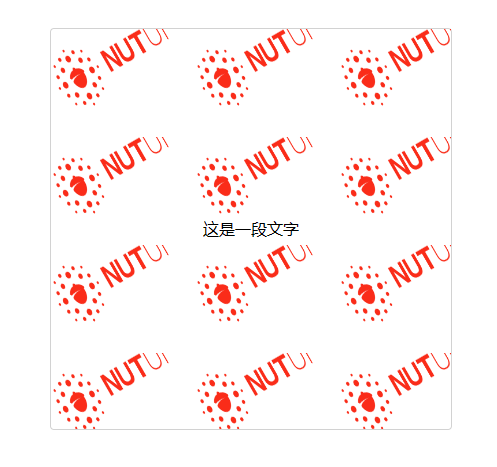
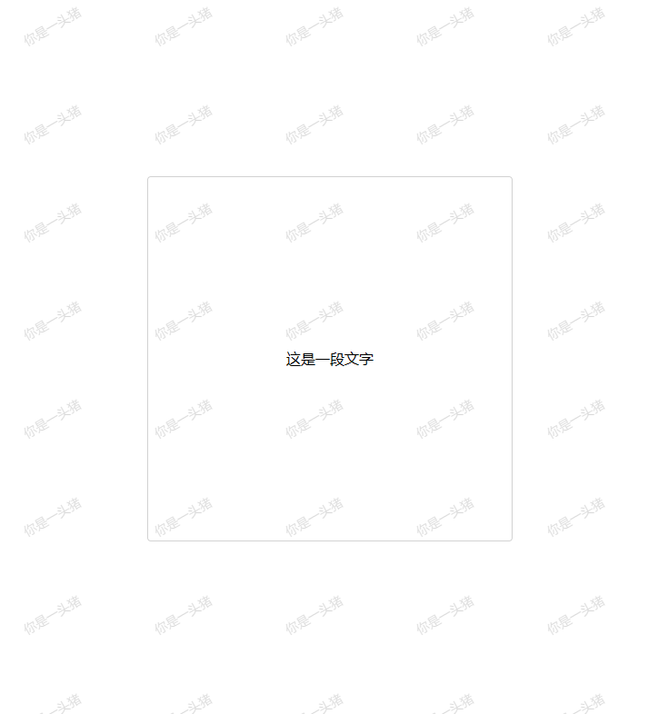

水印功能是内容保护的一种手段之一,水印可分为文字水印、视频水印等等。对于文件相关水印为了其安全性通常由后端实现,对于视图水印可以由客户端实现,客户端实现水印的常见方案如下:

- 基于 CSS 的 background-image 实现图片水印。实现简单,不如 canvas、svg 灵活,
- 基于 canvas 绘制水印(支持文字和图片水印)。实现灵活,兼容性好,大部分环境都支持 canvas,因此 canvas 是绘制水印的主流方式。
- 基于 svg 绘制水印。实现简单,比较灵活,单兼容性不好,小程序和 uniapp 等环境都不支持 svg。

## 1.基于 CSS background-image 属性绘制图片水印

在 CSS 中,可以使用 background-image 属性来实现图片水印。首先,将水印图片放入 HTML 文档中,然后使用 background-image 属性将水印图片设置为背景图片,最后调整水印图片的位置和大小。基于 CSS background-image 绘制水印虽然简单,但实现水印效果不好(无法设置背景图的旋转方向和间距),而且 CSS 的实现方式不如 JS 灵活。

```css
<body>
    <div class="watermark"></div>
</body>
</html>
<style>
    *{
        margin: 0;
        padding: 0;
    }
    html,body{
        width: 100%;
        height: 100%;
        background-color: aliceblue;
        position: relative;
        overflow: hidden;
    }
    .watermark {
        position: absolute;
        left: 0;
        top: 0;
        width: 100%;
        height: 100%;
        background-image: url('https://img11.360buyimg.com/imagetools/jfs/t1/57345/6/20069/8019/62b995cdEd96fef03/51d3302dfeccd1d2.png');
        /* 背景图的位置(x和y轴) */
        background-position: center center;
        /* 不平铺背景图 */
        background-repeat: no-repeat;
        /* 背景图片大小 */
        background-size: 120px;
        /* 逆时针旋转45度 */
        transform: rotate(-45deg);
        /* 设置鼠标事件无响应,避免层级过低的元素无法被点击 */
        pointer-events: none;
    }
</style>
```

## 2.基于 Canvas 绘制水印

canvas 绘制水印原理是创建一个 Canvas 元素,利用 canvas 绘制图片或文字内容,绘制完成后通过 toDataURL()将内容转为 base64 编码,最后利用 CSS background-image 引入 base64 编码并展示。由于水印的层级过高,可能导致层级低的元素无法响应鼠标事件,为了避免影响层级过低的元素鼠标事件,需要水印元素样式设置为 pointer-events: none。canvas 绘制水印流程如下:

- 创建一个 canvas 元素并设置 canvas 宽和高。根据 canvas 元素创建上下文对象,通过 window.devicePixelRatio(当前显示设备的物理像素分辨率与 CSS 像素分辨率之比)获取 canvas 的宽度和高度,获取 canvas 宽高后设置 canvas 的宽高。由于 canvas 缩小放大会导致绘制内容模糊,使用 window.devicePixelRatio 确定应添加多少额外的像素密度以使图像更清晰。
- 根据 image 或 content 输入判断绘制图片水印还是文字水印。如果同时设置 image 和 content,图片水印优先级高于文字水印。
- 绘制水印。首先利用 canvas 绘制水印内容,通过 canvas 的 drawImage()将 canvas 的内容绘制成图片,然后通过 toDataURL()将图片转为 base64 编码,最后利用 CSS `background-image`引入 base64 编码并展示水印,通过`background-repeat:repeat`属性支持水印重复显示。
  - 绘制图片水印。创建一个 Image 对象,监听 Image 对象的 onload 事件(加载成功事件),当图片加载成功时,通过 canvas 的 translate()和 rotate()设置图片平移位置和旋转角度,然后通过 canvas 的 drawImage()绘制图片,绘制图片后调用 restore()将 canvas 恢复到最近一次的保存状态,最终通过 toDataURL()将图片转为 base64 编码,利用 CSS background-image 引入 base64 编码并展示,`background-repeat:repeat`属性支持水印重复显示。
  - 绘制文字水印。绘制文字水印与绘制图片大致相同,通过 canvas 的 translate()和 rotate()设置图片平移位置和旋转角度,通过 fillStyle、font、textAlign 等属性设置填充样式、字体、字体对齐方式,然后通过 fillText()绘制文字内容,绘制后通过 toDataURL()将图片转为 base64 编码,利用 CSS background-image 引入 base64 编码并展示。

```js
<!DOCTYPE html>
<html lang="en">
  <head>
    <meta charset="UTF-8" />
    <meta http-equiv="X-UA-Compatible" content="IE=edge" />
    <meta name="viewport" content="width=device-width, initial-scale=1.0" />
    <title>Document</title>
  </head>
  <body>
    <div class="box">
      <span>这是一段文字</span>
      <div class="watermark"></div>
    </div>
  </body>
</html>
<script>
  function watermark(options) {
    if (
      typeof options !== "object" &&
      options !== null &&
      options !== undefined
    ) {
      throw new Error("options参数错误");
    }
    // 默认配置项
    const defaultOptions = {
      // 水印宽度
      width: 120,
      // 水印高度
      height: 60,
      // 水印旋转角度
      rotate: -30,
      // 水印图片源
      image: "",
      // 水印图片宽度
      imageWidth: 120,
      // 水印图片高度
      imageHeight: 64,
      // 水印图片层级
      zIndex: 2000,
      // 水平间距
      gapX: 24,
      // 垂直间距
      gapY: 48,
      // 文字水印内容
      content: "",
      // 文字大小
      fontSize: 14,
      // 文字颜色
      fontColor: "rgba(0,0,0,.15)",
      // 文字样式
      fontStyle: "normal",
      // 文字字体
      fontFamily: "PingFang SC",
      // 文字粗细
      fontWeight: "normal",
      // 是否全屏水印
      fullPage: false,
    };

    function drawImage(ctx, options) {
      const { imageWidth, imageHeight, ratio, markWidth, markHeight, rotate } =
        options;
      // 创建一个图片对象
      const img = new Image();
      /**
       * 请求图片时是否开启CORS功能。anonymous表示在请求头上携带Origin属性,
       * 但请求不会携带cookie和其他的认证信息。
       */
      img.crossOrigin = "anonymous";
      /**
       * 该属性表示获取资源时的引用方式。"no-referrer"表示HTTP头部信息将不会发送referrer
       */
      img.referrerPolicy = "no-referrer";
      // 设置图片源
      img.src = image;
      /**
       * 监听图片加载完成事件,图片加载完成则通过
       * canvas绘制图片水印
       */
      img.onload = function () {
        /*
         * translate(x,y):将canvas按x点的水平方向、y点垂直方向进行平移变换
         */
        ctx.translate(markWidth / 2, markHeight / 2);
        /**
         * rotate(angle):用于旋转canvas,angle表示旋转的幅度,正数表示顺时针旋转,
         * 负数表示逆时针旋转,旋转公式为:degree * Math.PI / 180。旋转中心点默认是
         * canvas 的起始点,可以通过translate()方法平移改变旋转中心点。
         * translate(markWidth / 2, markHeight / 2)表示以canvas的中心点作为
         * 旋转中心。
         */
        ctx.rotate((Math.PI / 180) * Number(rotate));
        /**
         * drawImage(image, sx, sy, sWidth, sHeight, dx, dy, dWidth, dHeight)
         * 用于绘制图像,包含如下参数:
         * - image:绘制到canvaS上下文的元素。元素可以是图片、svg、video、canvas。
         * - sx:需要绘制到目标上下文中的,image的矩形(裁剪)选择框的左上角 X 轴坐标。
         * - sy:需要绘制到目标上下文中的,image的矩形(裁剪)选择框的左上角 Y 轴坐标。
         * - sWidth:需要绘制到目标上下文中的,image 的矩形（裁剪）选择框的宽度。
         * - sHeight:需要绘制到目标上下文中的,image 的矩形（裁剪）选择框的高度。
         * - dx:image 的左上角在目标画布上 X 轴坐标。
         * - dy:image 的左上角在目标画布上 Y 轴坐标。
         * - dWidth:image 在目标画布上绘制的宽度。
         * - dHeight:image 在目标画布上绘制的高度。
         */
        ctx.drawImage(
          img,
          (-imageWidth * ratio) / 2,
          (-imageHeight * ratio) / 2,
          imageWidth * ratio,
          imageHeight * ratio
        );
        // 将canvas恢复到最近一次的保存状态
        ctx.restore();
        const base64Url = canvas.toDataURL();
        setStyle(base64Url, options);
      };
    }
    function drawText(ctx, options) {
      const {
        fontSize,
        fontColor,
        fontStyle,
        fontWeight,
        fontFamily,
        markWidth,
        markHeight,
        rotate,
      } = options;
      const markSize = Number(fontSize) * ratio;
      // 设置文本基线,middle表示文本基线在文本块的中间
      ctx.textBaseline = "middle";
      // 文字对齐方式,center表示居中对齐
      ctx.textAlign = "center";
      // 填充样式
      ctx.fillStyle = fontColor;
      // 设置字体
      ctx.font = `${fontStyle} normal ${fontWeight} ${markSize}px/${markHeight}px ${fontFamily}`;
      // 文字绕中间旋转
      ctx.translate(markWidth / 2, markHeight / 2);
      ctx.rotate((Math.PI / 180) * Number(rotate));
      /**
       * fillText(text, x, y, [maxWidth]):填充文字。
       * - text:渲染的文本内容。
       * - x:渲染文本的x轴坐标。
       * - y:渲染文本的y轴坐标。
       * - maxWidth:绘制的最大宽度,可选。如果指定了值,并且经过计算字符串的
       * 值比最大宽度还要宽,字体为了适应会水平缩放或者使用小号的字体。
       */
      ctx.fillText(content, 0, 0);
      // 将canvas恢复到最近一次的保存状态
      ctx.restore();
      /**
       * toDataURL(type, encoderOptions)用于返回一个包含图片展示的 data URI。
       * data URI即利用base64编码把图片数据翻译成标准ASCII字符,简单来说toDataURL()
       * 将canvas绘制的图片转为base64编码。toDataURL参数如下:
       * - type:转换的图片格式。默认为image/png。
       * - encoderOptions:转换后图片质量。如果图片格式为 image/jpeg 或 image/webp
       * 的情况下,可以从 0 到 1 的区间内选择图片的质量。如果超出取值范围,将会使用
       * 默认值 0.92,其他参数会被忽略。
       */
      const base64Url = canvas.toDataURL();
      setStyle(base64Url, options);
    }

    /**
     * 根据canvas绘制图片的base64编码和配置对象设置样式。
     * 通过CSS background-image 引入绘制图片base64编码实现水印,
     * 由于background-repeat属性的默认为repeat,水印会沿着水平轴和垂直轴
     * 重复;通过background-size属性设置 gapX(水平间距) + width(水印宽度)
     * 实现水印之间的间距。
     * @param {*} base64Url canvas绘制图片的base64编码
     * @param {*} options 配置对象
     */
    function setStyle(base64Url, options) {
      const el = document.getElementsByClassName("watermark")[0];
      if (!el) return;
      const { zIndex, gapX, width, fullPage } = options;
      el.style.zIndex = zIndex;
      el.style.backgroundSize = `${gapX + width}px`;
      el.style.backgroundImage = `url(${base64Url})`;
      /**
       * 判断是否全屏显示水印,如果全屏显示水印则添加watermark-full-page类样式,
       * 注意非全屏显示水印需要将父元素为相对布局,即 position: relative。
       */
      if (fullPage) {
        el.classList.add("watermark-full-page");
      }
    }

    // 创建一个canvas元素
    const canvas = document.createElement("canvas");
    /**
     * 根据canvas获取上下文对象,HTML Canvas API仅支持2d,
     * 若要渲染3d效果请使用Webgl(Three.js是目前最为流行的webgl库)
     */
    const ctx = canvas.getContext("2d");
    if (!ctx) {
      throw new Error("当前环境不支持canvas");
    }
    options = Object.assign(defaultOptions, options);
    const { width, height, gapX, gapY, image, content } = options;

    /*
     * 返回当前显示设备的物理像素分辨率与CSS像素分辨率之比,由于canvas
     * 缩小放大会导致绘制内容模糊,使用window.devicePixelRatio确定应添加
     * 多少额外的像素密度以使图像更清晰。
     */
    const ratio = window.devicePixelRatio || 1;
    // 获取canvas的宽高,即: (水平或垂直间距 + 宽或高) * 像素比
    const canvasWidth = `${(gapX + width) * ratio}px`,
      canvasHeight = `${(gapY + height) * ratio}px`;
    // 设置canvas宽高
    canvas.setAttribute("width", canvasWidth);
    canvas.setAttribute("height", canvasHeight);

    const opts = {
      ...options,
      ratio,
      // 获取蒙层宽
      markWidth: width * ratio,
      // 获取蒙层高
      markHeight: height * ratio,
    };

    // 如果image存在则优先绘制图片水印
    if (image) {
      drawImage(ctx, opts);
    } else if (content) {
      // 如果文字内容存在则绘制文字水印
      drawText(ctx, opts);
    }
  }

  /** ========================================================== */
  const image =
    "https://img11.360buyimg.com/imagetools/jfs/t1/57345/6/20069/8019/62b995cdEd96fef03/51d3302dfeccd1d2.png";
  // 图片水印
  watermark({ image });

  //   // 文字水印
  //   watermark({
  //     content: "你是一头猪",
  //     fullPage: true,
  //   });
</script>
<style>
  html,
  body {
    position: relative;
    height: 100%;
    width: 100%;
    overflow: hidden;
    display: grid;
    place-items: center;
  }
  .box {
    width: 400px;
    height: 400px;
    border: 1px solid #d2d2d2;
    border-radius: 4px;
    position: relative;
    display: grid;
    place-items: center;
  }
  .watermark {
    position: absolute;
    top: 0;
    left: 0;
    bottom: 0;
    right: 0;
    /*
     * 设置元素永远不会成为鼠标事件target。注意:由于水印层级较高,
     * 避免层级过低的元素无法被点击。
     */
    pointer-events: none;
    background-repeat: repeat;
  }
  .watermark-full-page {
    position: fixed;
  }
</style>
```




## 3.基于 SVG 绘制水印

## 4.通过 MutationObserver 观察元素防止水印被篡改

## 5.封装 Watermark 组件

### 5.1 基于 React 封装 Watermark 组件

```tsx
import React, { CSSProperties, useMemo, useState, useEffect } from 'react'
export interface WatermarkProps {
  // 水印宽度,默认:120
  width?: number
  // 水印高度,默认:60
  height?: number
  // 绘制水印时旋转的角度,默认:-22
  rotate?: number
  // 图片源,优先使用图片渲染水印
  image?: string
  // 图片宽度,默认:120
  imageWidth?: number
  // 图片高度,默认:64
  imageHeight?: number
  // 水印元素的z-index,默认:2000
  zIndex?: number
  // 水印文字内容
  content?: string
  // 水印文字大小
  fontSize?: number | string
  // 水印文字颜色
  fontColor?: string
  // 水印文字系列,默认:'PingFang SC'
  fontFamily?: string
  // 水印文字样式,默认:'normal'
  fontStyle?: string
  // 水印文字粗细,默认:'normal'
  fontWeight?: string
  // 水印之间的水平间距,默认24
  gapX?: number
  // 水印之间的垂直间距,默认:48
  gapY?: number
  // 是否覆盖整个页面,默认false
  fullPage?: boolean
  // class名称
  className?: string
  // 样式
  style?: React.CSSProperties
  // 子节点
  children?: React.ReactNode
}

function Watermark({
  width = 120,
  height = 60,
  rotate = -22,
  image,
  imageWidth = 120,
  imageHeight = 64,
  zIndex = 2000,
  content = '',
  fontSize = 14,
  fontColor = 'rgba(0,0,0,.15)',
  fontStyle = 'normal',
  fontFamily = 'PingFang SC',
  fontWeight = 'normal',
  gapX = 24,
  gapY = 48,
  fullPage,
  style,
  className,
}: WatermarkProps) {
  const [base64Url, setBase64Url] = useState('')
  const init = () => {
    const canvas = document.createElement('canvas')
    const ctx = canvas.getContext('2d')
    if (!ctx) {
      throw new Error('当前环境不支持canvas')
    }
    const ratio = window.devicePixelRatio || 1
    const canvasWidth = `${(gapX + width) * ratio}px`,
      canvasHeight = `${(gapY + height) * ratio}px`
    const markWidth = width * ratio,
      markHeight = height * ratio

    canvas.setAttribute('width', canvasWidth)
    canvas.setAttribute('height', canvasHeight)

    if (image) {
      ctx.translate(markWidth / 2, markHeight / 2)
      ctx.rotate((Math.PI / 180) * Number(rotate))
      const img = new Image()
      img.crossOrigin = 'anonymous'
      img.referrerPolicy = 'no-referrer'
      img.src = image
      console.log('image', image)
      img.onload = () => {
        ctx.drawImage(
          img,
          (-imageWidth * ratio) / 2,
          (-imageHeight * ratio) / 2,
          imageWidth * ratio,
          imageHeight * ratio,
        )
        ctx.restore()
        console.log('canvas.toDataURL()', canvas.toDataURL())
        setBase64Url(canvas.toDataURL())
      }
      return
    }

    if (content) {
      ctx.textBaseline = 'middle'
      ctx.textAlign = 'center'
      ctx.translate(markWidth / 2, markHeight / 2)
      ctx.rotate((Math.PI / 180) * Number(rotate))
      const markSize = Number(fontSize) * ratio
      ctx.font = `${fontStyle} normal ${fontWeight} ${markSize}px/${markHeight}px ${fontFamily}`
      ctx.fillStyle = fontColor
      ctx.fillText(content, 0, 0)
      ctx.restore()
      setBase64Url(canvas.toDataURL())
    }
  }

  useEffect(() => {
    init()
  }, [
    gapX,
    gapY,
    width,
    height,
    rotate,
    image,
    imageWidth,
    imageHeight,
    content,
    fontStyle,
    fontWeight,
    fontColor,
    fontSize,
    fontFamily,
    fullPage,
  ])

  const getStyle = useMemo((): CSSProperties => {
    const styleProp: CSSProperties = {
      position: fullPage ? 'fixed' : 'absolute',
      left: 0,
      right: 0,
      top: 0,
      bottom: 0,
      pointerEvents: 'none',
      backgroundRepeat: 'repeat',
      zIndex,
      backgroundSize: `${gapX + width}px`,
      backgroundImage: `url(${base64Url})`,
      ...style,
    }
    return styleProp
  }, [gapX, width, base64Url, zIndex, fullPage])

  return <div style={getStyle} className={className}></div>
}
Watermark.displayName = 'Watermark'

export default Watermark
```

### 5.2 基于 Vue 封装 Watermark 组件
