## 1.React仓库目录

React(19.2)基于Monorepo方式进行仓库管理,其相关源码包位于仓库的packages目录下。

```text
packages/
├── dom-event-testing-library/
├── eslint-plugin-react-hooks/
├── internal-test-utils/
├── jest-react/
├── react/
├── react-art/
├── react-cache/
├── react-client/
├── react-debug-tools/
├── react-devtools/
├── react-devtools-core/
├── react-devtools-extensions/
├── react-devtools-fusebox/
├── react-devtools-inline/
├── react-devtools-shared/
├── react-devtools-shell/
├── react-devtools-timeline/
├── react-dom/
├── react-dom-bindings/
├── react-is/
├── react-markup/
├── react-native-renderer/
├── react-noop-renderer/
├── react-reconciler/
├── react-refresh/
├── react-server/
├── react-server-dom-esm/
├── react-server-dom-fb/
├── react-server-dom-parcel/
├── react-server-dom-turbopack/
├── react-server-dom-webpack/
├── react-suspense-test-utils/
├── react-test-renderer/
├── scheduler/
├── shared/
├── use-subscription/
└── use-sync-external-store/
```

根据不同职责,可以将react的package包分为六类: 核心包、服务端渲染、渲染器、开发工具、工具包、实验性功能、绑定层。

### 1.1 react核心包

顾名思义，react核心包是react的核心功能，是react的基础，也是react的核心。

```text
├── react/
├── react-reconciler/
├── scheduler/
```

#### 1.1.1 react

这是React的基础包，提供了所有React组件的基本API，如 React.createElement、React.Component、React.useState等。包定义了React的公共接口，但不包含任何渲染相关的代码。当在项目中导入React时，实际上就是导入这个包。

#### 1.1.2 react-reconciler

React的核心调和引擎，主要负责Fiber架构。当组件状态发生变化时，reconciler会计算出哪些DOM需要更新，然后交给渲染器执行实际的DOM操作。reconciler是React性能优化的核心所在，它实现了时间切片、优先级调度等特性，以保证用户体验的流畅性。

#### 1.1.3 scheduler

调度器负责任务的优先级管理和执行时机控制。React通过scheduler来实现时间切片和并发模式，使得React可以在不阻塞主线程的情况下执行渲染工作。scheduler会根据任务优先级和浏览器的空闲时间来安排任务执行，确保用户交互的流畅性。

### 1.2 渲染器相关包

```txt
├── react-dom/
├── react-native-renderer/
├── react-art/
├── react-test-renderer/
```

#### 1.2.1 react-dom

React最常用的渲染器，负责将React组件渲染到浏览器DOM中。它包含了所有与浏览器DOM交互的代码，如事件系统、属性处理等。同时react-dom还提供了服务端渲染的功能（ReactDOMServer）。

#### 1.2.2 react-native-renderer

React Native的渲染器，负责将React组件渲染为原生移动应用UI组件，将React的声明式编程模型带到了移动应用开发中。

#### 1.2.3 react-art

一个用于绘制矢量图形的渲染器，可以将React组件渲染为SVG、Canvas等图形。

#### 1.2.4 react-test-renderer

用于测试的渲染器，可以将React组件渲染为纯JavaScript对象，方便进行快照测试和单元测试。它不依赖DOM环境，可以在Node.js中运行。

### 1.3 开发工具相关包

```
├── react-devtools-core/
├── react-devtools-extensions/
├── react-refresh/
```

#### 1.3.1 react-devtools-core 包

这是React开发者工具的核心实现，提供了组件树检查、性能分析等功能的底层支持。

#### 1.3.2 react-devtools-extensions

基于core包构建的浏览器扩展，为Chrome、Firefox等浏览器提供React调试工具。这些工具可以帮助开发者检查组件层次结构、props和state变化、性能瓶颈等。

#### 1.3.3 react-refresh

实现了React的热更新功能，使得在开发过程中修改代码后，浏览器可以在不丢失组件状态的情况下更新UI。这大大提高了开发效率，是现代React开发工作流的重要组成部分。

### 1.4 服务端渲染相关包

```txt
├── react-devtools-core/
├── react-server-dom-webpack/
```

#### 1.4.1 react-server

提供了React服务端渲染的核心功能，支持在Node.js环境中渲染React组件。

#### 1.4.2 react-server-dom-webpack

React Server Components的实现，允许组件在服务器上渲染并将结果流式传输到客户端。这种方式可以减少客户端JavaScript的体积，提高首屏加载速度，同时保持React组件模型的一致性。它与webpack集成，处理模块加载和代码分割。

### 1.5 工具包相关包

```txt
├── react-is/
├── react-cache/
├── shared/
```

#### 1.5.1 react-is

提供了一系列工具函数，用于检测React元素的类型。例如，可以用它来判断一个对象是否是React元素、Fragment、Context等。这在开发库和高阶组件时特别有用。

#### 1.5.2 react-cache

实现了资源缓存的功能，主要用于React Suspense特性。它可以缓存异步请求的结果，避免重复请求，提高应用性能。

#### 1.5.3 shared

包含了React各个包之间共享的工具函数和常量，如对象池、错误处理、环境检测等。这些代码被多个React包复用，确保了行为的一致性。

### 1.6 绑定层相关包

```txt
├── react-dom-bindings/
├── use-subscription/
```

#### 1.6.1 react-dom-bindings

react-dom的底层实现，负责将React的通用渲染逻辑与具体的DOM操作绑定起来。它处理DOM元素的创建、属性更新、事件系统等细节。

#### 1.6.2 use-subscription

提供了一个React Hook，用于安全地订阅外部数据源。它确保组件在卸载时正确地取消订阅，避免内存泄漏和无效更新。

## 2.React工作流程

react的全流程在一定程度上可以分为四个阶段:

- 客户端初始化:建立 React 应用的根节点（Root Fiber），构建最初的 Fiber 树结构
- 调度/触发阶段:决定何时执行渲染（Render Phase），并保证不同优先级的任务得到合理调度。
- 渲染阶段:基于最新的 React Element（JSX 结构）生成新的 Fiber 树，计算出要对 DOM 做的所有变更（副作用）。
- 提交阶段:将渲染阶段的副作用（effect list）应用到真实 DOM，并触发生命周期与副作用（useEffect 等）。


